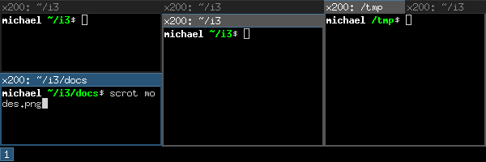

# De-mystifying i3
I've been using Linux for a couple of years now, but I've begun to realise that there seem to be two breeds of Linux users - those that use a tiling window manager and those that don't. Not that there's anything wrong with either, but I was always curious about the former. A few of my colleagues have been i3 enthusiasts and so I've remained curious about the benefits of using a tiling window manager over the default desktop experience one expects from the likes of Gnome or KDE.

However, just as I have been curious to try a new desktop environment, I've also found the list of tools that seem to be associated with tiling window managers to be something of a dark art. There are so many names of things or technologies, packages and configurations, that its always been quite a daunting task to try it out for an hour or two.

This steep learning curve has always seen be reverting to using Gnome after a dabble here or a dabble there, but I recently invested the time to overcome these challenges and am finally an i3 convert! In this post, I hope to explain things as I see them (in very simple terms!) to try go give other people in my situation a fast-track to getting up and running sooner.

## Step 1: Glossary
You might be asking, what is i3? What is a tiling window manager? Do I need a compositor? What is compton? How do I use a dotfiles repo?

Well, let's start there.

### i3
i3 is a tiling window manager. Its a desktop environment which you can install like many others with `sudo apt-get install i3`. Once this is done, the next time you log into your distribution, `i3` should be an option for your desktop environment.

### Tiling window managers
A tiling window manager differs from a regular desktop environment in that it manages windows in tiles that are docked in a grid. By default, you can't have a single window on your screen that occupies less than the entire space. Two window share the space in equally sized tiles. Three windows are arranged in half and two quarters. If you're familiar with `tmux`, the terminal multiplexer, you can think of a tiling window manager as a `tmux` for your desktop.

### Compositors
A compositor is an application responsible for rendering windows over one another. You don't normally think about this kind of thing in Gnome or KDE, i3 doesn't support rendering windows over one another. Nor does it support animation effects or transparency. A compositor can be used to add some of these visual affects to inject a bit of spice into the aesthetic of your desktop.

### Compton
Compton is a popular, open source compositor that many people use with i3. It is easily configured and can be tied into the startup of i3 with no hassle. People often used to ask me, "do you use i3 with Compton?" and I had no idea what they meant.

i3 with Compton means: i3 (a simple, no-frills tiling window manager) with Compton (a popular window compositor for adding transparency and visual effects). When you see cool screenshots of futuristic desktops with tiles of windows this way, that way and all over the place, with translucent terminals, they're probably using i3 with Compton.

### dotfiles and how to manage them
Running i3 or Compton requires a number of different config files and scripts to be configured for your individual setup. Managing this many files can be cumbersome, especially when you're moving between different machines frequently.

This, combined with the common use-case of backing up other dotfiles (e.g. `.bash_profile`, `.bash_aliases` and `.bashrc`) means having a good way to manage these files important.

A common pattern that people use is to have a "dotfiles repo" - a git repository in which they store these files. That way, they can use source control techniques to manage changes to the files and easily synchronise files across machines.

## Step 2: Why bother anyway?
Ok, so now we've got a point of reference for the various buzz-words, is it worth the effort?

### i3
First of all, you don't need any of the other tools listed above (or an of those that aren't listed, like `i3-gaps`). All you need to do is install `i3`, reboot and login to the new desktop environment. i3 has has three main window tiling modes (as well as a huge amount of customisation potential, which I won't go into here). These three modes are as follows.

#### Splits
In split mode, windows are split across the available screen space vertically or horizontally. This is a format you might be familiar with if you're used to arranging windows in a grid (whether manually or with some other tool). If you're familiar with `tmux`, this mode is a lot like `tmux` but for your desktop.

> In split mode, everytime you open a new window the screen is subdivided into a new row or column for the new window.

#### Tabs
Tabs, as the name suggests, arranges all of your windows fullscreen, but with a tab bar with tabs arranged horizontally. In this mode, you can switch left and right between the tabs in much the same way as you would with the `Alt-tab` shortcut on most desktops. 

> In tabbed mode, everytime you open a new window, it is opened in a new tab in the tab bar.

#### Stacks
Stacks are almost identical to tabs, except the tab bar is arranged vertically, so you can swap between windows by moving up and down.

> In stacked mode, everytime you open a new window, a new tab is added to the bottom of the stack.

The real power of i3 comes into play, because you can combine each of these modes in a single workspace (which is like a virtual desktop). In other words, you can have the screen split into three vertical splits - one can have horizontal splits in, one can have stacked windows in and the other can have tabbed windows in. The image below (taken from the wonderful [i3 user guide](https://i3wm.org/docs/userguide.html)) illustrates this perfectly:



This flexibility means that you can arrange windows just the way you want them and move between them effortlessly, without ever taking your fingers off the keyboard.

### Compton (or any other compositor)
Compton is very much a nice-to-have when it comes to tiling window managers. Based on the people I've worked with who use i3, some people use Compton and others just don't see the need. It can do all sorts of cool things to make your windows transparent when you're using them, or when they're unfocussed, as well as adding animations and effects here there and everywhere. The config looks complicated!

Personally, I just use a very minimal Compton setup to make my terminals slightly transparent.

### Dotfiles repos
Based on the number of config files you'll need to manage, not to mention the number of tweaks and changes you'll want to experiment with, I can highly recommend organising your dotfiles in a source control repo of some kind.

## Step 3: My setup - a simple example
My first foray into the world of i3 and Compton has been a simple one, but nevertheless I hope my dotfiles might prove to be useful inspiration to other people in a similar position to myself at the beginning of my tiling journey. A lot of dotfile repos I see have so much in them that I don't know where to look first! You can find my repo at [https://github.com/andykuszyk/dotfiles](https://github.com/andykuszyk/dotfiles).

In the sections below, I've picked out some of the highlights that I find particularly useful or that took my a while to figure out.

### `.config/i3/config`
This file is bascially the default i3 config file, with the comments removed and a few modifications here and there. The most notable is the override for the default fullscreen behaviour, which is a workaround for the fact that this triggers Chrome to open the focussed tab in fullscreen mode:

```
bindsym $mod+f split v; focus parent; fullscreen toggle; focus child
```

### `.config/i3/startup.sh`
This script is run by i3 on startup and has a few useful commands in, most notably:

* `xrandr...` - this is used to set the screen resolution and relative positions of my external displays. This can be a nightmare to do manually, so I used `arandr` to generate this line from a GUI.
* `gnome-keyring-daemon --start --components=pkcs11,secrets,ssh,gpg` - coming from Gnome, I noticed that none of my passwords had been preserved in Chrome, etc. This command ensured that the Gnome keyring which manages all of this in Gnome still ran under i3.
* `feh` - useful for setting desktop images.
* `compton` - this is where I start Compton from.

### `.config/compton.conf`
This file contains the configuration used by Compton to render transparency, etc. I copied the default file and basically just hacked it and re-ran Compton each time until I arrived at something I liked - this file is the result.

## Closing thoughts - was it worth it?
Yes.

I was happy with Gnome for years, but i3 has made me feel finally comfortable in my desktop environment. Arranging my workspace feels more natural than it did in a traditional floating window manager and feels more like shuffling papers on my desk than navigating Windows 95.

I am a convert.
