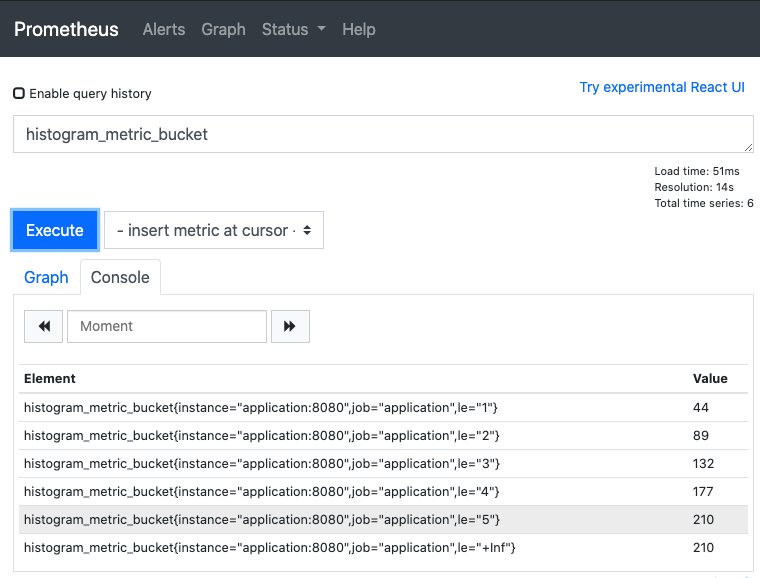
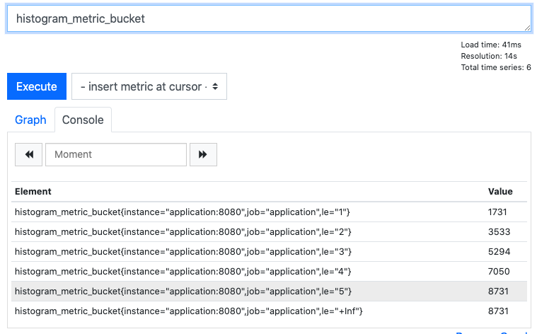
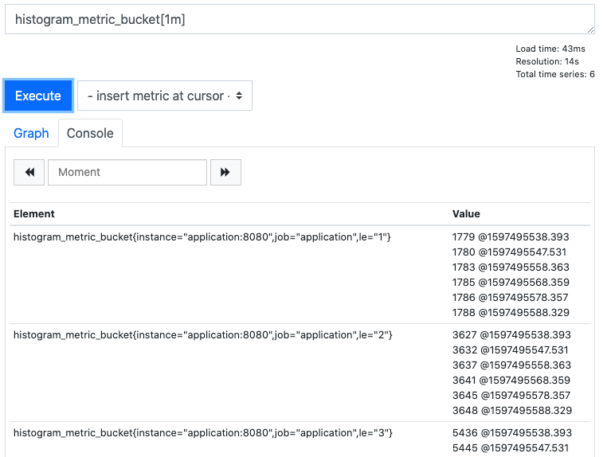
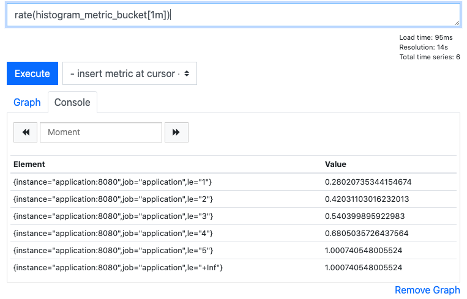
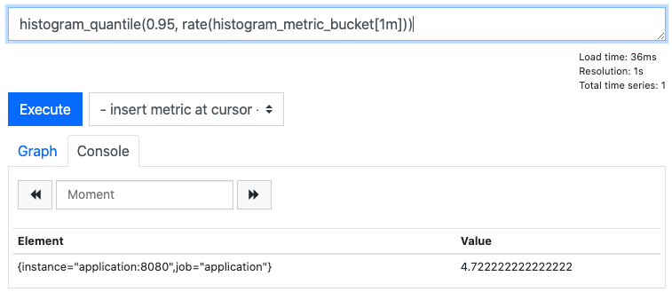

# Prometheus Histograms. Run that past me again?
I recently found myself in the position where I needed to do some detailed analysis of how long things were taking in a distributed software system. This is a solved problem from the community's point of view with tools like [Prometheus](https://prometheus.io/).

This blog post assumes you are familiar with the different [types of metric](https://prometheus.io/docs/concepts/metric_types/) Prometheus has to offer and are aware of the fact that real-time, dynamic values can be measured using [histograms or summaries](https://prometheus.io/docs/practices/histograms/).

Having read about the difference between [histograms and summaries](https://prometheus.io/docs/practices/histograms/), I found myself thinking, "run that past me again?". In other words, I still had no idea what the difference was and was very much in the dark when it came to making an enlightened choice about how to instrument my application and start querying the results.

This post is a summary (excuse the pun) of what I subsequently learnt about histograms and how they can be used. If you're already a Prometheus black-belt, read no further. If you still don't know what I'm talking about, read on!

## What is a histogram anyway?
Before we talk about histograms in Prometheus, let's re-cap histograms in general. I think it's normal at times like this to quote the [wikipedia definition](https://en.wikipedia.org/wiki/Histogram), but in this case I'm not sure that's helpful.

A histogram is a way of summarising (not in the Prometheus sense!) how some data is distributed - how many of the values were high, how many were low and how many were somewhere in between.

Take a look at this histogram:

<iframe width="600" height="371" seamless frameborder="0" scrolling="no" src="https://docs.google.com/spreadsheets/d/e/2PACX-1vTZRwsKfQVttZ1VCzT9lClNqbuij0v9iuiZUXsVUBsP16n4juzgk2i3UyKvXEBu32Gb-RDZdWPEwe_b/pubchart?oid=1197197263&amp;format=image"></iframe> 

It shows the distribution of a dataset. Some values are low (<=10), some are medium (>10 and <=100) and some are high (>100 and <=1000). The histogram groups the data into buckets based on these ranges and counts how many values are in each bucket. This gives us some insight into how the data is distributed across its range of values. When deciding how to draw a histogram, you normally choose bucket ranges that are sensible for the data and meaningful to the analysis.

## What about Prometheus histograms?
Now that we know what a histogram is, let's talk about Prometheus histograms. Prometheus histograms are a little different to the above example in three ways:

1. The buckets are cumulative - that is to say that each bucket contains values less than or equal to the bucket's upper threshold.
2. A Prometheus histogram metric is also a time series - the example we say above can be thought of a simple example of a Prometheus histogram at an instant in time. But, Prometheus records these histograms over time so things are a little more complicated when you start writing queries.
3. The time series itself is cumulative - the buckets in the histogram are always increasing so that the most recent instance of the histogram shows the total values for each of the buckets since the metric was first recorded.

Let's focus on each of these differences in turn.

### 1. The buckets are cumulative
In the above example, each bucket was exclusive of the values on either side. The values that were less than or equal to 10 only appeared in the <=10 bucket and not in any of the others.

Prometheus histograms are cumulative. In Prometheus, our example above would have different buckets: <=10, <=100 and <=1000. Let's see how this would look:

<iframe width="600" height="371" seamless frameborder="0" scrolling="no" src="https://docs.google.com/spreadsheets/d/e/2PACX-1vTZRwsKfQVttZ1VCzT9lClNqbuij0v9iuiZUXsVUBsP16n4juzgk2i3UyKvXEBu32Gb-RDZdWPEwe_b/pubchart?oid=830654358&amp;format=image"></iframe>

You can see that now, each bucket is bigger than the one before and contains a sum of all values up until the bucket's threshold.

### 2. Prometheus histograms are time series'
Prometheus scrapes metrics from a process at intervals. Each time it scrapes a histogram metric, it will receive a histogram similar to the one above - a cumulative histogram with "less than or equal to" buckets.

What's important to understand is that when you're querying the histogram, you're suddenly dealing with a time series of histograms. The histogram metric itself contains a range of values--one for each point in time that a scrape occurred--and each value represents a histogram like the one above.

Each histogram value--scraped at a scrape interval--summarises the distribution of values recorded by the process since the last scrape.

### 3. The time series itself is cumulative
Each time the histogram is scraped by Prometheus, the values are not reset. This means that the counts in each bucket are cumulative over the lifetime of the metric (at least in the memory of each process) and that it's really the *change* in each bucket's values the tells us the distribution of observations since the last scrape.

## An example
Let's put all of these ideas into practice. The examples below can all be found [here](https://github.com/andykuszyk/prometheus-histogram-example) along with a Docker Compose file for running a sample application and Prometheus.

### Example application
Let's start with an example application, written in Go. To begin with, let's configure the application to listen for HTTP requests on port 8080 and handle Prometheus scrapes on the `/metrics` route:

```go
package main

import (
    "log"
    "net/http"
    "github.com/prometheus/client_golang/prometheus/promhttp"
)

func main () {
    http.Handle("/metrics", promhttp.Handler())
    log.Fatal(http.ListenAndServe(":8080", nil))
}
```

Now, let's create a histogram metric with some predefined buckets:

```go
package main

import (
    "log"
    "net/http"
    "github.com/prometheus/client_golang/prometheus"
    "github.com/prometheus/client_golang/prometheus/promhttp"
    "github.com/prometheus/client_golang/prometheus/promauto"
)

func main () {
    histogram := promauto.NewHistogram(prometheus.HistogramOpts{
        Name:    "histogram_metric",
        Buckets: []float64{1.0, 2.0, 3.0, 4.0, 5.0},
    })
    http.Handle("/metrics", promhttp.Handler())
    log.Fatal(http.ListenAndServe(":8080", nil))
}
```

Finally, let's run a function in the background to record values (or observations) in the histogram:

```go
func main () {
    histogram := promauto.NewHistogram(prometheus.HistogramOpts{
        Name:    "histogram_metric",
        Buckets: []float64{1.0, 2.0, 3.0, 4.0, 5.0},
    })
    go func() {
        for {
            histogram.Observe(rand.Float64() * 5.0)
            time.Sleep(1 * time.Second)
        }
    }()
    http.Handle("/metrics", promhttp.Handler())
    log.Fatal(http.ListenAndServe(":8080", nil))
}
```

See [here](https://github.com/andykuszyk/prometheus-histogram-example/blob/master/application/main.go) for the full file, but note that all we're doing in this application is observing a random number between 0 and 5 once every second. The random number is a float, so each value will likely be different. We're expecting the histogram to count the observations that fall into each of the buckets, which are separated by a value of 1.

> Bucket thresholds are floats too, but in this example I've chosen integers to try to make things simpler.

### Example metric
Now that we've got an example application that will do some work, record some metric values and expose them to Prometheus, let's try running it and seeing the metric in Prometheus. Running `docker-compose up` against [this `docker-compose.yml` file](https://github.com/andykuszyk/prometheus-histogram-example/blob/master/docker-compose.yml) should get you setup with the application and Prometheus running locally.

Open up Prometheus ([http://localhost:9090](http://localhost:9090)) and try searching for our metric with `histogram_metric_bucket`. You should see something like this:



> You may notice when you're typing `histogram_metric` that two other metrics are listed as well: `histogram_metric_count` and `histogram_metric_sum`. This is because, in addition to the data that represents a histogram as we discussed above, histogram metrics in Prometheus also expose a cumulative count of all observations and a cumulative sum of all observations. This is particularly useful if, for example, you want to know the average duration of some thing as well as how many times per second it happened - the `_count` series can be used with the `rate()` function to give you the per-second rate of change.

OK, so what are we looking at when we query the metric? There are a few key points to note:

* We are looking at an [*instant vector*](https://prometheus.io/docs/prometheus/latest/querying/basics/#instant-vector-selectors), which means we're seeing the latest set of values scraped by Prometheus (as opposed to a range of values over time). In other words, we're looking at a cumulative histogram just like the example we discussed above.
* Each time Prometheus scrapes a histogram, it collects an instant vector like this one.
* After the metric name in `{}` are a set of *labels* which add dimensions to the histogram's data (you can filter the values based on label criteria).
* The most important of these is the *`le`* label which is the "less than or equal to" bucket threshold.
* The value for `le=1` is the cumulative count of all observations <=1. The same is true for the other `le` values, which is why the counts always increase as the value of `le` increases - all the buckets are cumulative.

So, now we have a cumulative count of all observations in each of our buckets. Whilst that (hopefully) makes sense so far, it's not particularly useful for helping us understand the underlying distribution of the observations made in our instrumented program. We need a good way to query histograms.

### Example query
#### The frequency of observations
First of all, before we dive into understanding the distribution of values in our histogram, let's just back-track to the fact that the histogram also exposes a `_count` which we can use to understand the frequency of observations per second. This might be particularly useful in the example of recording HTTP request durations - the histogram `_bucket` series will tell you how long the requests tool, but the `_count` series can also be used to tell you how many requests were made per second. Understanding the rate of observations is easy with the following Prometheus query:

```
rate(histogram_metric_count[1m])
```

This query takes the observations for the last minute (`[1m]`) and calculates the per-second rate of change of the count, thus giving us the number of observations per second.

#### The distribution of observations
This is where the real magic happens. We have some high-frequency event (again, think web requests) where a large number of observations (e.g. request durations) are made in-between each of Prometheus' scrape intervals. We use a histogram metric to record the observations and now we want to query the metric to give us some insight into how the values are distributed within the scrape interval and over time.

Let's build up the query step-by-step. First, let's just query the metric with `histogram_metric_bucket`:



> This shows us the the cumulative count of observations in each of our buckets.

Now, let's take a range of values from the metric for the last minute with `histogram_metric_bucket[1m]`:



> Now we have the cumulative counts for each bucket, but over the last minute's scrape intervals.

Let's see how those buckets have been changing over time by looking at the per-second rate of change of each bucket with `rate(histogram_metric_bucket[1m])`:



> This shows us how frequently observations have been made in each of the buckets over the last minute.

Finally, we can use the Prometheus function [`histogram_quantile()`](https://prometheus.io/docs/prometheus/latest/querying/functions/#histogram_quantile) to turn this information into useful insight. Because we have the rate of change of each of the histogram buckets, Prometheus can now work out which bucket label contains a given quantile (e.g. the 95th percentile). This means that we can now find out the approximate value at which a given quantile was represented in the data. For example, `histogram_quantile(0.95, rate(histogram_metric_bucket[1m]))`:



Here you can see that over the last minute the approximate value of our observations at the 95th percentile is 4.72. Insight! Remember that each time Prometheus scrapes the value of the histogram, it's pulling back a cumulative count of all the buckets in our histogram (just like the examples at the beginning of this blog). Over time (e.g. the one minute interval in this example), that's a lot of data and, over a time-series (e.g. a chart showing the last 6 hours), that's a lot of data to summarise! There are lots of ways to try to glean insight from this data, but the example given here is the simplest. You might want to try querying different quantiles to see how your system is performing - you'd find the median value at quantile 0.5 and the maximum values at quantile 1.0.

## Summary `<<--that's a Prometheus pun!`
Of the four metric types that Prometheus understands, I've found the histogram the most difficult to get to grips with. Histograms and Summaries can be used for similar things, but histograms are very versatile and are a great way of understanding processing durations in a distributed system.

I hope this post helped you understand histograms a little better!

