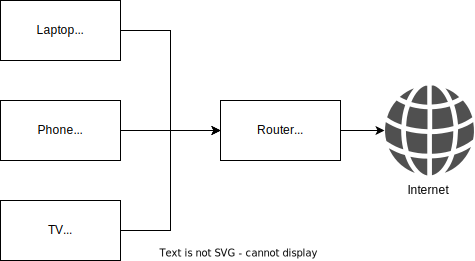

# Network Address Translation (NAT) and Proxies
Exposing pools of machines to clients, or routing network traffic via an intermediary, are common techniques in distributed computing, and large networks. Network Address Translation, forward proxies, and reverse proxies, are three common techniques for managing network traffic at scale. However, I've always found each of these topics to be somewhat mystical, and I've never understood the fundamentals of how each technique works.

In this blog post, I will attempt to distil each idea into its simplest form, and write a code example where possible.

This blog post will:
- Introduce TCP/IP at a high level, and demonstrate TCP communication in Go.
- Take a deeper look at IP communication, and the Linux networking stack.
- Introduce Network Address Translation, and illustrate how it works.
- Examine forward proxies, and show a simple example in Go.
- Examine reverse proxies, and show a simple example in Go.
- Summarise the differences and similarities between NATs and proxies, and provide examples of their use cases.

## TCP over IP
TCP is a connection-oriented protocol, which normally uses the Internet Protocol (IP) to transmit data. This combination is often referred to as TCP/IP. TCP underpins most network traffic on the internet, so before we go any further it's useful to get a grasp of how it works from a practical point of view.

In TCP, servers listen for new connections on a specific port. Clients establish connections to server's port from a random port on their host, allocated by the operating system. This combination of the IP/port of the client, and the IP/port of the server, uniquely identifies the connection between the two machines.

In Go, listening for new connections (like a server would) is easy using the `net` package. The `net` package offers a high-level interface for listening for, accepting, and reading from new connections. The example below shows a simple example of a process listening for new connections, and waiting to accept them.

```go
func main() {
    // The server listens for TCP connections on the port 8080. If a client
    // tried to establish a connection with the host this process was running on,
    // on port 8080, they would be directed to this process.
    listener, err := net.Listen("tcp", ":8080")
    if err != nil {
        panic(err)
    }

    for {
        // The server waits to accept new connections. It can handle multiple
        // connections, from multiple clients. As a result, it can handle each
        // connection in the background, and the continue to wait for new connections
        // to be established.
        connection, err := listener.Accept()
        if err != nil {
            panic(err)
        }

        // Handle the connection in the background.
        go handleConnection(connection)
    }
}
```

The `handleConnection()` function can handle new connections by reading any data sent along the connection, and writing any data that needs to be returned. The example below illustrates reading and writing data, before closing the connection:

```go
func handleConnection(connection net.Conn) {
    // The server reads data from the connection. This data is just a stream of bytes, and
    // could represent a common application-level protocol such as HTTP, or a custom
    // protocol of your choosing.
    b, err := io.ReadAll(connection)
    if err != nil {
        panic(err)
    }

    // The server can also send data back along the connection. In this case,
    // it always sends the same data.
    _, err = connection.Write([]byte("hello world!\n"))
    if err != nil {
        panic(err)
    }

    // The server can keep the connection open for as long as it likes, and
    // continue to send and receive data indefinitely. In this example,
    // having read and written data, the server closes the connection. If the
    // client wanted to continue communicating with the server, it would have
    // to establish a new connection.
    connection.Close()
}
```

Running this sample application will start a process listening on port 8080, and allow you to establish TCP connections with `localhost:8080`. A TCP connection can be established from a client using a command line tool: `nc` (`netcat`). In the following example, a TCP connection is established, some data sent, and some data received:

```sh
$ echo -n "hello" | nc localhost 8080
hello world!
```

---
> ### TCP over IP summary
> - TCP is a connection-oriented protocol, allowing a client to establish a reliable line of communication with a server.
> - TCP is a transport-layer protocol, and requires a network-layer protocol to handle underlying network transmission.
> - TCP is usually transmitted via the Internet Protocol (IP), and this combination is normally referred to as TCP/IP.

---

## IP and the Linux networking stack
The Internet Protocol itself is a low-level protocol used to transmit data packets across an internet network. It is used to encapsulate higher-level protocols (like TCP and UDP). IP packets consist of a header and a payload. The payload is where the encapsulated packets from the higher-level protocol are transmitted. The IP header contains a number of fields, but the following ones are of interest to this post:
- Source address: the IP address of the sender.
- Destination address: the IP address of the intended recipient.

These fields contain the source and destination IP addresses of the packets, and nothing else. You may notice that there is no information in here about ports, which are part of higher-level protocols (e.g. ports are part of the TCP implementation). In a world without Network Address Translation, every source and destination IP address would need to be unique and we would soon run out of IP addresses.

Now, when it comes to sending and receiving IP packets from an application it isn't as straightforward as it sounds. IP is a low-level networking protocol, and is normally handled directly by the operating system. In Linux, the socket-based networking stack takes care of all TCP/IP and UDP/IP communication. The sending and receiving of raw IP network packets is handled in kernel space, and user space applications are presented with a high-level interface (a file descriptor to read/write data to).

As a result, it's difficult to illustrate IP packet handling in a simple user space application, because the details of packet handling are normally handled by the kernel's network stack. In the TCP example above, the networking primitives exposed by the Go `net` package are somewhat similar to the syscalls the Linux kernel exposes to applications. Interacting with IP packets directly isn't something a user space application would normally need to worry about.

---
> ### IP and Linux networking summary
> - IP is a low-level protocol, concerned with the IP addresses of hosts on a network (but not ports).
> - IP packet transmission is normally handled by the operating system.
> - The Linux kernel offers applications a networking abstraction at the transport-level (e.g. TCP, UDP), and handles IP packet transmission internally.

---

## Network Address Translation
Network Address Translation is a procedure commonly employed on routers to hide the IP network space of one network when connecting it to another. A good example of this is your home network router. Your router probably applies NAT to network traffic destined for the internet. If you check out your public IP address, you will find out the IP address of your router on the internet, rather than the private IP address allocated to your machine on your home network. This process is illustrated in the diagram below:



In this example, your router has a public IP address on the internet (`80.123.123.123`), and all of the devices on your local network have local IP addresses (`192.168.0.0/24`). Whenever network traffic destined for the internet passes through your router, your router modifies the IP packets to use its public IP address as the source IP. When return packets are sent, they are addressed back to your router's public IP address. You router maintains a local mapping of your original IP address on the private network, so that when it receives return packets it can send them back to the correct local IP address.

> Network Address Translation can hide private IP addresses from the public internet, and replace them with a single public IP address instead.

### Reasons to use NAT
There are a variety of reasons you might want to use NAT, including:

- Preserving IP address space between multiple private networks (and on the internet).
- Ensuring consistent source IP addresses--your network traffic will always appear to originate from the IP address of the device performing NAT.
- Ensuring consistent destination IP addresses--your network traffic will always appear to be received at the IP address of the device performing NAT.

Each of these reasons are explored in more detail below.

#### Preserving IP address space
IPv4 addresses are limited to 4.3 billion unique addresses, which means that without some kind of solution we would soon suffer from [IP address exhaustion](https://en.wikipedia.org/wiki/IPv4_address_exhaustion). There are a number of solutions to IP address exhaustion--including the introduction of IPv6--but NAT limits the impact of the relatively small size of IPv4 address space.

If a private network is connected to the internet via NAT, then it doesn't matter how many IP addresses are allocated on the private network, they will only ever use as many public IP addresses as there are routers that NAT traffic.

It's conventional to use the following IP address spaces for private networks:
- `10.0.0.0/8`
- `172.16.0.0/12`
- `192.168.0.0/16`

Between these IP address ranges, there are more than 17 million private addresses that can be allocated. As a result, NAT allows large private networks to be constructed without exhausting IPv4 space on the public internet.

#### Consistent source IP addresses
It's often useful to secure access to a system by maintaining an allowlist of IP addresses that are permitted to reach it. This might form the basis of firewall rules that permit inbound traffic into a network. Permitting traffic based on the source IP address of network traffic is difficult if there are a large number of possibilities for that source IP address.

For example, if you ran machines in your corporate network in `10.0.0.0/8`, and you gave your external software vendor this CIDR range to add to their allowlist, it wouldn't be a very restrictive security measure!

NAT can be a useful technique to mask the IP addresses of your internal systems and ensure a consistent source IP address when connecting to other network resources or external systems. In this instance, NAT is used to translate traffic from private addresses in your internal network so that they appear to have originated from your router's public IP address instead.

#### Consistent destination IP addresses
You might also be in a position where you have a private network resource that you want to expose on a public network. NAT can be used in this instance to translate traffic addressed to your public address to your private addresses instead. This is sometimes referred to as "port forwarding", and you might have seen features like this on your home router to expose resources on your local machine (on your private home network) to the internet.

### How NAT works
So, how does NAT actually work? Well, it's simple...and it's not!

#### The simple explanation
The simple part, is that NAT works by re-writing the source or destination headers in the IP packets based on which way round NAT is being applied to your traffic. In the case where you home router uses NAT to present a single source IP address to the internet, all of your outgoing IP packets have their source IP address changed to match your router's address. That way, return packets can be addressed back to your router over the internet.

Your router knows it needs to adjust the source IP address of your IP packets, so it keeps a record of your original source IP address. When it receives return packets, it re-writes the destination IP address to match your original address and then forwards the packets over your private network.

This process is completely transparent to the sender and receiver, and is normally completed by a hardware network device (e.g. a router).

#### The not-so-simple explanation
The less simple part of this process is that source and destination address information isn't just used at the IP level of network transmission. It's also used in TCP and UDP, where it forms part of the message checksum calculations to avoid errors in transmission. This means that the device performing NAT needs to be aware of the higher-level protocols being transmitted in the IP packets. It needs to decode the contents of the IP packet's payload, modify it accordingly, and re-write it so that it still contain valid TCP/UDP packets. When the packets are decoded and passed up the network stack to user space applications, they still appear to contain valid TCP or UDP packets, which have been modified transparently from the point of view of the application.

### Where's the code example?
This whole process is difficult to demonstrate in a simple coding example, because the processing of IP packets is normally handled by the networking stack in an OS, and user space application code typically deals with higher-level abstractions based around TCP and UDP protocols.

NAT is normally performed by specialised networking devices (like routers), whose sole purpose is to process IP packets and route them to their next network hop.

---
> ### NAT summary
> - NAT involves re-writing source and destination addresses in IP packets, so that all network traffic from a network appears to have originated from a single IP address.
> - NAT can be used to mask source or destination IP addresses.
> - NAT is a useful way of connecting private and public networks together, whilst still preserving IP address space.

---

## Forward proxies
Whereas NAT is implemented at the network-layer (i.e. at the IP layer, beneath TCP), proxies operate at the application-layer (e.g. HTTP). This means that proxies are normally specific to the protocol you intend them to operate on. In the examples below, I'll look at HTTP proxies, although proxies could be used for other protocols as well.

An HTTP proxy acts an intermediary between the client sending the request, and the server receiving the request. Unlike NAT, which transparently modifies network packets, a proxy accepts and terminates network connections, and then re-transmits requests to the destination.

This means that, when you make requests via a proxy, the proxy actually accepts and processes the request, before making a new request on your behalf to the downstream server.

Unlike NAT, this is very easy to illustrate in a simple Go application, because all of the work happens at the application layer. Here's a sample application:

```go
package main

import (
    "io"
    "net/http"
)

func main() {
    // The proxy handles all HTTP requests.
    http.HandleFunc("/", func(w http.ResponseWriter, r *http.Request) {
        // The proxy makes a new request using the same HTTP verb and
        // relative URL as the original request. For simplicity, the body
        // is excluded, so in practice this would only work for GET
        // requests.
        req, err := http.NewRequest(r.Method, r.RequestURI, nil)
        if err != nil {
            panic(err)
        }

        // The proxy sends a new request, on behalf of the original
        // client.
        res, err := http.DefaultClient.Do(req)
        if err != nil {
            panic(err)
        }

        // The response is read by the proxy.
        body, err := io.ReadAll(res.Body)
        if err != nil {
            panic(err)
        }
        defer res.Body.Close()

        // The contents of the proxied request are then written back
        // to the HTTP response of the original client's request.
        w.WriteHeader(res.StatusCode)
        w.Write(body)
    })
    http.ListenAndServe(":8080", nil)
}
```

This simple example handles all web requests by:
- Reading the request.
- Sending a new HTTP request that looks like the one it received.
- Reading the response to this request.
- Sending the same response back to the original client.

In reality, this is a very simple example (it will only work for GET requests among other things). However, it does illustrate the following main points:

- Network packets are not handled transparently by the proxy.
- Network traffic is processed at the application layer by the proxy.
- TCP connections are terminated from the client by the proxy.
- New connections are made downstream from the proxy to the destination.

Whilst this is a very different approach to NAT, it does have the same effect of masking the source IP address from the destination server's point of view. Since all requests are re-originated from the proxy, it is the proxy's IP address that will appear as the source IP address, at least at the network layer. Whether or not the same is true at higher levels of the network stack (e.g. in HTTP headers) depends on your implementation, but forward proxies like this can also be used to mask source IP addresses for many of the same reasons as NAT.

---
> ### Forward proxies
> - Forward proxies operate at the application-layer.
> - They receive and terminate network-level traffic, e.g. TCP connections.
> - Forward proxies make onward requests on behalf of the original client, so the requests appear to originate from the proxy.

---

## Reverse proxies
A reverse proxy operates in much the same way as a forward proxy, except that the address that is proxied is configured in advance in the proxy, rather than being dynamically based on the client's request.

When a request is sent to a forward proxy, the request is forwarded on to the original recipient indicated by the client's HTTP request. When a request is sent to a reverse proxy, the proxy decides where to forward the request based on some predetermined configuration.

This makes reverse proxies useful for presenting a public IP address for a set of private resources, like a set of private, back-end servers.

This is illustrated in the following simple Golang application:

```go
package main

import (
    "io"
    "net/http"
)

func main() {
    // The proxy listens for all HTTP traffic.
    http.HandleFunc("/", func(w http.ResponseWriter, r *http.Request) {
        // The proxy handles the request by performing a pre-determined action. In
        // reality, it is likley to forward the request to another upstream server, 
        // but in this example it simply makes a request to Google on behalf of
        // the original client.
        req, err := http.NewRequest(http.MethodGet, "https://www.google.com", nil)
        if err != nil {
            panic(err)
        }

        // The proxy makes the request on behalf of the client.
        res, err := http.DefaultClient.Do(req)
        if err != nil {
            panic(err)
        }
        defer res.Body.Close()

        // The proxy copies the contents of the proxied response into
        // the response to the original client's request.
        w.WriteHeader(res.StatusCode)
        _, err = io.Copy(w, res.Body)
        if err != nil {
            panic(err)
        }
    })
    http.ListenAndServe(":8080", nil)
}
```

In this example, all requests to the reverse proxy are forwarded to `https://www.google.com`. This forwarding URL represents the static configuration that will determine how your proxy will route requests. If I run this example locally, and then `curl -v http://localhost:8080`, the Google home page is returned.

---
> ### Reverse proxies
> - Reverse proxies operate at the application-layer.
> - They receive and terminate network-level traffic, e.g. TCP connections.
> - Reverse proxies make onward requests on behalf of the original client according to a set of pre-defined rules.

---

## Summary
This blog post has described the behaviour and characteristics of Network Address Translation, forward proxies, and reverse proxies. This is summarised below:

| Technique                   | Network Layer                              | Behaviour                                                                                                               | Uses                                                                                                                                                     |
|-----------------------------|--------------------------------------------|-------------------------------------------------------------------------------------------------------------------------|----------------------------------------------------------------------------------------------------------------------------------------------------------|
| Network Address Translation | Network (e.g. IP packets)                  | - Transparent modification of IP packets.<br> - IP address modification for all higher protocols (e.g. TCP, HTTP).      | - Masking source IP addresses of private network resources.<br> - Connecting two private networks together without doubling IP address space.            |
| Forward proxy               | Typically Application (e.g. HTTP requests) | - Receive, process, and re-transmit requests.<br> - Not transparent to network layer.<br> - Terminates TCP connections. | - Masking source IP addresses of clients connecting to public internet resources.<br> - Handling all internet egress through a single, controlled point. |
| Reverse proxy               | Typically Application (e.g. HTTP requests) | - Receive, process, and re-transmit requests.<br> - Not transparent to network layer.<br> - Terminates TCP connections. | - Expose a single public IP address for multiple, private network resources.<br> - Handling all internet ingress through a single, controlled point.     |

I hope you found this blog post useful in understanding these three networking techniques in the future, and you now consider them somewhat less mystical!
