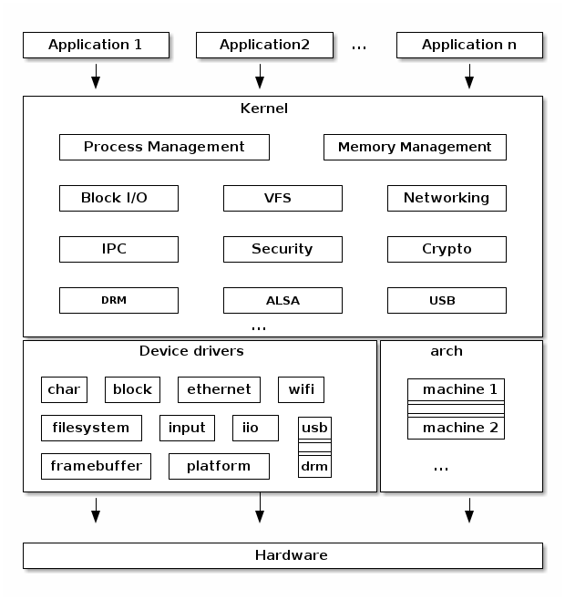

# Linux fundamentals: user space, kernel space, and the syscalls API surface
The Linux kernel has always held a mystical place in my mind. It's the inner sanctum of computer magic which makes programs work. Somehow.

People with arcane knowledge of the Linux kernel often refer to "user space" programs, but I've never really been sure what they mean by that. Or of what actually makes up the "kernel", for that matter.

Ultimately, when I write a program which interacts with the file system, or communicates over a network, or somehow interacts with the outside world, I've never really known how these operations are actually executed by the computer/operating system/programming language. Magic!

If, like me, you also feel like a level one Linux user in dire need of experience points, then fear not! This blog post will try to give you a high-level summary of the following arcane topics:

- The Linux software stack in general.
- User space programs.
- Kernel space programs.
- The boundary between user/kernel space.
- The Linux kernel system calls.

Having introduced you to these concepts, I'll then try to illustrate how a program makes use of the services provided by the operating system. I'll demonstrate a couple of small applications, written in Go, which consume operating system services directly. This will hopefully take some of the mystery out of computers in the future. If you reach the end of this blog post, you gain one hundred Linux experience points!

## Linux software stack
There is a stack of services that underpin user-run processes in Linux. User-run processes (normally referred to as user space processes, see the user space section below) rely on services provided by the kernel. The kernel is a special part of the operating system, which handles a variety of low-level operations in a privileged running mode (see the section on kernel space below).

This is illustrated in the diagram below, which I borrowed from [linux-kernel-labs.github.io](https://linux-kernel-labs.github.io/refs/heads/master/lectures/intro.html#typical-operating-system-architecture):


This diagram shows how user space processes rely on the kernel for access to hardware, and how they access it via a system call (or syscall) interface. However, the kernel itself has more to it than just a syscall API for low-level operations. As well as facilitating this interface with user-run processes, the kernel contains a process scheduler, networking stack, virtual file system, and device drivers for hardware support, to name just a few. The diagram above is a bit of an over-simplification, and the following diagram (again borrowed from [linux-kernel-labs.github.io](https://linux-kernel-labs.github.io/refs/heads/master/lectures/intro.html#linux-kernel-architecture)) shows a more complete picture:



The remainder of this blog post will cover user and kernel space in more detail, discuss the syscall interface, and provide practical code examples of syscalls in practice.

## User space
A user space process is executed by a user in the operating system, rather than being part of the operating system itself. It might also be executed by an init system (e.g. systemd), but it isn't part of the kernel. [User space](http://www.linfo.org/user_space.html) is the area of memory that non-kernel applications run in. User space processes literally run in the user space part of memory. A user space process runs in [user mode](http://www.linfo.org/user_mode.html), which is the non-privileged execution mode that the process' instructions are executed with. User mode processes have to switch to kernel mode when they want to consume services provided by the kernel (e.g. disk I/O, network access). Switching to kernel mode involves triggering a syscall to be executed by the kernel.

User mode execution of user-run processes ensures that a user space process cannot access or modify memory managed by the kernel, and can't interfere with another process' execution. This is an important security control in ensuring that user-run processes cannot corrupt or interfere with the operating system.

## Kernel space
[Kernel space](http://www.linfo.org/kernel_space.html) is the area of system memory reserved for the kernel. It is where the kernel runs and executes kernel mode instructions. [Kernel mode](http://www.linfo.org/kernel_mode.html) is the CPU execution mode of the kernel, which runs in a privileged, root-access mode. When a user space application requires the services provided by the kernel, it will signal the kernel to execute a syscall, and switch to kernel mode for the duration of the syscall execution.

## Boundary between user space and kernel space
Special CPU instructions are used by user space processes to invoke syscalls on most modern CPU architectures. The user space process executes the CPU instruction when it wants to execute a syscall, which switches the process' execution from user mode to kernel mode. The syscall executes in kernel mode, before returning execution to the user space process.

## Syscalls
[Syscalls](http://www.linfo.org/system_call.html) are functions in the kernel that provide services to a user space application. They are the API that the kernel exposes to user space programs, which allow a program to utilise the functionality the kernel offers. Examples include starting new processes, disk I/O, and networking. 

A full list of syscalls can be found by running `man syscalls` on a Linux system. All syscalls are accompanied by a detailed `man` page, all of which can be found in section 2. For example, the `man` page for the `chdir` syscall can be read by running `man 2 chdir`. The `man` pages for syscalls are a really useful primary source of documentation, so if you're not familiar with `man` try running `man man` and start exploring the syscall documentation.

Many syscalls are accompanied by small Linux programs which wrap them. For example, the `chdir` syscall for changing working directory can be invoked directly by running `chdir` in a shell. Other syscalls are designed to be used in concert with each other. There are a variety of syscalls for socket-based networking (e.g. `socket`, `bind`, `listen`, and `accept`), which combined offer a suite of socket-based functions for user space programs to utilise.

As mentioned above, syscalls are invoked via an interrupt or instruction executed by the user space process and the kernel mode execution. This system is normally wrapped by a library (e.g. `glibc`), which offers a slightly higher-level abstraction for programs in the form of functions that can be called. Furthermore, most programming languages come with much higher-level abstractions that allow you to deal with logical operations, rather than physical syscalls.

Nonetheless, breaking down some simple operations in their syscall components can prove interesting. The remainder of this blog post will illustrate a couple of simple examples using Golang, and demonstrate how the syscalls themselves can be observed by a user.

## Example 1: using the file system
Writing to a file is a simple operation in most programming languages, and it's also a simple operation using syscalls. Three syscalls are involved in writing to a file:
1. `open`, which opens a file descriptor for use by the process.
2. `write`, which allows the process to write bytes to the file descriptor.
3. `close`, which closes the file descriptor.

The use of these syscalls can be illustrated in the following Golang example:

```go
package main

import (
	"os"

	"golang.org/x/sys/unix"
)

func main() {
	fd, err := unix.Open("test.txt", os.O_CREATE|os.O_WRONLY, 0600)
	if err != nil {
		panic(err)
	}

	_, err = unix.Write(fd, []byte("hello world\n"))
	if err != nil {
		panic(err)
	}

	err = unix.Close(fd)
	if err != nil {
		panic(err)
	}
}
```

This program opens a file called `test.txt`, writes the string `hello world` to it, and then closes the file descriptor. Normally these operations are abstracted by a higher-level API, but the use of these syscalls directly illustrates how writing to a file is a achieved at the user space/kernel space boundary.

The use of the kernel by this program can be further illustrated using a diagnostic tool called `strace`. Syscalls can be observed directly using `strace`, either for a process you want to execute, or an already running process. It allows the syscalls used by a program to be observed directly, which can be very useful for understanding what operations the program is performing that rely on system resources.

If you compiled the example above and ran it with `strace`, you would see something like this:

```sh
$ go build -o file-syscall-example main.go
$ strace file-syscall-example
...
openat(AT_FDCWD, "test.txt", O_WRONLY|O_CREAT, 0600) = 3
write(3, "hello world\n", 12)           = 12
close(3)                                = 0
```

In the `strace` output, the numbers following the equals sign indicate the returned values from the syscall itself. In this example `openat() = 3` tells us that the opened file descriptor can be identified by `3`, `write() = 12` tells us that `12` bytes were written, and `close() = 0` tells us that the operation was successful.

This example demonstrates the use of the syscalls for file access from an external point of view, and the same technique could be used on any program to gain an insight into the way it interacts with the kernel.

## Example 2: network communication
The Linux kernel has a number of syscalls for socket-based communication, facilitating unix sockets, TCP sockets, UDP sockets, and a number of more exotic network protocols. These syscalls are all based around the use of a file descriptor for a socket, and (in the case of TCP) a file descriptor for a connection. These file descriptors can be used to read bytes into a buffer (or send data), and can also be closed when the socket is no longer needed.

The Go example below illustrates all of these steps:

```go
package main

import (
	"fmt"

	"golang.org/x/sys/unix"
)

func main() {
	// Create a socket.
	fd, err := unix.Socket(unix.AF_INET, unix.SOCK_STREAM, 0)
	if err != nil {
		fmt.Println("error calling SOCKET")
		panic(err)
	}

	// Bind the socket to an address.
	err = unix.Bind(fd, &unix.SockaddrInet4{
		Port: 8080,
		Addr: [4]byte{127, 0, 0, 1},
	})
	if err != nil {
		fmt.Println("error calling BIND")
		panic(err)
	}

	// Start listening to the socket.
	err = unix.Listen(fd, 0)
	if err != nil {
		fmt.Println("error calling LISTEN")
		panic(err)
	}

	// Accept TCP connections on the socket.
	connectionFd, _, err := unix.Accept(fd)
	if err != nil {
		fmt.Println("error calling ACCEPT")
		panic(err)
	}

	bytes := make([]byte, 8)
	oobBytes := make([]byte, 8)
	// Read data from the connection.
	_, _, _, _, err = unix.Recvmsg(connectionFd, bytes, oobBytes, 0)
	if err != nil {
		fmt.Println("error calling READ")
		panic(err)
	}

	fmt.Printf("received bytes:\n%v\n", string(bytes))

	// Close the connection.
	err = unix.Close(connectionFd)
	if err != nil {
		fmt.Println("error calling CLOSE for the connection file descriptor")
		panic(err)
	}

	// Close the socket.
	err = unix.Close(fd)
	if err != nil {
		fmt.Println("error calling CLOSE for the socket file descriptor")
		panic(err)
	}
}
```

Once again, the use of syscalls by this program can be observed with `strace`:

```sh
$ go build -o socket-syscalls main.go
$ strace socket-syscalls > syscalls.log &
$ netcat localhost 8080
hello world!
$ cat syscalls.log
...
socket(AF_INET, SOCK_STREAM, IPPROTO_IP) = 3
bind(3, {sa_family=AF_INET, sin_port=htons(8080), sin_addr=inet_addr("127.0.0.1")}, 16) = 0
listen(3, 0)                            = 0
accept4(3, {sa_family=AF_INET, sin_port=htons(58868), sin_addr=inet_addr("127.0.0.1")}, [112->16], 0) = 4
...
recvmsg(4, {msg_name=0x400004e0e0, msg_namelen=112->0, msg_iov=[{iov_base="hello\n", iov_len=8}], msg_iovlen=1, msg_controllen=0, msg_flags=0}, 0) = 6
...
close(4)                                = 0
close(3)                                = 0
```

This example is slightly more complicated than the file-writing example, because we need to open a TCP connection to the program and send data to it. `netcat` is a convenient tool to do this, and in this example we just send the text "hello world", and then close the connection with a keyboard interrupt.

## Summary and conclusions
I hope this blog post has demystified some of the workings of the Linux kernel, and the relationship it has with user-run programs. The top takeaways for me are:

- The Linux kernel exposes services to programs via syscalls, which are functions which allow a program to interact with system resources.
- Syscalls are executed in kernel space, as opposed to a program's regular instructions, which are executed in user space.
- Syscalls themselves cover a wide range of functionality, include disk I/O and networking.
- The use of syscalls by an application can be observed directly using `strace`, which is a useful diagnostic tool.

Congratulations, you've earned your one hundred Linux experience points!
