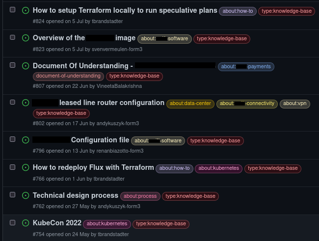
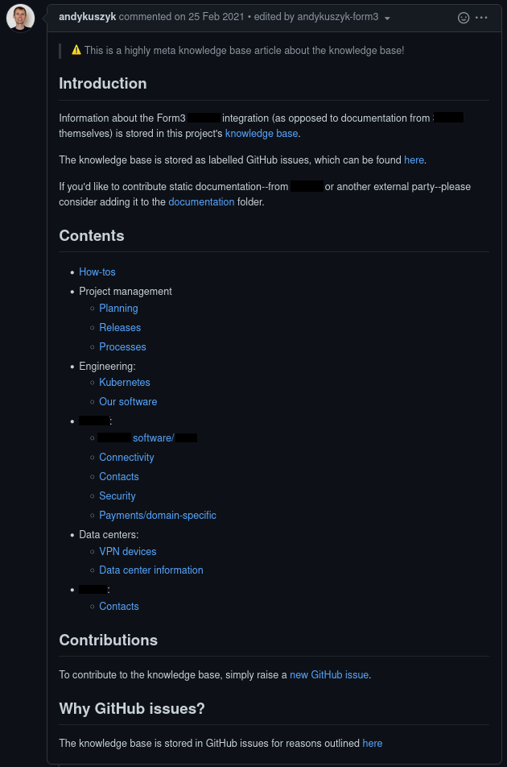
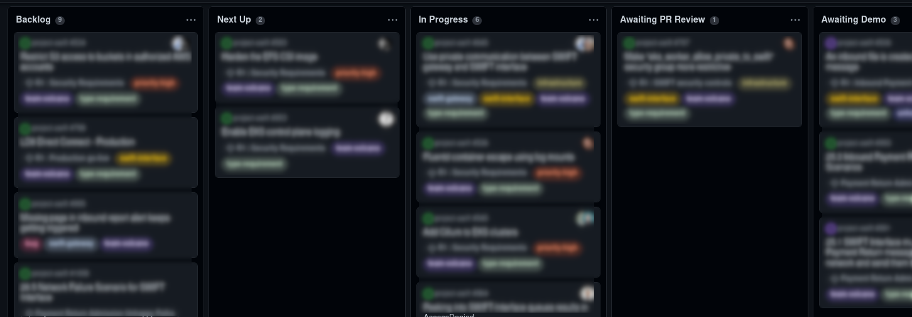
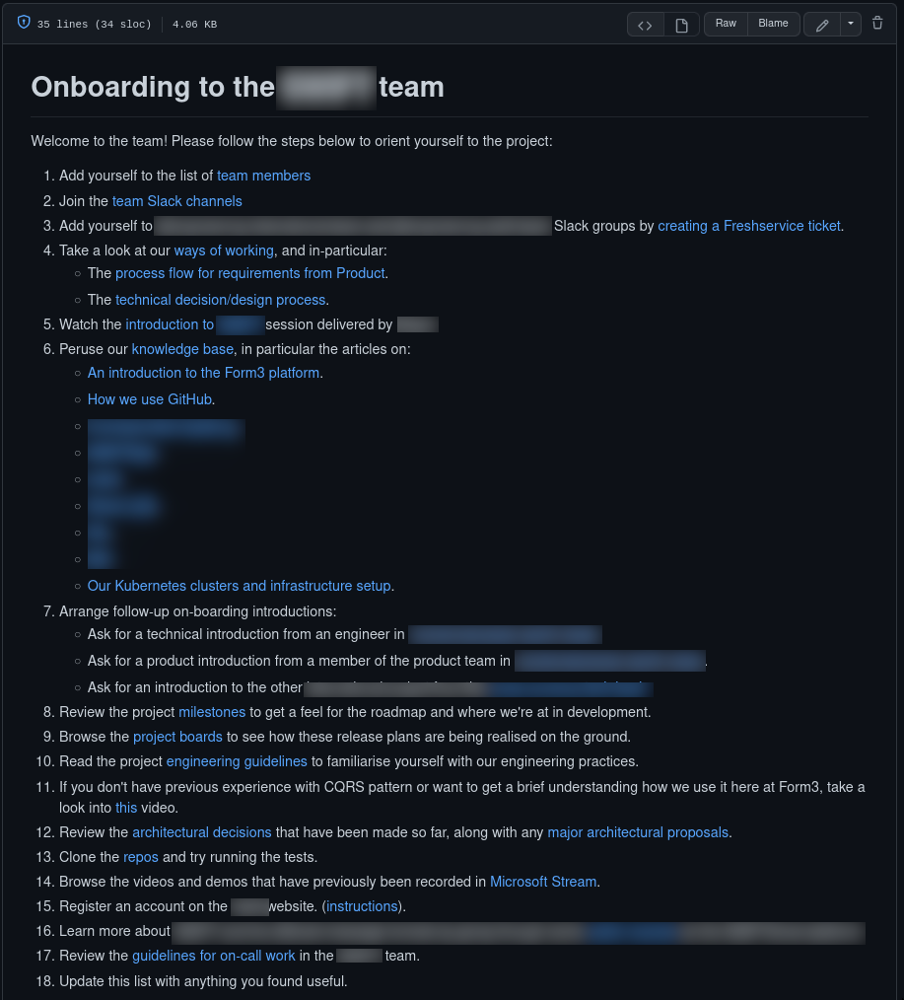

# What I learned from starting a new project
In February 2021 I moved from an individual contributor role at Form3, to being lead engineer on a new project. For the first six months, I was lead engineer of a team of one (myself!), and spent a long time researching the new project, and iterating on technical designs. I also spent a lot of time thinking about how we would eventually build a team around the project, and organise its various activities.

More than a year and a half later, and that team now exists. It consists of three independent engineering teams, consisting of more than twenty engineers. I am now in the role of Head of Engineering for this larger team, and I find myself now reflecting on how things have gone.

Many of the ideas I had in the early days have born fruit, and some have not. In this blog post, I would like to share the ideas and practices that have proven effective in planning, growing, and operating a large team of engineers across a complex project. I have organised my learnings around three key themes:
1. Encouraging a self-organising culture.
2. De-centralising decision making.
3. Democratising the technical design process.

Nothing here is sensational or ground-breaking, but I do hope it will prove inspiring--or at least affirming--for people in a similar position, or considering similar topics.

## Encouraging a self-organising culture
From the outset, I wanted to encourage a culture of self-organisation in our engineering teams. I had seen this work really effectively elsewhere at Form3, where engineers could self-serve new work, find answers to their own questions, and collaborate with their colleagues; all without any central organisation or direction.

It seemed to me that there were a few key pillars of this kind of self-organising culture:
- Documentation that is easy to discover and contribute to.
- Requirements/tasks that are self-describing with little prior knowledge.
- Task workflow management that runs itself.
- A decentralised, and asynchronous onboarding process.

This section has some practical examples of how we managed to achieve these things.

### Storing project/domain documentation as GitHub issues
Based on some prior examples of this at Form3, I decided at the outset that I would try storing all of our user-generated, project and domain-specific documentation as labelled GitHub issues.

Notable alternatives to this approach are:
- A GitHub repo wiki.
- Plain markdown files stored in a git repo.

However both of these approaches suffer from three main problems:
1. They are not inherently easy to browse and discover. To browse them you have to browse the files/titles, and to search them you have to use GitHub search.
2. They are not easy to organise and categorise along multiple themes or topics.
3. They do not support reciprocal links--linking one page to another does not automatically add a link in the reverse direction.

GitHub issues, on the other hand, support all of these things:
1. They are browsable using the issue search, and via labels.
2. They are easy to organise into multiple, dynamic categories using labels.
3. They naively support reciprocal linking--linking another issue adds a reverse link on that issue.

Below is an example of an issue list from one of our knowledge bases:



You can see from this screenshot that many of the issues have been categorised in more than one category, and have been contributed by multiple members of the team. This was one of the goals of storing project documentation in this format: not only is it easy to find and organise, but it's also easy to contribute to. It is my view that this format encourages members of the team to contribute their own knowledge to the team's corpus of documentation, making it a resource which is owned by everyone.

For those that think they might miss a more traditional wiki-like layout, we have also organised our knowledge base with a wiki-style index. The links in this index refer to labels, which means they link to a dynamic list of issues that will grow and shrink as issues are labelled in the knowledge base:



### Storing external documentation as plain files in source control
We used the GitHub issues approach described above mainly for team-generated documentation. Documents that came from a third party, or which were otherwise considered primary sources, we generally stored as plain files committed to a git repository. These files are often linked for further reading from the issues in our knowledge base.

### Documenting requirements with references and acceptance criteria
I think a key characteristic of a self-organising team is that anyone in the team can pick up any new piece of work. This means that, as long as work is clearly labelled as being ready to go, no single person needs to orchestrate the scheduling or assignation of new work.

This means that each new work item needs to have the following attributes:
- It needs to be self contained. The description of the work item should contain everything an engineer needs to complete the task.
- It needs clear context and documentation. It should assume the reader has general context about the project, but not about the specific are the work needs to be completed it. It should contain references to further reading to help the reader understand the particular domain within which the task needs to be completed.
- It should have a clear set of requirements. These describe what needs to be done to complete the task.
- It should have a clear set of acceptance criteria. These are similar to requirements, but describe the conditions that must be met for the task to be completed.

We made use of our knowledge base extensively for providing engineers with background reading for new tasks. In fact, it was a good reminder that something wasn't well documented when we realised that a particular term or topic required a good external definition, when writing a short introduction for new tasks.

We used this GitHub issue template for new requirements, calling out explicitly further reading that would be relevant to the completion of the task:

```markdown
## Context
<!-- Add some context about this requirement here -->

<!-- Related issues: delete or include as appropriate.
## Related issues
### Knowledge base
### Decisions
### Proposals
### Requirements
-->

## Requirements
<!-- A list of things that need to be achieved for this requirement:
- [ ] This thing.
- [ ] That thing.
 -->

## Acceptance Criteria
This issue will be complete when:
<!-- A list of things that will indicate when this requirement has been completed:
- [ ] This is possible.
- [ ] That is possible.
-->
```

### Using a "next-up" column for scheduling upcoming work
In order to make it easy for anyone in the team to pick up a new task with no centralised organisation, we made use of a "next-up" column on our project/kanban board. This list of tasks is normally curated by the lead engineer of a team, and contains tasks that match the team's current priorities, and have been documented to a sufficient standard to allow them to be independently accessible by anyone on the team.

Here's an example from one of our typical project boards:



### Onboarding new team members with a documented guide
Growing the team with new people to the company, or existing team members from elsewhere, requires a lot of product orientation, domain knowledge transfer, and explanation of our architecture. We wanted this process to be as scalable, and self-directed as possible, so as we grew our team, we also documented an onboarding guide.

When a new person joins the team, we always ask them to follow this guide to orient themselves and then keep in touch with any questions they might have. It typically takes between 2 days and week to complete this guide, but at the end of the process we find people are generally ready to start pairing on new tasks.

Here is an example of our onboarding guide:



### Growing a team only as fast as pair programming allows
One final note on onboarding is that, whilst our self-directed onboarding process was a success, it was then always followed of a month or two of sustained pair programming. We practice pair programming as a matter of course anyway, but this is especially important for new members of the team. The onboarding guide covered the basics, and then everything else a person needed to know was normally covered during the synchronous time they had with other members of the team whilst pairing.

This approach has worked very nicely, as long as the team only grows as fast as pair programming allows. Assuming you start with two experienced engineers, you can start off by taking on two new team members. Each new member will need to pair with an experienced person for a couple of months, before they would be able to pair with a new joiner themselves. In practice, this means taking on two to four new people every two months or so. This allows the team to grow rapidly, whilst still sustaining its collective domain knowledge and working practices.

## De-centralising decision making
A key part of how a team operates is the way it identifies problems, discusses solutions to them, agrees on a solution, and then moves on. When growing our team, I wanted to avoid a situation where:
- A single key individual (or small group of individuals) were required for every decision to be made.
- Decisions could only be made through synchronous contact time (e.g. in meetings).
- Decisions became opaque as soon as they were made ("Why did we do that again?").

I also wanted to encourage everyone in the team to take part in the problem solving and decision making process, whether they were an engineer, a product person, or someone from InfoSec. I thought we should make decisions transparently and democratically, and be able to refer to them later to provide context for our current state of the world.

There are many ways of achieving this, some of which include:
- Architecture Decision Records (ADRs).
- Request For Comments (RFCs).
- Proposals.
- Decision logs.

Many of these terms refer to overlapping ideas, and in some cases describe the same thing. There are lots of ways to record these things, varying from markdown files in a git repository to a shared spreadsheet. For me, the most important thing was to have a consistent, documented, and accessible method of making decisions, that everyone in the team could contribute to regardless of the role.

As a result, we decided to use GitHub issues to keep track of our decisions for many of the same reasons we used them for our internal documentation:
- Anyone in the team can write a new issue, whereas some team members might have more trouble editing markdown files directly.
- Issues benefit from reciprocal links, which means decisions could be linked to requirements and knowledge base articles, and vice versa.

We decided to use two different flavours of GitHub issue to track our decisions:
1. Decision records.
2. Proposals.

I'll describe each flavour in more depth below.

### Decision records
We use decision records to describe a decision that has been made that requires little or no feedback. For example:
- A pair of engineers might make an architectural decision that they wish to record for posterity, or to communicate to their peers for context. They don't require any input or assistance, but might want to document the different approaches they explored, and why they chose their final option.
- A business analyst might decide how a feature in the product should work, or why we chose to use a particular service from a third party. They can record this decision to use as context for future requirements, or in knowledge base articles.

In both cases, members of the team can contribute their own decisions. Collectively, this corpus of decision records makes up a decision log, which can be taken as a partial history of all the decisions taken on the project.

We use this issue template for new decision records:

```markdown
<!--
Guidance on creating new decision records:

- A decision record should be used to document a decision that has already been taken.
- If feedback is required on the decision, or if there are multiple options that still need to be considered, use a proposal.
- If you need input into the decision making process, use a proposal.
-->

## Introduction
<!-- Provide some background to the reader about what the decision needs to be made about, and why it's important. -->

## Problem
<!-- Describe what problem needs to be solved with this decision. -->

## Constraints
<!-- Outline any constraints on possible solutions to the problem. -->

## Options
<!-- List the viable options for solving the problem, along with any relevant pros/cons or comparisons. -->

## Decision
<!-- Describe the solution that has been decided upon. -->
```

### Proposals
We use proposals when we need to make a decision about something, but it's less clear that a decision can be made unilaterally, or when feedback is required to gain a consensus. Proposals typically document a problem we have with the product, security, technology or our team process. They normally outline one or more possible solutions, and propose a way forward. We circulate them amongst the team, and people can take part in the decision making process asynchronously via comments. Sometimes we organise a small working group to discuss the problem synchronously, but most of the time we are able to reach a consensus asynchronously.

In my view, this enables decisions to be made by the team at large, without a single decision-maker being required, and without a great deal of synchronous contact time. Everyone has the opportunity to be involved in every decision that requires discussion, and the results of that discussion are transparent and recorded for posterity.

Combined with the decision records, proposals form a complete history of the major decisions we have made, and the problems we have solved.

The GitHub issue template for proposals is similar to decision records:

```markdown
<!--
Guidance on creating new proposals:

- A proposal should be used if you wish to propose a change/solution.
- A proposal should be used to request feedback/comments from others.
- A proposal should be used when a decision hasn't been made, and feedback is required to do so.
- A proposal should not be used when you just need to record a decision that has been made.
- If you need to record a decision, use a decision record.
-->

## Introduction
<!-- Provide some background to the reader about what this proposal is about, and why it's important. -->

## Problem
<!-- Describe what problem this proposal is addressing. -->

## Constraints
<!-- Outline any constraints on possible solutions to the problem. -->

## Options
<!-- List the viable options for solving the problem, along with any relevant pros/cons or comparisons. -->

## Proposal
<!-- Describe the solution/proposal that you would like feedback on. -->

## Approvers
<!-- Optional: if you would like a specific group of people to approve this proposal, list them here

- [ ] @person-a
- [ ] @person-b
- [ ] @person-c
-->
```

## Democratising the technical design process
As the size of our team grew, and the complexity of the product we were building increased, we started to notice that our original design process wasn't working well. Our original process consisted of:
1. The product team writing requirements.
2. Me reviewing those requirements, and providing any feedback.
3. Me writing a "technical proposal" (more on this below).
4. The requirements being shared with the engineering team for implementation.

I had a lot of background knowledge and context, combined with the experience of designing the system so far. When I reviewed requirements, I would write a technical proposal which a was proposal designed to summarise the functionality from a technical point of view. This proposal served three purposes:
1. To summarise my understanding to play back to the product team for approval.
2. To communicate the overall design to engineers implementing individual requirements, for context.
3. To serve as a record of the design of the system for reference in the future.

Whilst this worked well for 1. and 3. it turns out these documents weren't quite so good at transferring the context in my mind to engineers asynchronously. Furthermore, as I became more detached from the actual implementation of the product, sometimes unexpected issues came up during implementation that I hadn't anticipated.

As a result, we improved our design process to be more inclusive and democratic, and utilise the skills of the entire team. What we do now is:
1. The product team write requirements.
2. We ask for a group of volunteers from the engineering team to form a working group to review the requirements. Preferably, these volunteers would include the people likely to work on the implementation.
3. We review the requirements with the working group and product team members and discuss problems and ask questions.
4. The working group collectively write the technical proposal (normally with myself or a lead engineer driving the actual prose and diagrams).
5. We share the proposal for feedback.

The result of this is that by the time we come to implement the requirements, they have had a lot more engineering scrutiny than before, and the context is communicated not just via the proposal, but through participation in the working group as well.

We typically end this exercise by providing a rough time estimate. We've found estimates from the working group to be much more accurate than estimates from me alone!

## Closing thoughts
Leading a project from inception to a large, complex build and team has been a challenge, and I continue to learn about the best ways to face the challenges it brings. However, I think the ideas in this post are some of the key ingredients to success.

The main philosophies I think are important are:
- Encourage a culture of self-organisation, where team members can operate independently without any oversight or direction.
- Seed and grow a corpus of knowledge and documentation that the team can own and maintain.
- Provide a forum for asynchronous and democratised decision making and design discussions to take place.

Whilst I'm sure there are many more best practices out there, these have certainly helped us grow a large team, and build a complex product.
