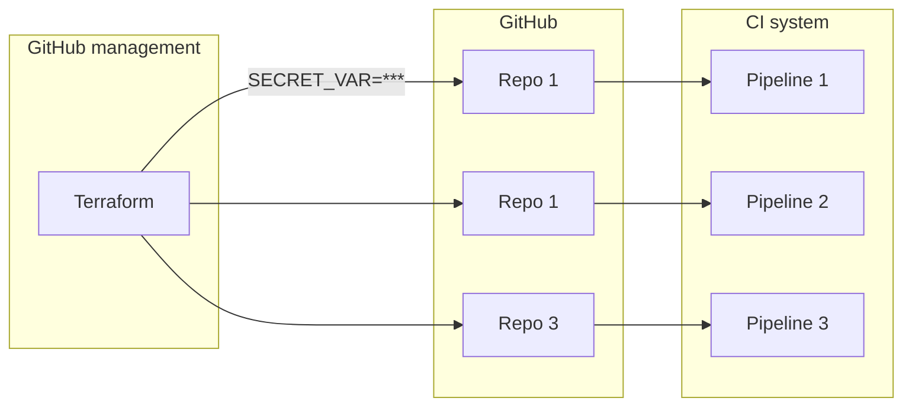
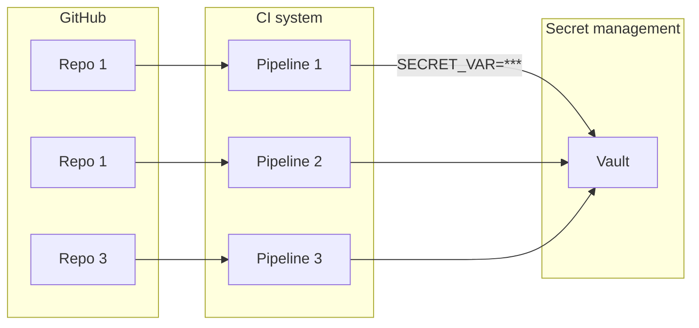

# Secrets management in build and deployment pipelines
I [recently wrote](https://andykuszyk.github.io/2023-03-15-bootstrapping-an-engineering-organisation.html) about what I thought were the key ingredients to success when bootstrapping a new engineering organisation. One of these ingredients is secrets management in build and deployment pipelines. In this post, I'm going to describe why I think this is so important, and provide some practical examples of how to get it right (and how to get it wrong!).

Secrets are required to build and deploy software. Normally when you start out, there are some simple, secure ways to inject secrets into your build and deployment pipelines. For example, with Travis you can use the CLI to commit an encrypted file to a repo, or add an encrypted environment variable. In GitHub Actions, you can add a secret to a repo, which you can safely use later in your workflows.

However, it doesn't take long before you've got lots of secrets in lots of different places. When this happens, the secrets themselves become hard to manage, and hard to maintain. You can't easily revoke or rotate them, or roll out new secrets automatically.

Ideally, when bootstrapping an engineering organisation, you want to establish a good way of injecting secrets into your entire build and deployment pipeline estate from day one.

## First, an example
What exactly am I talking about when I say "secrets management in build and deployment pipelines"? Let's start with a simple example to set the scene.

Say you have a project called Hello World, which has a simple Dockerfile:

```Dockerfile
FROM alpine
CMD echo 'hello world'
```

In your build and deployment pipeline, you want to build this Dockerfile, and publish it to a public Docker registry (for example Docker Hub). Let's assume you're using GitHub Actions for this. Your pipeline might look something like this:

```yaml
on: [push]
jobs:
  docker-publish:
    runs-on: ubuntu-latest
    steps:
      - uses: actions/checkout@v3
      - run: docker build -t andykuszyk/hello-world:latest .
      - run: docker push andykuszyk/hello-world:latest
```

Great; nice and simple. However, before you publish to the Docker registry, you're going to need to authenticate with it, which means you're going to need some credentials. You need something like this before the `docker build` step:

```yaml
      - run: docker login -u "andykuszyk" -p "n0tmyr3alpa22w0rd"
```

So, how are you going to do that without committing your credentials to source control? Well, there's normally a variety of ways you can do this with the CI system of your choice. In the case of GitHub Actions, you can store [encrypted secrets](https://docs.github.com/en/actions/security-guides/encrypted-secrets) alongside the repo itself via the repo settings:


If you add `docker_username` and `docker_password` secrets to your repo, then you can easily use them in your CI pipeline:

```yaml
on: [push]
jobs:
  docker-publish:
    runs-on: ubuntu-latest
    env:
      DOCKER_USERNAME: ${{ secrets.docker_username }}
      DOCKER_PASSWORD: ${{ secrets.docker_password }}
    steps:
      - uses: actions/checkout@v3
      - run: docker login -u "$DOCKER_USERNAME" -p "$DOCKER_PASSWORD"
      - run: docker build -t andykuszyk/hello-world:latest .
      - run: docker push andykuszyk/hello-world:latest
```

This has solved the problem for a single repo. When you're starting a new engineering organisation, you might start off with one (or a small number) of repos, which makes this approach effective. However, when the number of repos in your estate begins to grow, this approach becomes problematic. It's easy to lose track of what secrets are in use in which repos, and you're relying on people manually adding secrets in order to inject them into your pipelines. This means you need to grant everyone in your organisation access to your secrets, or rely on a small number of people to manage the secret injection.

Most problematic of all is that, one day, you'll need to revoke or rotate the secrets. If you've been manually adding them here, there, and everywhere, then this becomes a real problem. You have to go through every repo, and rotate them one by one.

What you really need is a nice, convenient way to manage the secrets centrally in a way that lets you deploy a single set of secrets to your estate of repos. That way you can see what is being used where, and rotate secret values easily.

## Two patterns for pragmatic secret management
In order to make managing secrets in CI easier in the long-run when building an engineering organisation, I think you need to achieve two things:

1. Manage secrets centrally.
2. Be able to rotate them easily.

Below are two patterns for secret management that will help you do this.

### 1. Inject secrets using Terraform
Rather than creating and updating secrets manually, you can manage them centrally by managing your estate of repos using Terraform. This is a good practice anyway, because it means that you can administer your repos en-masse in Terraform, and can restrict admin permissions to the user that Terraform uses, rather than granting it to your ordinary users.

In my description below, I will be focusing on GitHub and GitHub Actions secrets, although this pattern can just as easily be applied to other CI providers that expose some sort of secret storage functionality via an API.

The general idea with this pattern is that you manage your GitHub repos centrally in Terraform, and use Terraform to create secrets in each of your repos. CI pipelines in each repo can then access the secrets provisioned via Terraform:



What this looks like in reality is fairly straightforward. GitHub repos are easy to provision using Terraform:

```terraform
resource "github_repository" "hello_world_api" {
  name                 = "hello-world-api"
  description          = ""
  has_downloads        = true
  has_issues           = true
  has_wiki             = true
  has_projects         = true
  homepage_url         = ""
  vulnerability_alerts = true
  visibility           = "public"
  lifecycle {
    ignore_changes = [etag]
  }
}
```

Similarly, secrets can also easily be provisioned:

```terraform
resource "github_actions_secret" "hello_world_api_docker_username" {
  repository      = "hello-world-api"
  secret_name     = "DOCKER_USERNAME"
  plaintext_value = var.docker_username
}
```

Then, you just need a variable for injecting the value:

```terraform
variable "docker_username" {}
```

You obviously need a good way to actually set values for this secret, and systems like [Terraform Cloud](https://www.hashicorp.com/products/terraform/pricing) allow you to set sensitive values for a Terraform project, such that they can be injected using a Terraform variable. For this to work, you need to lock-down access to your Terraform Cloud account (especially to the state files, which will contain the secret values in plain text), however you do end up with a simple way of injecting secrets from a single place into your entire repo estate.

Furthermore, if you need to rotate a secret, the process is simple:

1. Update the value used by the Terraform variable.
2. Run a `terraform plan` and `terraform apply`.
3. Profit! All your repos are updated in one go!

### 2. Issue secrets from a secret manager
An alternative pattern to the approach described above, is to issue secrets to CI pipelines, rather than inject them in. A secret manager (e.g. [Hashicorp Vault](https://www.vaultproject.io/)) can be used as the central location of secrets, and can control issuing them to authorised clients. Provided your CI pipelines have a suitable mechanism of authenticating with the secret manager, they can then reach out on demand to fetch the secrets they need:



This approach has the advantage of avoiding the need to restrict access to the same Terraform workspace that manages your GitHub repos (although you still need to inject your secrets into the secret manager somehow), but does require additional infrastructure to run and manage the secret manager in the first place.

More importantly, it means that the secrets issued by your secret manager could be dynamically provisioned, and issued with short time-to-live. Rather than having static credentials that are valid for a long period (which could cause a lot of damage if they were stolen), your CI pipelines can use ephemeral secrets with such short lifespans that they wouldn't be very useful to an attacker.

## Summary
Managing secrets in your build and deployment pipelines is something that I think you need to get right early on when building an engineering organisation, otherwise it can become a logistical and security problem later.

In this post I've described two patterns for managing your pipeline secrets at scale:

1. Injecting them using infrastructure as code.
2. Issuing them using a central secrets manager.

In my opinion, the first pattern is easier to get up and running, and scales very well. However, it does require careful configuration to ensure the secrets are securely stored at the point of injection (e.g. in Terraform Cloud). It also has the disadvantage that all the secrets are static values with long expiry lifetimes.

The second approach separates the concepts of repo management and secret management, by introducing a dedicated secrets manager. Whilst this approach has advantages--notably by allowing the use of ephemeral secrets--it comes with the additional overhead of having to run and manage a separate secret manager (e.g. Vault).

However, I think both approaches are preferable to manually managing secrets on a repo-by-repo basis. It's all too easy to fall into that trap when you start out, which is why I think getting this right from day one is so important.
