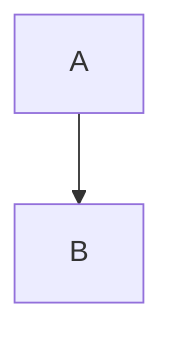

# Yet another guide for using Mermaid diagrams in GitHub pages
Using Mermaid diagrams in GitHub pages ought to be very easy. In fact, it is very easy! However, I found it surprisingly difficult to discover just how easy it was, so I'm summarising what I learnt in this post.

By default, if you include a Mermaid diagram like this in your Markdown GitHub pages files it won't be rendered:



In fact, the above is an example!

Jekyll has a plugin that support Mermaid, but you can't use it in GitHub pages. In order to render Mermaid in GitHub pages, you need to do two things:

1. Write your Mermaid diagrams in `<pre class="mermaid"></pre>` HTML tags.
2. Include the Mermaid Javascript directly in your Markdown source files.

An example of a Mermaid diagram in `<pre>` tags is as follows:

```markdown
<pre class="mermaid">
flowchart TD
     A-->B
</pre>
```

An example of including the Mermaid Javascript in your Markdown files is as follows:

```markdown
<script type="module">
	import mermaid from 'https://cdn.jsdelivr.net/npm/mermaid@10/dist/mermaid.esm.min.mjs';
	mermaid.initialize({
		startOnLoad: true,
		theme: 'dark'
	});
</script>
```

The result is a diagram which is correctly rendered like this:

<pre class="mermaid">
flowchart TD
     A-->B
</pre>

If you want to see the raw source files for this, just take a look at the [source for this page](https://raw.githubusercontent.com/andykuszyk/andykuszyk.github.io/master/2023-05-03-yet-another-mermaid-in-github-pages-guide.md).

<script type="module">
	import mermaid from 'https://cdn.jsdelivr.net/npm/mermaid@10/dist/mermaid.esm.min.mjs';
	mermaid.initialize({
		startOnLoad: true,
		theme: 'dark'
	});
</script>
