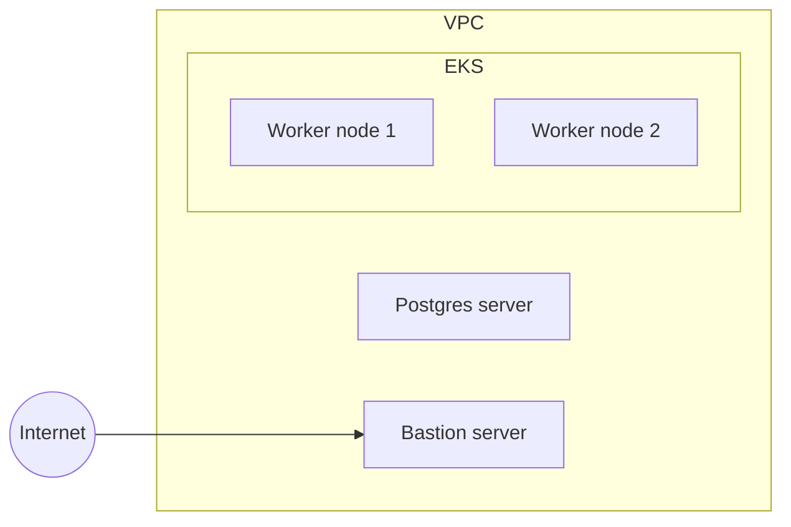

# Securing environment access from day one
I [recently wrote](https://andykuszyk.github.io/2023-03-15-bootstrapping-an-engineering-organisation.html) about what I thought were the key ingredients to success when bootstrapping a new engineering organisation. One of these ingredients was securing access to your environments from early on in the development of your engineering organisation.

You'll probably start with a development environment. Then you might need a testing environment. Soon enough you'll have a production environment, and in no time at all you'll have a fleet of environments to manage. For each environment, your engineers will need a variety of different means of access. For example:

- SSH access to compute nodes.
- Control plane access (e.g. via `kubectl`) to Kubernetes.
- Database access to your database servers.
- Command line or web console access to your cloud provider.

For some environments, you'll want engineers to have unrestricted access. In others, you'll want access to be tightly controlled, possibly with some kind of privilege escalation and auditing.

Access to your environments is a fundamental component to your engineering organisation, and getting this right at the beginning will allow your team to grow and build out a platform in a secure, safe way.

In this post, I'm going to provide some practical examples of how this can be achieved. These examples will necessarily be opinionated, and I hope that they serve as inspiration for your own ideas about how you might approach the problem of securing access to your organisations environments.

## Assumptions
Before we begin with some examples, let's make a few assumptions about what each of your "environments" might look like. Let's assume that:
- It's provisioned in AWS.
- It's network boundary is delimited by a VPC.
- You're running EC2 worker nodes inside your VPC.
- Your worker nodes provide compute capacity for an EKS Kubernetes cluster.
- You're running a database server of some kind inside your VPC.
- Your worker nodes and database server aren't exposed to the internet, so you run a bastion server to gain access from outside.

Taken together, this means each of your environments might look something like this:

## What problems are we solving here?
As your engineering organisation grows, so to will the number of environments you have, and the number of engineers who need to access them.

This blog post aims to outline some ideas to ensure that:
- Your environments are secured by default.
- Your environments are associated with access controls; development should be easier to access than production.
- Your engineers have all the tools they need to easily access environments when they need to.

I'm sure there are countless ways this could be achieved, and many other criteria you might be interested in. However, I will focus on these three objectives, within the context of the assumed environment set-up described above.

## SSH access to your servers
TODO

## Control plane access to EKS
TODO

## PSQL prompt access to your database server
TODO

## Command line and console access to AWS
TODO

## Summary
