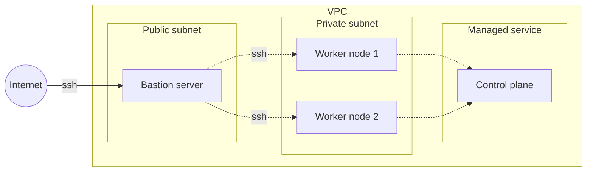
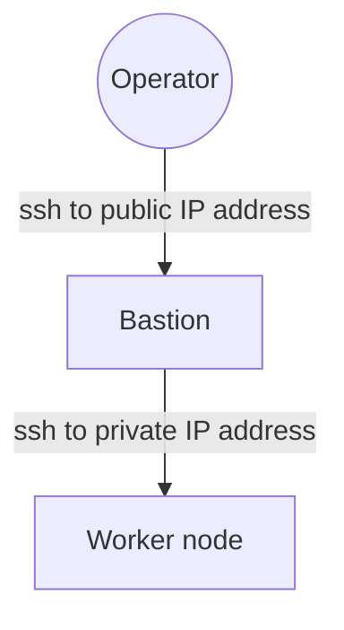
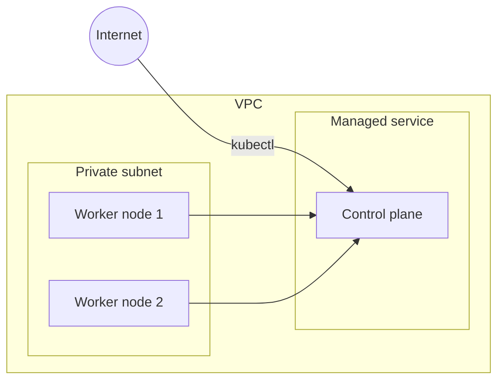
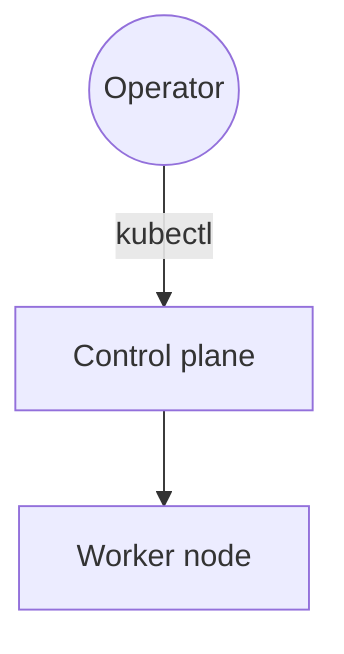
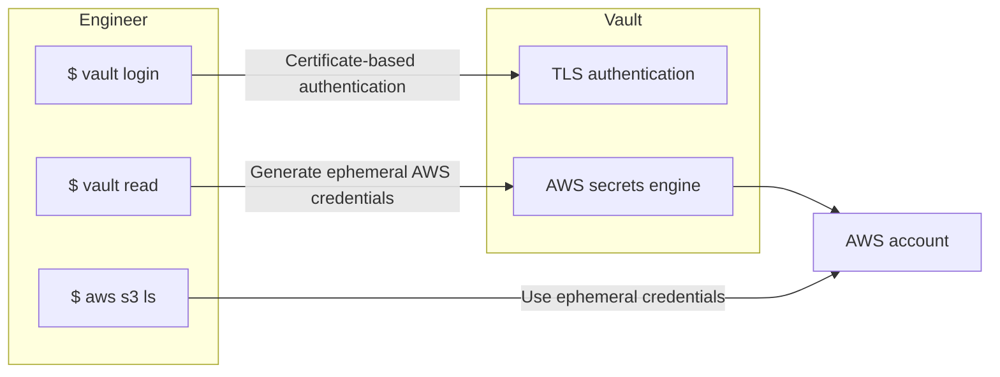
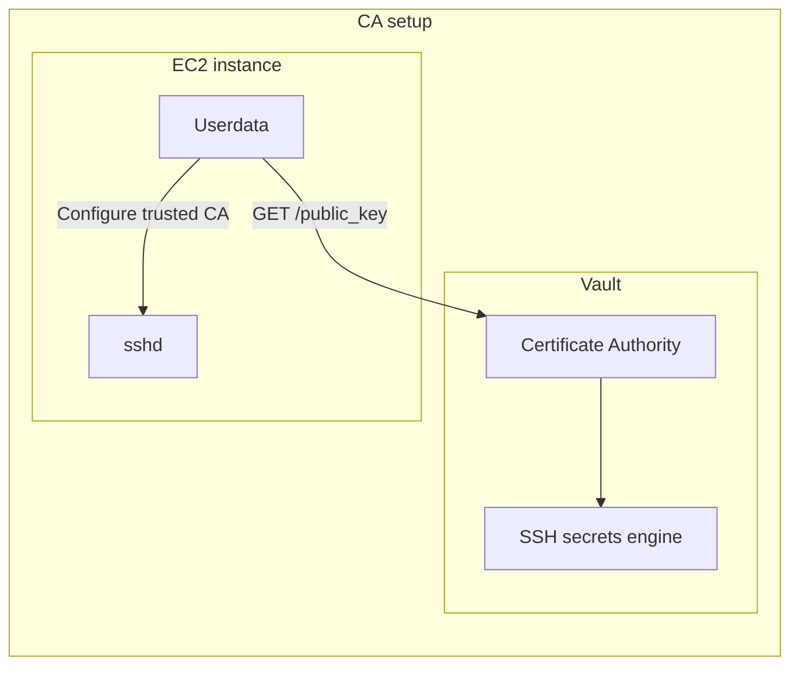
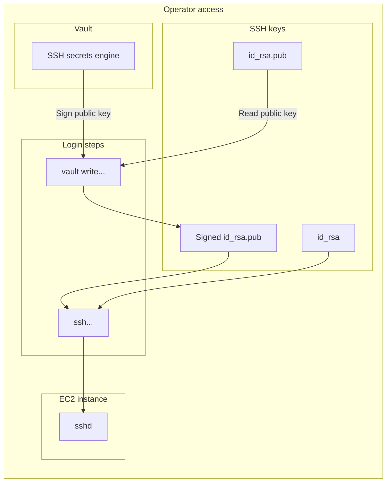

# Securing environment access from day one
I [recently wrote](https://andykuszyk.github.io/2023-03-15-bootstrapping-an-engineering-organisation.html) about what I thought were the key ingredients to success when bootstrapping a new engineering organisation. One of these ingredients was securing access to your environments from early on in the development of your engineering organisation.

You'll probably start with a development environment. Then you might need a testing environment. Soon enough you'll have a production environment, and in no time at all you'll have a fleet of environments to manage. For each environment, your engineers will need a variety of different means of access. For example:

- SSH access to compute nodes.
- Control plane access (e.g. via `kubectl`) to Kubernetes.
- Database access to your database servers.
- Command line or web console access to your cloud provider.

For some environments, you'll want engineers to have unrestricted access. In others, you'll want access to be tightly controlled, possibly with some kind of privilege escalation and auditing.

Access to your environments is a fundamental component to your engineering organisation, and getting this right at the beginning will allow your team to grow and build out a platform in a secure, safe way.

In this post, I'm going to outline a few ways of tackling this problem. This is a very broad subject, which is also very deep. There are many ways of solving this problem, and each solution can be individually quite complicated. Rather than delving into the details of just one idea, I'm going to outline a few, and give you some simple examples. These examples will necessarily be opinionated, and I hope that they serve as inspiration for your own ideas about how you might approach the problem of securing access to your organisations environments.

## A taxonomy of environment types
Before we start talking about securing environment access, I want to classify a few basic patterns for building an environment. Each of these types has different access characteristics, and it will be convenient to compare them using a simple name. This list is by no means exhaustive and, if anything, is simply a product of my experience to-date.

1. Static compute with SSH.
2. Static compute without SSH.
3. Dynamic compute.

Let's brief explore each of these categories with a simple example, so I can show you what I mean.

### 1. Static compute with SSH
When I refer to environments comprising of static compute with SSH access, I'm talking about one where you run a set of virtual machines, and your primary means of access is SSH.

You might run a pool of EC2 instances that run your software, or which provide the compute capacity for a container scheduler like Kubernetes. You might want to administer and operate your environment primarily by accessing these machines over SSH, and you might facilitate access to these machines using a bastion server. Here's an example of what this setup might look like:



In this example, your worker nodes run in a private, secure subnet, with no direct access to the internet. They may connect to a managed service control plane, e.g. EKS. You run a bastion server alongside them, which has internet access, and you use the bastion to mediate access further into your environment.

A typical access control flow would be:



I would describe this as a fairly typical set-up, although it is not without its complexities and disadvantages.

### 2. Static compute without SSH
Static compute without SSH is very similar, except that you treat the underlying compute nodes providing capacity to your container scheduler as immutable, and ephemeral. You operate your environment entirely through the control plane of your scheduler, and don't permit direct SSH access to your compute nodes at all. Following on from the example above, an environment like this might look as follows:



In this configuration, you don't need to expose any compute nodes directly to the internet. Instead, you rely soley on your nodes communicating with your schedulers control plane, and then mediate operator access directly with the control plane itself.

For example, an operator might gain access as like this:



This has some security benefits in terms of limiting the footprint of your estate on the internet, but can be difficult to manage and troubleshoot in the event that things going wrong with your underlying hosts.

### 3. Dynamic compute
The third configuration I wanted to describe is one where you have no control over the underlying compute whatsoever. This might take the form of fully managed compute nodes for your container orchestrator (e.g. AWS Fargate), or serverless functions (e.g. AWS Lambda).

Irrespective of the mechanism, environments consisting of dynamic compute have no logical compute that you can directly access; the only thing your concerned with is the software running on top of the compute.

## Securing access
Now, when it comes to securing access to your environments, the main point of discussion is the first hop an operator would need to make in the configurations described above. For static compute with SSH, this is the SSH connection to the bastion. For static compute without SSH, this is authentication with the control plane. For dynamic compute, this is either authentication with the control plane, or no authentication at all!

So, that leaves us with two primary challenges:
1. Securing control plane access (i.e. securing cloud credentials).
2. Securing SSH access.

Securing control plane access is largely a vendor-specific issue once an operator is in possession of valid credentials. SSH access is a little more open ended. These are the two topics I'm going to focus on in this blog post.

## 1. Securing cloud credentials
### 1.1 Running Vault
In this section, I'm going to focus on automating access to your AWS environment using Hashicorp Vault. Running Vault securely could be another blog post by itself, so I simply assume that you've got a Vault instance running somewhere.

When I was working on this blog post, I signed up for a free account for Hashicorp Cloud Platform, and provisioned an instance of Vault with a public IP address. Whilst this probably isn't what you want in real life, it will get you up and running with the examples provided here.

You may also be able run a local development instance of Vault with a command similar to the following:

```sh
$ vault server -dev -dev-tls -dev-root-token-id root
```

This will run a local development server of Vault, with TLS enabled, and with a root token of `root`. It's worth noting that if you do this, any HTTP requests to the server will need to skip TLS verification (or use the temporary certificate authority generated for the development server). This can be done on Vault CLI commands using the `-tls-skip-verify` option, or by setting the `VAULT_CACERT` environment variable (the value for which is printed when the development server starts).

### 1.2 Automating credential generation
Before we start talking about accessing resources in your environments, we need to talk about how you authenticate with AWS in the first place. You probably have different AWS accounts for development and production, and you'll probably start off with a team small enough for you to create new user accounts in each of your AWS accounts when new people join your team. However, creating access manually is problematic for a couple of reasons:
- It doesn't scale well as your team grows; you need to grant access to multiple AWS accounts for every user that joins, and remove access when they leave.
- The user themselves can generate long-lived access keys, which could cause a lot of damage if they were compromised.
- You'll need some kind of manual process for privilege escalation when granting users access to production environments.

The approach I will describe here involves dynamically provisioning access to AWS--both on the command line, and in the web console--using Vault. The user authenticates with Vault, and then Vault uses what it knows about the user to grant them access to a particular account.

This is a little easier to manage as your organisation grows, and also allows you to add some automation around privilege escalation. It also forms the foundation of the other access controls described later in this post.

At this point, I'm assuming you've got a working installation of Vault, and an AWS account that you want to automate access to. The basics of this approach involve your engineers authenticating with Vault using TLS certificates, Vault issuing temporary AWS credentials, and then your engineers using these credentials to access the AWS CLI and web console. This idea is illustrated below:



I'm going to break this approach down into four stages, and provide some practical examples for each:
1. Authentication with Vault.
2. Setting up the AWS secrets engine in Vault.
3. Generating ephemeral AWS credentials.
4. Using the AWS CLI and console with ephemeral credentials.

#### 1.2.1 Authentication with Vault
One of the great things about Vault is the plethora of ways for a user to authenticate with Vault. I couldn't do justice to it to describe them all here, but I will briefly describe one way of managing authentication with Vault at scale.

The TLS authentication method can be used in combination with a physical hardware token, such as a Yubikey, and the Vault Terraform provider to effectively manage access to Vault at scale. In brief, you could:

- Issue your engineers with Yubikeys.
- Grant them access to Vault by adding their public keys to source control, and provision them using Terraform.
- Permit and deny access directly through source control, as well as controlling permissions and access through Terraform with Vault roles.

With these things in place, your engineers can securely authenticate with Vault using the private key stored on their Yubikey, along with a PIN known only to them. This provides a secure way for operators to gain access to Vault, which will be the cornerstone of the access controls described in this post.

### 1.2.2 The AWS secret engine
When you have Vault running, and an AWS account you want it to issue credentials for, you can set up its AWS secrets engine to be able to provision ephemeral access keys.

To do this, log in to your AWS account with your root credentials, and create a new user for Vault to use. This user should have administrative permissions. Generate an access key and secret access key for this user, and keep these values safe--they are the keys to your kingdom! These will be long-lived, and very powerful credentials that Vault uses to provision all other user accounts, so they need to be protected.

Next, enable the AWS secrets engine in Vault, and configure it with the access key you just generated:
```
$ vault secrets enable aws
Success! Enabled the aws secrets engine at: aws/
$ vault write aws/config/root \
    access_key=<your-access-key> \
    secret_key=<your-secret-access-key> \
    region=us-east-1
Success! Data written to: aws/config/root
```

Once this is done, Vault can now authenticate with AWS and generate credentials.

### 1.2.3 Generating ephemeral AWS credentials.
Now that Vault can authenticate with AWS, we need a role that can be used to generate ephemeral credentials for a user. This is the role that will be associated with the ephemeral credentials issued to your users, and will describe what actions they can perform in your AWS account. You could easily use a variety of roles--each with different levels of permissions--and restrict which roles you engineers can access based on the Vault path permissions. In this example, the `developer` role has all permissions for EC2, and permission to create federation tokens (which is needed for web console access):

```
$ vault write aws/roles/developer \
    credential_type=iam_user \
    policy_document=-<<EOF
{
  "Version": "2012-10-17",
  "Statement": [
    {
      "Effect": "Allow",
      "Action": "ec2:*",
      "Resource": "*"
    },
	{
      "Effect": "Allow",
      "Action": "sts:GetFederationToken",
      "Resource": "*"
    }
  ]
}
EOF
Success! Data written to: aws/roles/developer
```

A user authenticated with Vault can then generate ephemeral AWS credentials by simply reading from this path:

```
$ vault read aws/creds/developer
Key                Value
---                -----
lease_id           aws/creds/developer/lv1unjkhfJRvSOqe74RzbbEF.ucVqf
lease_duration     1h
lease_renewable    true
access_key         HJHJKLHJKHJKGISC7FLD
secret_key         nQeiHx6/2w5dashjfklh3j4klhlkjhkjslyhmJVN
security_token     <nil>
```

### 1.2.4 Using the AWS CLI and console with ephemeral credentials
Now that your operators have the ability to generate ephemeral AWS credentials using Vault, they can easily interact with AWS from the command line by exporting the access key and secret key into a shell environment:

```
$ export AWS_ACCESS_KEY_ID=HJKHKJHJKHJKHKJHBKGI
$ export AWS_SECRET_ACCESS_KEY=eahfklhgkulhjkl.rehkghkh248937hjgh
```

Gaining access to the AWS console using these credentials is a little more involved, but mainly involves gaining federated access using `aws sts get-federation-token`.

## 2. Securing SSH access
Once your engineers can reliable authenticate with Vault, you can also leverage Vault's [SSH secrets engine](https://developer.hashicorp.com/vault/docs/secrets/ssh/signed-ssh-certificates) to automate SSH access to your servers.

This involves using Vault as a certificate authority (CA) which is trusted by the `sshd` daemon on your servers, and which signs the SSH keys of your clients (i.e. your engineers' machines).

Before your operators can authenticate with your hosts in this way, you'll need to complete these pre-requisites:
1. Configure Vault as a certificate authority.
2. Configure the Vault backend of SSH key signing.
3. Download the CA root certificate in userdata when machines start, and configure `sshd` to trust it.

These steps are illustrated below:



Then, when an operator tries to login, they will perform these steps:
1. Request Vault to sign the public key of the local SSH keypair.
2. SSH with the signed public key, and the original private key.
3. `sshd` on the host will verify the signature using the CA from Vault.
4. Access will be granted.

This process is illustrated below:


This approach leverages the access your engineers already have to Vault, and extends it to control SSH permissions at scale. You can control which classes of machines or environments operators have access to using Vault policies, and only need to manage the distribution of the certificate authority materials to your compute nodes, rather than managing fleets of SSH keys.

## Comparison of environment types
TODO

## Closing thoughts
TODO
