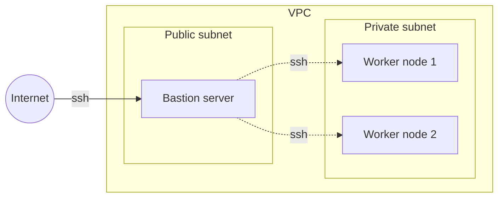
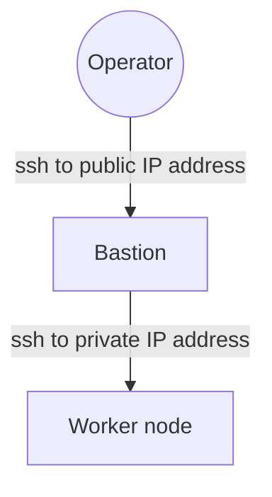

# Securing environment access from day one
I [recently wrote](https://andykuszyk.github.io/2023-03-15-bootstrapping-an-engineering-organisation.html) about what I thought were the key ingredients to success when bootstrapping a new engineering organisation. One of these ingredients was securing access to your environments from early on in the development of your engineering organisation.

You'll probably start with a development environment. Then you might need a testing environment. Soon enough you'll have a production environment, and in no time at all you'll have a fleet of environments to manage. For each environment, your engineers will need a variety of different means of access. For example:

- SSH access to compute nodes.
- Control plane access (e.g. via `kubectl`) to Kubernetes.
- Database access to your database servers.
- Command line or web console access to your cloud provider.

For some environments, you'll want engineers to have unrestricted access. In others, you'll want access to be tightly controlled, possibly with some kind of privilege escalation and auditing.

Access to your environments is a fundamental component to your engineering organisation, and getting this right at the beginning will allow your team to grow and build out a platform in a secure, safe way.

In this post, I'm going to outline a few ways of tackling this problem. This is a very broad subject, which is also very deep. There are many ways of solving this problem, and each solution can be individually quite complicated. Rather than delving into the details of just one idea, I'm going to outline a few, and give you some simple examples. These examples will necessarily be opinionated, and I hope that they serve as inspiration for your own ideas about how you might approach the problem of securing access to your organisations environments.

## A taxonomy of environment types
Before we start talking about securing environment access, I want to classify a few basic patterns for building an environment. Each of these types has different access characteristics, and it will be convenient to compare them using a simple name. This list is by no means exhaustive and, if anything, is simply a product of my experience to-date.

1. Static compute with SSH.
2. Static compute without SSH.
3. Dynamic compute.

Let's brief explore each of these categories with a simple example, so I can show you what I mean.

### 1. Static compute with SSH
When I refer to environments comprising of static compute with SSH access, I'm talking about one where you run a set of virtual machines, and your primary means of access is SSH.

You might run a pool of EC2 instances that run your software, or which provide the compute capacity for a container scheduler like Kubernetes. You might want to administer and operate your environment primarily by accessing these machines over SSH, and you might facilitate access to these machines using a bastion server. Here's an example of what this setup might look like:

In this example, your worker nodes run in a private, secure subnet, with no direct access to the internet. You run a bastion server alongside them, which has internet access, and you use the bastion to mediate access further into your environment.

A typical access control flow would be:

### 2. Static compute without SSH

### 3. Dynamic compute
