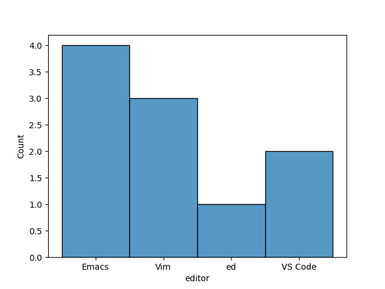

# Visualising data analysis in Emacs org-mode
Before I had first started using Emacs, a colleague of mine was extolling the benefits of org-mode. He said something along the lines of:

> You can even run blocks code, and perform data analysis, just like in a Jupyter notebook.

Well, when I started using Emacs, I soon realised the benefits of running code in org-mode, and it has become a common part of my workflow. However, it wasn't until recently that I actually had a need to perform some data analysis, and I remembered the sage words of my colleagues.

What I wanted to do was:

1. Load some data into Python using `pandas`.
2. Explore it a bit.
3. Plot a chart using `seaborn`
4. See the chart appear--as if by magic--directly within Emacs.

Steps (1) and (2) are pretty straightforward to do with regular org-mode code blocks, but I had to Google how to do step (4). In this blog post, I'm just going to briefly summarise how you do it.

## In the beginning, there was Data
First, we need some data. Here's some real-world data about the text editors that some well-known computer users prefer. I've included an org-mode snippet showing how you could write this to disk from within Emacs.

```org
#+begin_src bash :results output file :file data.njson
echo '{"name": "Spock", "editor": "Emacs"}
{"name": "James Kirk", "editor": "Vim"}
{"name": "Dr McCoy", "editor": "Vim"}
{"name": "Scotty", "editor": "Emacs"}
{"name": "Worf", "editor": "ed"}
{"name": "Geordi LaForge", "editor": "Emacs"}
{"name": "Data", "editor": "Emacs"}
{"name": "Jean-luc Picard", "editor": "VS Code"}
{"name": "Wesley Crusher", "editor": "VS Code"}
{"name": "William Riker", "editor": "Vim"}
'
#+end_src
```

The key to this source block is the `:results output file` header argument, and the corresponding `:file data.njson`. This tells org-mode to save the output of the code block to a file, rather than displaying the `stdout` in-buffer, and that the results should be saved to a file called `data.njson`.

## Visualising the data, directly in org-mode
Now, we can load that data into `pandas`, and visualise it with `seaborn`:

```org
#+begin_src python :results output file :file usage.png
import pandas as pd
import seaborn as sns
import sys

df = pd.read_json("data.njson", lines=True)
axes = sns.histplot(df, x="editor")
axes.get_figure().savefig(sys.stdout.buffer)
#+end_src
```

The main tricks in use here are:
- The `:results output file` and `:file usage.png` header arguments to save the `stdout` to a file called `usage.png`, just like when we created the data.
- Saving the chart to `sys.stdout.buffer`, which causes Python to write the bytes of the image to the `stdout` file descriptor.

Since Python is writing the image to `stdout`, and org-mode is saving the `stdout` to a file, this all works nicely to save the image to disk, and display it directly in the org-mode buffer.

## Results
And, of course, the results are unsurprising:


