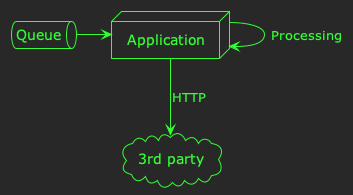
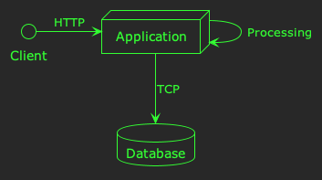
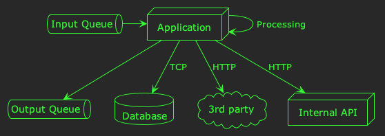
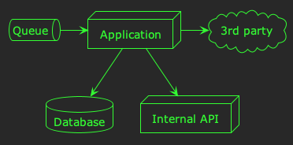
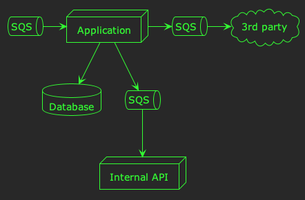
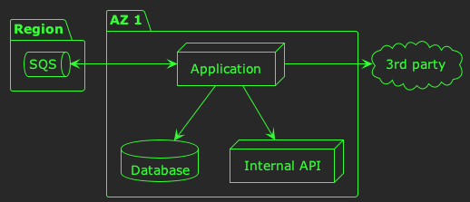
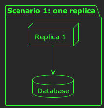

# A practical checklist for building distributed systems 

## Introduction

When I worked at Form3&#x2013;particularly during a period when I was designing a new payments system&#x2013;I worked with several teams of engineers to design new components in a highly distributed system. The software components themselves were distributed; running in several different locations, with lots of asynchronous inputs. However, their underlying platform was also distributed; relying on [CockroachDB](https://www.cockroachlabs.com/) for data storage, and [JetStream](https://docs.nats.io/nats-concepts/jetstream) for messaging.

There are many traps it's easy to fall into when building new components in an environment like this. Sometimes we would catch these early in the design process, and sometimes they would be caught later during peer review. Occasionally they didn't come up until we started performing load and chaos testing on the system. Luckily none of them made their way to production 😅

As we iterated on our design process&#x2013;which we repeated many times as the payments system took shape&#x2013;we created a checklist of ideas to consider when designing a new part of the system. I thought this was an incredibly valuable prompt for conversations about the draft design; it ensured we considered what we planning from a variety of different angles and failure scenarios, before we'd even begun to write the code.

Below is a list of the main items that were on the checklist, with a description of why its valuable, and its context for designing distributed systems. I hope this prompts some interesting questions for you, whenever you're designing distributed systems in the future.

## Network boundaries and failure

In any distributed system, there will be network boundaries between components. These might be HTTP requests one program makes to another, database connections, or publication/consumption of messages to a broker. Each of these network boundaries introduces a significant source of failure, so any design that introduces new network boundaries should carefully consider how failure will also be managed.

Let me give two simple examples of how you might decide to handle failure. First, let's say you're introducing a feature which will make an HTTP request to an external system when it processes a message from a queue:

Typically, a message broker that asynchronously delivers messages to your application will have a robust mechanism for retrying the delivery of messages, and eventually doing something with them if they continually fail (e.g. sending them to a dead-letter queue). In this case, the simplest way of dealing with failure at the HTTP boundary is to fail the entire processing pipeline, and rely on the message's delivery being retried by the message broker.

Another example is of an application whose inputs are HTTP requests, with an upstream network boundary to a database:

If there is a problem with the TCP connection between the application and its database, processing the HTTP request might fail (e.g. inserting a record in the database). In this case, the simplest way to deal with database-level failure would be to simply return a descriptive status code to the client, e.g. a 500. Returning a failure code like this assumes the client will retry the input request in the future.

However, things get more difficult if these examples get a little more complex:

In this example, when the application processes a message from the input queue, it does several things in succession. It publishes a message to an output queue, writes to a database, sends an HTTP request to a third party, and sends an HTTP request to an internal API. Any one of these network boundaries could cause a failure, so simply relying on retries originating from the input queue isn't enough.

In addition to identifying network boundaries as a source of failure, we also need to consider idempotency, retry logic, and duplicate checking. These topics are explored below, but it's also worth mentioning that some good patterns for dealing with this situation are [transactional outbox](https://microservices.io/patterns/data/transactional-outbox.html) or [event sourcing](https://microservices.io/patterns/data/event-sourcing.html), combined with [the saga pattern](https://microservices.io/patterns/data/saga.html).

## Idempotency, retries, and duplicate checking

In the example above, there are two ways of dealing with failure at each of the network boundaries:

1.  Retry the network communication in-process until it is successful.
2.  Fail the entire pipeline of processing back to the input message, and retry all the network I/O.

In practice, a combination of the two approaches is often necessary. Communication over each boundary could be retried over a short timescale to see if this results in successful communication. For example, if sending the HTTP request to the internal API fails, the application could retry it 5 times every 100 ms. However, a long duration of retries (e.g. an exponential backoff lasting several seconds) puts the operation at risk of being interrupted (e.g. by a termination signal); more on this later. If the failure cannot be mitigated by short-term retries, then the entire pipeline should be aborted; this relies on the initial message queue boundary to retry the segment of processing which includes this gauntlet of network I/O.

This could be dangerous if not done carefully. Duplicate messages could be sent to the output queue, duplicate records written to the database, and multiple resources created in upstream APIs when only one is expected. In order to retry the network I/O safely, each network boundary must have logic that ensures it is idempotent. For example:

-   Messages sent to a message queue should have an immutable identifier that won't change if they are re-sent in the future.
-   Records written to a database should have a deterministic primary key, such that inserting them more than once will fail.
-   Resources created in an API should have the same ID on every attempt, so that the upstream API can determine if the resource has been created in the past.

This should make your application very robust to retrying its communication over network boundaries. Sometimes it is difficult to get this right when dealing with third party systems, but most of the time they have a mechanism for your to build your client in an idempotent way.

## Disaster recovery 

Designing disaster recovery strategies for software systems is a large topic in itself, however it's useful to have disaster recovery in mind when building new components in a distributed system. I like to think about this at three levels:

1.  The component level; what happens when an individual component is unavailable?
2.  The data center (or availability zone) level; what happens when a data center is unavailable?
3.  The region level; what happens if a cloud region is unavailable?

How much effort you invest in each of these levels may vary based on your use-case. Your application might not be critical enough for you to worry about seemlessly surviving outages of an entire cloud region, or it might be a global, mission-critical system that has to be always-on. Either way, considering the first two levels can still bring value in the design process for a distributed system.

### Disaster recovery at the component level

As described in the network boundaries section above, your application is probably connected to several other software components over a network. Some of these might be other internal systems, others might be databases, etc:

When designing a system to communicate with each of these other components over a network, it's worth considering how the application will behave if each component is unavailable. In the sections above, we discussed a generalised way of handling such failure, but it may be worth considering each component in its own right. The approach discussed above was quite simplistic, but it might be worth introducing more components to try to make the application more resilient to component-level failure. This might become a trade off between the perceived resilience of different components in your system. However, you might consider services offered by a cloud provider much more resilient than other parts of your system, in which case it might make sense to rely on them more. For example, if your message queues are provided by AWS SQS, maybe you'll want to introduce buffers between your application and failure-prone components so that you can employ the same message/retry scenario in specific use-cases:

### Disaster recovery at the data center level

Disaster recovery at the level of data centers&#x2013;or availability zones&#x2013;is more a question of how you plan to run your application, than it is of how you design it to function. Provided you've already considered its resiliency to network failure, you also need to consider what happens when the compute infrastructure running your application (and its dependencies) becomes unavailable.

Consider the following example:

In this scenario, your application makes use of a regional cloud service (SQS), and is deployed in a single AZ alongside its dependencies. However, assuming you make use of a cloud service&#x2013;or some other technology&#x2013;that allows your database to be replicated across AZs, and the team that maintains the internal API has already solved this problem, the following diagram is probably more realistic:

As a result, the main things to consider when protecting against availability zone disasters are that:

-   The application depends on resources which are already as distributed geographically as possible.
-   The application itself is geographically distributed, and that running many concurrent replicas of it won't result in unusual behaviour.

Ideally, this is the target state for the application:

## Horizontal scaling and process heterogeneity

One of the advantages of building a distributed system is that you can scale individual components based on the traffic demands and compute requirements of each program. However, when designing new functionality in a distributed system, it's important to consider how the program will behave when it scales horizontally. In other words, how will its behaviour differ in these two scenarios:

For me, there are two main considerations when thinking about your program scaling from scenario 1 to 2:

1.  Will your program's dependencies be able to cope with many replicas? E.g. can your database handle a large number of clients?
2.  Will your program behave correctly when there are many instances of it running concurrently?

The first consideration can often be thought about in terms of the specific technologies you're using. For example, perhaps you're using Postgres, and you might need to consider introducing an in-network connection pooler. Or, perhaps you're using a distributed database which will also scale horizontally in the event of increased traffic.

However, the second consideration can be a little more complicated to think about. It requires understanding the domain your program operates in, and how it functions. In general, programs that have no special "sense of self" will probably work well without special modifications. These are the programs that don't consider themselves leaders, or have any logic that assumes they are the only process performing a piece of work. However, if you do have a program that assumes it is the only one performing certain types of work, then it might require careful thought before being ready for horizontal scaling.

## Planned and unplanned process termination

A distributed system is likely to be running in a number of ephemeral containers, especially if it is designed with horizontal scaling in mind. This means that your program could receive a termination signal at any time, and&#x2013;occasionally&#x2013;experience unplanned termination. When designing new functionality for your system, it's important to keep in mind that any execution could be interrupted with relatively little notice. As a result, it's best to restrict in-memory processing to short lived operations. If you have a long-running pipeline of tasks (such as the example illustrated at the beginning of this post) that need to be executed, you could consider breaking them up into smaller chunks which can then be distributed amongst your pool of processes. This may require some additional orchestration, such as using the [saga pattern](https://microservices.io/patterns/data/saga.html), but it will limit the amount of work being performed at any time which could be unexpectedly interrupted.

For example, let's say your program responds to some queued input, and carries out a three step processing pipeline, before sending its output to another queue. Each step can take several seconds, and the entire pipeline could take up to a minute:

If the program is interrupted during the execution of the third step, it will need some mechanism to retry the work from the input queue. As we've already discussed, it will need a way to do this idempotently to avoid the side-effects of steps 1 and 2 being repeated. This might be sufficient for your use-case. However, if the processing pipeline is lengthy, or the individual steps costly, you might want to decompose the pipeline so that only the step that is interrupted is retried.

As described in the [saga pattern](https://microservices.io/patterns/data/saga.html), one way of doing this is to separate each step via its own (or a shared) processing queue, and allow your program to individually process each step in turn:

Another advantage this has is your application can more accurately scale to the different demands of each step in the process, and make better use of your underlying compute infrastructure.

## Summary

So, there's our checklist. When we were designing new areas of a distributed system, we would review our drafts against the following topics:

-   Network boundaries and failures.
-   Idempotency, retries, and duplicate checking.
-   Disaster recovery at the component, AZ, and region level.
-   Horizontal scalability.
-   Process termination.

This isn't an exhaustive list of things to think about when designing a distributed system, but it was a good practical reminder of common problems to watch out for. Ultimately, it always led to a productive discussion about proposed designs, and helped improve the quality of our software before we'd started writing code. I hope you find it useful as inspiration for your own conversations!

