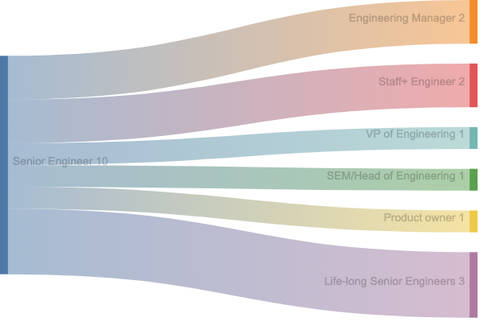

# Table of Contents

1.  [Where do all the senior engineers go?](#org086996e)

# Where do all the senior engineers go?

Earlier in my career, I often wondered where all the senior engineers went 🤔

It might have just been the sorts of companies I was working at, but it seemed that people progressed from junior to senior engineers and then&#x2026;just disappeared! There weren't any older senior engineers around, and I ended up wondering: where are all the senior engineers in their 40s, 50s, and 60s? As I get further into my career, I'm also wondering: what will I be doing in my 50s and 60s?

As time has gone by, I've started to notice more and more roles that have "senior engineer" as a common ancestor. Some people stay as a senior engineer for a long time (it's sometimes referred to as the [career level](https://staffeng.com/guides/overview-overview/) for software engineers).

However, I've also noticed that a lot of people in leadership roles like engineering managers, senior engineering managers, heads of engineering, and VPs of engineering, all had "senior engineer" somewhere in their career history.

Not only that, but there are also a range of technical leadership roles (such as lead, staff, and principle engineer) that have "senior engineer" as their root.

I've spoken to some people in product ownership and management roles who transitioned from software engineering to product at some point in the past as well.

So it turns out, "senior engineer" leads many places. Here's my view of where 10 senior engineers might end up in the future of their career:

That's why I couldn't find all the senior engineers earlier in my career; I was looking in the wrong place! They're not necessarily turning out code still (although they might be doing so with great skill). Instead, they might be leading projects or teams, evolving products, designing new systems, or drafting company strategies.

Actually, if you look closely, senior engineers are everywhere in software companies; you just have to know where to look! 👀

