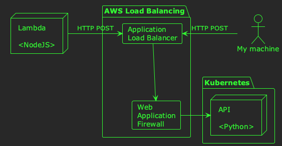

# Debugging phantom HTTP 400 responses

I recently spent an entire week debugging an unusual situation involving unexplained, intermittent 400 responses to seemingly well-formed HTTP requests. Throughout the week, I tried a variety of things to debug the situation, pulled out more than a little of my hair, and finally stumbled across the solution.

Although&#x2013;at times&#x2013;frustrating, it was a great opportunity to explore some new infrastructure, and practice some network debugging skills. So much so, that I thought I would summarise the problem, how I debugged it, and the solution in a blog post. If you ever have the same problem in the future, I hope your Google searches bring you straight to this page to save you all the trouble!

## The problem

In essence, the problem was that I had a NodeJS Lambda sending HTTP POST requests to a Python server:

About 60% of the time these requests would succeed, the API would receive the body of the request, and return a 200 response. However, the rest of the time, the API was receiving an empty body, and returning a 400 response.

Why was the API receiving an empty body? Was the Lambda not sending a payload? Was the API failing to decode it? Was some intervening network infrastructure truncating the body?

I had no idea! 🙃

## What I tried 🔎 

Alright, so here's a list of things I tried in roughly timeline order:

### Adding logging to the API

I logged the length of the body, and whether or not any fields were present in it. After several attempts at this, I concluded that when the API returned a 400, it was because the body really was empty.

Why was the body empty? 🤔

### Adding logging to the Lambda

I added logging progressively closer to the point where the HTTP request was being sent. As far as I could tell from the logs, the Lambda was sending a request. The Lambda was using the NodeJS [https](https://nodejs.org/api/https.html#httpsrequesturl-options-callback) library to send requests, and was doing something like this:

    const https = require('https');
    
    const uri = new URL(apiAddress);
    
    // The actual request body here.
    const payload = {
      'spam': 'eggs',
    }
    
    const options = {
      hostname: uri.hostname,
      method: 'POST',
      path: uri.pathname,
      headers: {
        'Content-Type': 'application/json',
      },
    };
    
    const req = https.request(options, (res) => {
      // Code to handle the response here
      });
    });
    
    req.write(JSON.stringify(payload));
    req.end();

If the Lambda was definitely sending a body, and the API definitely wasn't receiving it, what was going wrong?

### Identify a failing payload

If the Lambda was sending a body, and the API wasn't receiving it, maybe there was something strange about particular payloads which caused the problem. I managed to identify a problematic payload, and recreate the issue by triggering the Lambda to process the same payload. Now I was getting somewhere! I could manually reconstruct the rest of the HTTP request, and try sending it myself.

### Sending HTTP requests from within the API's pod

My first attempt was to try running a shell inside the API's server container so that I could send the request directly to the server process without anything getting in between. I ran a shell inside the server's container like this:

    kubectl exec -it pod-name -c container-name -- bash

So far so good, except there were no utilities (like `curl`) installed in the container image for me to send HTTP requests with. That's a good thing really, since ideally all server images like this one should even be distroless, and not even contain a shell.

### Sending HTTP requests from an adjacent pod in the same namespace

Rather than sending the HTTP request from the same container, I tried sending it from an adjacent pod in the same namespace:

    kubectl run -it andy-debug --image nicolaka/netshoot

The `nicolaka/netshoot` is an excellent container image containing an array of useful network debugging utilities. In this case, I just needed `curl`. I sent the HTTP request that causes a 400 when sent from the Lambda, and&#x2026;received a 200 response 🤔

### Sending HTTP requests from my machine with `curl`

OK, so I got a 200 response when sending the request over the Kubernetes overlay network, but what about across the internet like the Lambda does?

In fact, at this stage, I took a quick diversion to find out how exactly the Lambda was sending requests to the API. The Lambda was using a public DNS address for the API; something like `https://api.company.com`. I took a look at the DNS record for this name using `dig`:

    dig api.company.name

The result showed me that the DNS address was CNAMED directly to an AWS load balancer, and the load balancer was essentially just routing requests directly to the Kubernetes cluster hosting the API. This meant that whether or not the request originated from the Lambda, or my machine, it would follow the same network route:

> 💡 I checked the AWS configuration, and noticed that the ALB was configured to use a WAF as well.

Anyway, sending the request from my local machine to the API was the same as sending it from my `netshoot` pod:

    curl https://api.company.com/route \
         -v \
         -H 'Content-Type: application/json' \
         -d '
    {
      "spam": "eggs"
    }'

This resulted in a 200 response as well. So I get a 200 response when:

-   I send the request from within the cluster, using `curl`.
-   I send the request across the internet, using `curl`.

But, I get a 400 response when:

-   The Lambda sends the request over the internet.

### Sending HTTP requests from my machine with NodeJS

Next, I put together a small NodeJS program locally which sent the HTTP request in the same way as the Lambda. It works with `curl` locally, so it will work with NodeJS, right?

Wrong! ⛔

When I sent the request from NodeJS, I got a 400 response; exactly as the Lambda did. But, how can that be? I'd put in lots of logging; the Lambda definitely sends the request body, doesn't it?! 😅

### Intercepting requests with `netcat`

Now I wanted to verify exactly what the NodeJS program was sending across the network, so I used `netcat` to intercept the TCP traffic locally. I ran `netcat` in listen mode as follows:

    netcat -l -p 8000

This will listen for TCP connections on port 8000, and write whatever it receives to the `stdout`.

Then, I configured the NodeJS program to send the request to `http://localhost:8000`. Sure enough, the request had a body as expected.

I tried the same with `curl` and `netcat`; the bodies where the same! What could the difference possibly be?

## What worked 🎊

After much ruminating, complaining to colleagues, and long walks to clear my head, I finally spotted an important difference between the requests sent by `curl` and NodeJS. `curl` was setting the `Content-Length` header, whereas NodeJS wasn't; instead, it was setting `Transfer-Encoding: chunked`. It turns out this is the [default behaviour](https://nodejs.org/api/http.html#requestwritechunk-encoding-callback) of the Node HTTP library. Manually setting the `Content-Length` header as follows seemed to fix the problem:

    const https = require('https');
    
    const uri = new URL(apiAddress);
    
    // The actual request body here.
    const payload = {
      'spam': 'eggs',
    }
    const json_payload = JSON.stringify(payload)
    
    const options = {
      hostname: uri.hostname,
      method: 'POST',
      path: uri.pathname,
      headers: {
        'Content-Type': 'application/json',
        'Content-Length': Buffer.byteLength(json_payload),
      },
    };
    
    const req = https.request(options, (res) => {
      // Code to handle the response here
      });
    });
    
    req.write(json_payload);
    req.end();

With this change deployed to the Lambda, payloads which would have resulted in a 400 response now return a 200. Success! 🎉

## Why it worked 💡

But, the question still remained: why did using the `Transfer-Encoding: chunked` header cause *intermittent* 400s. When I investigated the access logs of the ALB, it showed small request sizes when the payload was sent from Javascript, and large sizes when sent from `curl`.

In other words, when the `Content-Length` header was sent, the ALB forwarded the request normally. However, when `Transfer-Encoding` was used the ALB didn't forward (or even log) the body. I assume the body was being truncated at the ALB, because there's nothing downstream of it other than the client (as demonstrated by `dig` earlier).

I have absolutely no idea why this might be happening, however. Do you?! If you have any good ideas, feel free to [get in touch](https://www.linkedin.com/in/andy-kuszyk/)! 📧

