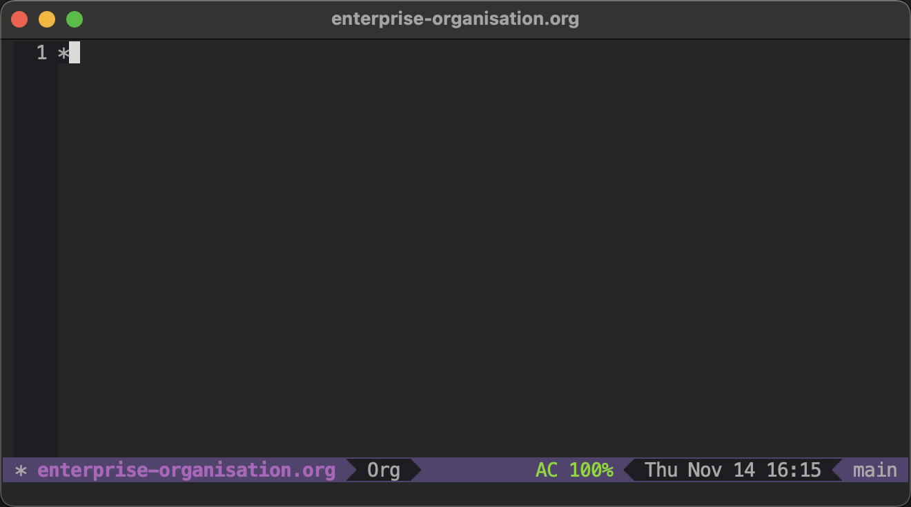
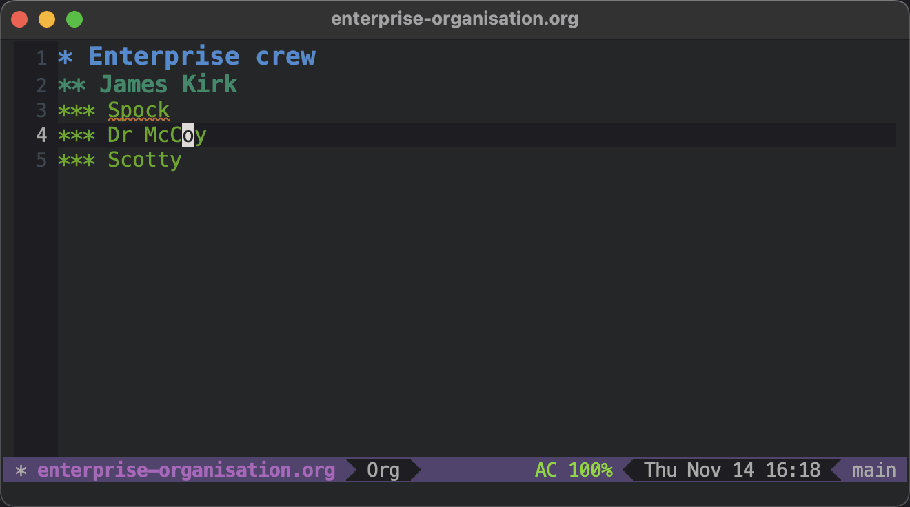
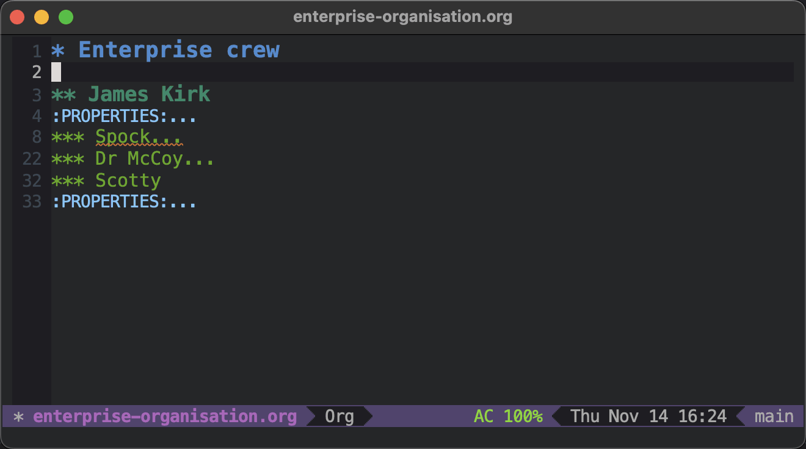
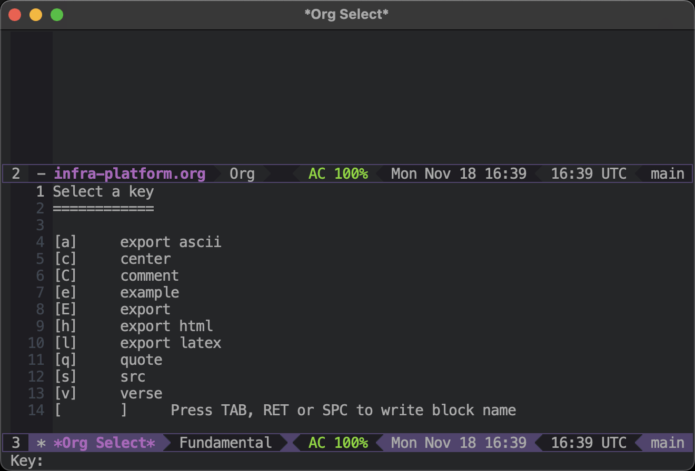
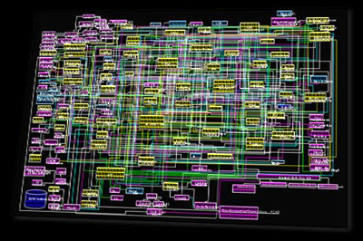
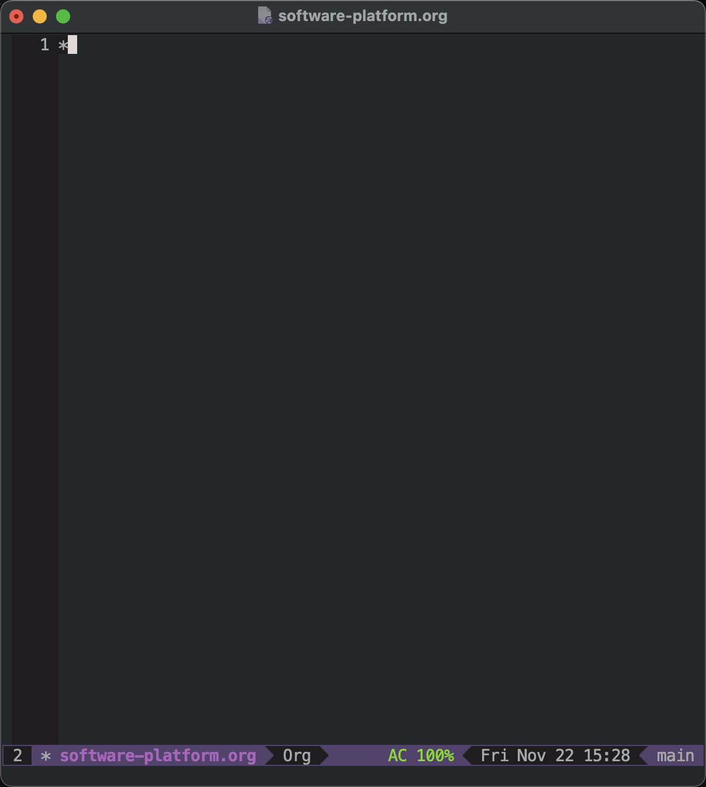

# My three phases of onboarding as a staff engineer 

I recently joined [Typeform](https://www.typeform.com/) as a staff engineer, which marked the third time in as many years that I've either joined a new company, or joined a new team, in this type of role. It's my experience that onboarding as a staff engineer is different to onboarding in other types of engineering roles. In previous roles, onboarding has normally meant:

-   Joining a small team, who I can get to know quickly.
-   Learning about an area of a codebase or platform, and understanding how it works in detail.
-   Discovering the boundaries of my new team, and who to reach out to outside of that team when necessary.

However, it's been my experience that staff roles require much more freedom-of-movement within an engineering organisation, and across a technical platform. In my last three roles, onboarding has meant:

-   Exploring the entire engineering organisation, and trying to understand how all the teams fit together.
-   Trying to get an overview of the entire platform from an infrastructure point-of-view, so that I can understand how the software platform is deployed and operated.
-   Trying to understand how the software works at a functional level; across team, and service boundaries.

In fact, after my most recent onboarding experience, I've noticed that I've gone through three distinct phases of onboarding:

1.  Mapping the engineering organisation.
2.  Mapping the infrastructure platform.
3.  Mapping the software platform.

In this post, I'm going to outline the sorts of activities I conducted to help myself onboard, and some of the techniques I used. Hopefully this will help remind me how to do it in future, and make my future onboarding experiences more seamless 🤞.

## 1. Mapping the engineering organisation

The first step in my onboarding journey has been to understand the layout of an engineering organisation. Working as a staff engineer often requires you to move laterally around an organisation, and this means you need to understand who does what, and in which teams. All the teams I've worked in have had their own ways of maintaining this map themselves; there's often an org chart, or an HR system, which will be self-documenting. Nonetheless, I have found it valuable to use these primary sources to construct my own map of an engineering organisation. As I've built this map, I've met with people, exchanged messages on Slack, and tried to enrich my map with as much context from human interaction as possible.

When I did this most recently, I used Emacs' excellent [Org Mode](https://orgmode.org/) to document this map. In particular, I used a combination of Org's hierarchical layout, [heading properties](https://orgmode.org/manual/Properties-and-Columns.html), and its [column view](https://orgmode.org/manual/Column-View.html). This has given me a living document that I can search, visualise, and refer to when I'm thinking about who to speak within the engineering team.

As an example, I started with a hierarchical list of members of the organisation:

Then, I used [properties](https://orgmode.org/manual/Properties-and-Columns.html) to indicate people's roles, and reporting lines:

Once this metadata is in place, visualising this data with [column view](https://orgmode.org/manual/Column-View.html), whilst also taking notes at the same time, becomes easy:

## 2. Mapping the infrastructure platform

Whilst I'm busy meeting people across the organisation, and piecing together a map of the engineering team, I also start the next phase of my onboarding journey: mapping the infrastructure platform.

As well as moving laterally across the engineering organisation, I also often find myself needing to think *vertically* across an entire platform. This means considering how the technology is working from its external interfaces (e.g. its public API), to its backend services, its databases, its compute, its storage, and its networking.

There's a lot to learn there, but in my second phase of onboarding I try to start building a map of how the infrastructure platform is organised. I ask myself questions like:

-   How is the network organised? (e.g. in one or more VPCs, in different or the same cloud accounts).
-   Where do applications run? (e.g. in Lambdas, on EC2 instances, in Kubernetes clusters).
-   What storage technologies are in use? (e.g. Postgres instances, S3 buckets, cloud-native databases).

Cloud consoles are a good primary source of information for this research. However, I also try to identify the place in source control where all this infrastructure is provisioned. This helps me to connect the dots between code files, cloud resources, and the overall infrastructure platform.

Since I'm a big fan of Emacs and plain-text, I also did this in Org Mode using [Org Babel](https://orgmode.org/worg/org-contrib/babel/), and  [PlantUML](https://plantuml.com/):

## 3. Mapping the software platform

After I've had a couple of weeks to meet people, and get to grips with the infrastructure platform, I start looking at the software platform in more detail. What I mean by *software platform* is the interconnected web of software components that *runs on top* of the infrastructure platform. This is the array of APIs, queue consumers, cron jobs, and myriad other applications that forms the cohesive software system of a company's product.

At a high-level, I think software platforms can be even more inscrutable than infrastructure platforms. Seen from afar, an infrastructure platform is a handful of building blocks; a VPC, a Kubernetes cluster, some databases. However, seen from afar a software platform can look a bit like this:

As my onboarding journey continues, I start trying to untangle the software platform by focusing on specific flows through the platform. Examples of a flow might be:

-   A customer logging in.
-   An order being placed.
-   A form being submitted.

Each of these flows (or *customer journeys*) will touch a particular pathway through the overall software platform, and will place the software components into context. This allows me to focus on a specific subset of the overall software platform, without getting overwhelmed with the big picture. As with the infrastructure platform, in practical terms I do this by researching the flows and documenting them as small snippets of prose and diagrams:

## Closing thoughts

Onboarding into a new role is something all of us will need to do several times during our career, and these three phases have emerged as something of a pattern for me in onboarding in staff roles recently. If you find yourself joining an engineering organisation as a staff engineer, I hope the ideas described here prove to be interesting food-for-thought as you join your new team 🙂

