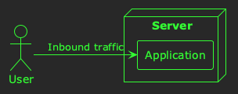
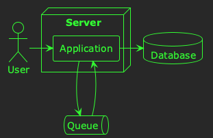
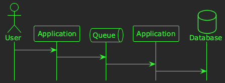
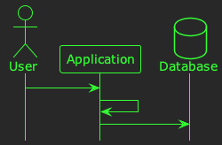
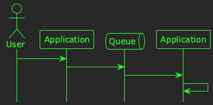

# Hypothesis-driven debugging

Several years ago, I spent about 18 months performance testing a distributed payments processing system at [Form3](https://www.form3.tech/). This was a really interesting period of my career when I learned lots about distributed systems, and how to instrument them using [Prometheus](https://prometheus.io/). There were lots of difficult challenges along the way to scale the system from processing less than 10 payments per second, to almost 1000 payments per second. We experimented with lots of different load testing tools, and even ended up writing [our own](https://github.com/form3tech-oss/f1).

The most difficult challenge I encountered during this period was debugging a distributed system at scale to try to identify the cause of failures and bottlenecks. Debugging an individual software component can sometimes be tricky, but modern debuggers make the process somewhat straightforward. Often you can write a failing test case for a bug you're investigating, and use a debugger to at least narrow down the possible causes.

However, when investigating problems in a large distributed system, the only tools you have at hand are the telemetry you receive from the system: logs, metrics, and traces. Often, this means you just need to *guess* what problems might be caused by, and *see if you were right*.

When I was debugging performance problems at Form3, I realised that the *guess and see* method is very similar to the [scientific method](https://en.wikipedia.org/wiki/Scientific_method). Furthermore, if you treat your guesses as hypotheses&#x2013;in particular, as *falsifiable* hypotheses&#x2013;then guessing can actually be a really effective way to diagnose problems.

In this post, I'm going to explain a little about what *falsifiable hypotheses* are, how they can relate to software, and how they can make the *guess and see* method more rigorous.

## Hypotheses

Before we talk about *falsifiable* hypotheses, let's quickly discuss what a *hypothesis* is. In general terms, when you make a guess at explaining something; that's a hypothesis! 💡

Let's take a simple example. Imagine this software system:

Now, imagine the server's CPU usage is high. An example of a hypothesis might be:

> *The server's CPU usage is high, because the inbound traffic is high.*

That's it! A hypothesis is an explanation that you guess.

## Falsifiability

Now, it turns out that not all guesses are of equal quality. Some hypotheses can be more rigorous than others, and [these days](https://en.wikipedia.org/wiki/The_Logic_of_Scientific_Discovery) a hypothesis needs to be *falsifiable* to be considered useful. What makes a hypothesis falsifiable? Well, you must be able to devise a test that will *prove it false*.

Let's take the example from above:

> *The server's CPU usage is high, because the inbound traffic is high.*

A good test for this hypothesis would be:

> *If I increase the inbound traffic, and the CPU usage doesn't increase, the hypothesis is false.*

Note that this test is designed to *disprove* the hypothesis, rather than *prove* it. In fact, one can never completely prove a falsifiable hypothesis; but you can test it, and see if it holds up to the test.

Let's look at another example; this time of a hypothesis that isn't falsifiable:

> *The server's CPU is high, because it hasn't been running for long enough*.

Perhaps this hypothesis is based on a guess that server's have high CPU usage when they start, but that after a while some start-up processing finishes, and their CPU usage returns to normal. This hypothesis isn't falsifiable, because no matter how long you wait, you can't disprove the hypothesis; the hypothesis could still hold true if you just waited a *little longer*.

Although this is a trivial example, the takeaway is that it *must be possible* to devise a *test to disprove the hypothesis* in order for it to be falsifiable.

## An example in the real world

Alright, let's look at a practical example, and walk through a couple of different hypothesis and tests that you might use to investigate it. Imagine the following software system:

In this example, users are creating resources in the system by sending HTTP requests to an application. The application enqueues the resources for asynchronous processing, consumes them at some later time, and then persists them to a database. The timeline for this process is illustrated below:

Now, let's imagine that you have some telemetry that tells you how long it takes for a request to go from being sent by the user, to being persisted in the database. The 99th percentile for this metric is 10 seconds, which is much too high. You need a hypothesis! Let's say our first hypothesis is:

> *Slow processing times are caused by latency in the queuing technology.*

There are lots of ways you could test this; indeed, when you're doing this for real you might devise a number of different tests to try to disprove&#x2013;or gain confidence in&#x2013;a hypothesis. Let's use this test:

> *If I replace the queue with an in-memory function call, and the processing time isn't reduced, the hypothesis is false.*

In other words, if we temporarily get rid of the queue, and it doesn't help, then the queue can't be the problem. So, let's test it:

You collect some metrics, but the processing time is still high 🤔

Alright, we need a different hypothesis:

> *Slow processing times are caused by poor database performance.*

We could test this by making a similar modification to our system:

> *If I replace the database with an in-memory cache, and the processing time isn't reduced, the hypothesis is false.*

In other words, if we temporarily get rid of the database, and it doesn't help, then it can't be the problem. Let's test it:

You collect some metrics, and&#x2026;the 99th percentile has decreased to 5 seconds! You haven't solved the problem, but you have learned something: there's a performance bottleneck in the database. 

## Hypothesis-driven debugging

Repeating this process to narrow down the causes of a problem in a software system is what I've come to think of as *hypothesis-driven debugging*. This certainly [isn't a new idea](https://csc151.cs.grinnell.edu/readings/hypothesis-driven-debugging.html), but it has become a valued technique to help me analyse and investigate large-scale software systems. It has helped me gain insight, learn facts, and&#x2013;eventually&#x2013;track down the source of problems that would otherwise have been difficult to identify.

Next time you need to debug a problem in a complex software system, I hope it helps you too! 🙂

