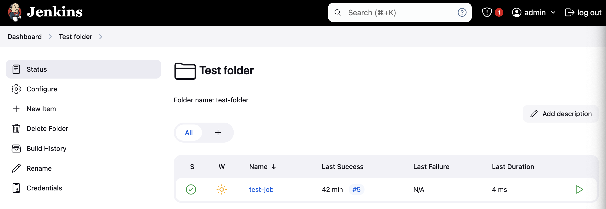
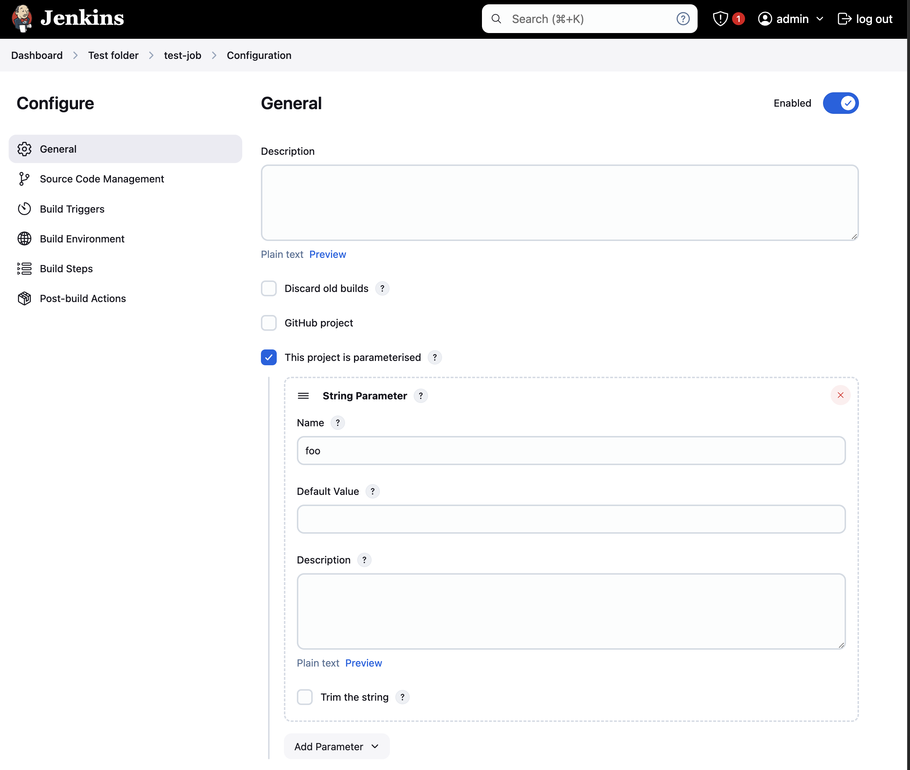
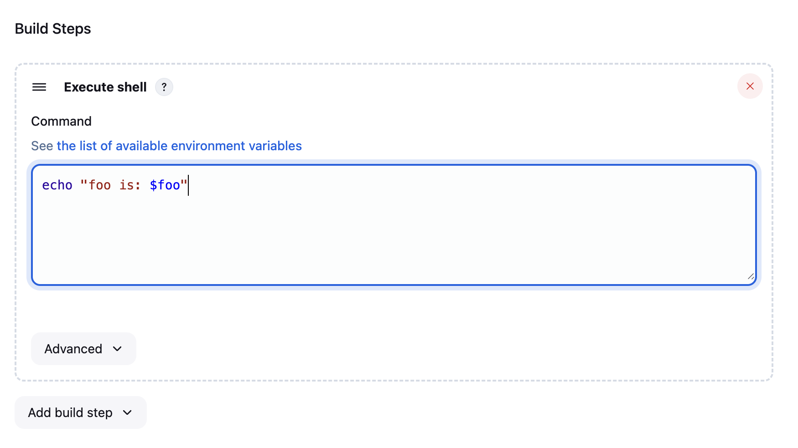

# Running parameterised Jenkins jobs using the Jenkins CLI

I have used Jenkins on-and-off for many years, but have never really been a power-user. I recently started using it a lot more, and needed to trigger parameterised jobs regularly with a variety of different parameter configurations. Doing this through the UI quickly became cumbersome, and I thought to myself: *there must be a better way!*

It turns out, there is! Jenkins comes with a [built-in CLI](https://www.jenkins.io/doc/book/managing/cli/), although I found it's initial installation and usage to be a little difficult to understand. Having finally worked how to use it properly, and made the process of regularly triggering paramterised jobs more ergonomic, I thought I would share my journey to help fellow and future Jenkins power users 💪

## Running Jenkins locally

Before we begin though, let's run a sandbox instance of Jenkins that you can use for testing out the procedures described in this post. All the instructions described herein should work with this sandbox.

You can start Jenkins easily enough using the [public Docker image](https://hub.docker.com/r/jenkins/jenkins):

    docker run -p 8080:8080 -p 50000:50000 --restart=on-failure jenkins/jenkins:lts-jdk17

When you start the container, an admin password is printed in the container logs. Make a note of this password, and login to Jenkins at <http://localhost:8080>. Install the recommended plugins, and you should have a fully-operational instance of Jenkins you can experiment with locally.

## Downloading the CLI

The CLI itself is provided as a Java JAR archive, which can be downloaded directly from your running Jenkins instance:

    wget http://localhost:8080/jnlpJars/jenkins-cli.jar

Once you've got the JAR on disk, you can run the CLI using Java as follows:

    java -jar jenkins-cli.jar

However, there's a few pre-requisites you need to setup first. To begin with, you need to tell the CLI where to find Jenkins. You can do this either by passing the `-s` command-line parameter, or by setting the `JENKINS_URL` environment variable:

    export JENKINS_URL=http://localhost:8080

You also need to supply your credentials for Jenkins using the `-auth` parameter. You credentials should be in the format `user:password`, but will ideally be provided:

-   Using a file, rather than directly in the command-line (*otherwise they will appear in your shell history*).
-   As an encrypted file on disk (*otherwise anyone could read it! 😅*).
-   Using an API token, rather than your password (*because this can be revoked if it is compromised*).

For this example, we'll just use the admin password you retrieved from Jenkins' startup logs, but we will store it in an encrypted file:

    echo 'admin:<password>' > .jenkins_auth
    gpg -e .jenkins_auth
    rm .jenkins_auth

> 🧙‍♂️ **A side-quest into GPG** 🔒
> 
> [GPG](https://gnupg.org/) is a convenient and ubiquitous toolchain for encrypting files locally. Before using it to encrypt a file (e.g. `gpg -e .jenkins_auth`), you first need to create an encryption key.
> 
> You can do this by running `gpg --full-generate-key`, and following the prompts.
> 
> Once you've generated a key, you can then use this key to encrypt files using the `gpg -e <file-name>` command, which will create an encrypted file called `file-name.gpg`. This file can easily be decrypted again from a terminal or script with `gpg -d <file-name.gpg>`.

I put all this together into a convenient wrapper script that I can invoke from a shell:

    #!/bin/bash
    JENKINS_URL=http://localhost:8080 java -jar jenkins-cli.jar -auth $(gpg -d .jenkins_auth.gpg) $@

The special `$@` variable at the end of the script just passes through all the command-line parameters from the script to the `java -jar` invocation.

I've saved this script in an executable file called `jk` in my `PATH`, so I can run `jk` from any shell to interact directly with Jenkins.

## A simple job test to the CLI

Now that we've got the CLI installed locally, and configured to use Jenkins, let's create a sample job in Jenkins to try it out. First, here's a folder with a job in:

The job has a parameter:

And a simple step that outputs the parameter value:

## Triggering parameterised jobs

Alright, now we can use the CLI to trigger the parameterised job as follows:

    $ jk build test-folder/test-job -p foo=bar -v -f

`build` is one of the commands provided by the CLI, but you can explore the others by running `jk help`. I've specified the name of the job including its folder path, along with the `-p` flag to specify a parameter, and the `-v` and `-f` flags to tail the console output of the job.

The `-p` flag can be used more than once to specify multiple parameter values, e.g:

    $ jk build test-folder/test-job -p foo=bar -p spam=eggs -v -f

The value for the `-p` flag is just the parameter and its value in the form `<name>=<value>`.

Running the CLI with the `-v` and `-f` flags produces some console output that looks like this:

    Started Test folder » test-job #1
    Started from command line by admin
    Running as SYSTEM
    Building in workspace /var/jenkins_home/workspace/test-folder/test-job
    [test-job] $ /bin/sh -xe /tmp/jenkins4656176625737391304.sh
    + echo foo is: spam
    foo is: spam
    Finished: SUCCESS
    Completed Test folder » test-job #1 : SUCCESS

As you can see, triggering the job from the command-line has correctly passed the build parameters through to its script. Success! 🎊

## The Jenkins CLI

And there you have it! Although you need to go through a few steps to set it up, once you do you can interact with Jenkins directly from your terminal. And, let's face it, that's always better than a web browser! 🤓

