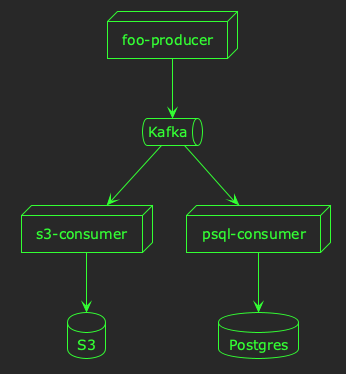
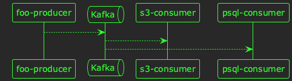

# How I write technical documents

I was recently talking with a colleague about how to write technical documents, and they asked me if I had any tips. Although I enjoy writing technical documents (e.g. design documents), I'm by no means an expert. I shared my thoughts with my colleague, and they found them valuable, so here they are in written form&#x2013;my favourite medium!

The sorts of documents I'm talking about in this context are technical design documents (TDDs), requests for comments (RFCs), and the like; a document communicating a technical idea for feedback and review, but not necessarily by someone familiar with the domain.

When I was speaking with my colleague, I realised I had three main suggestions:

1.  Start with a headline
2.  Move from the abstract to the specific
3.  Say the same thing three times

I'll explain a little more about what I mean by each in this post.


## 1. Start with a headline

The first thing I try to keep in mind is that not everyone will read the entire document. They might read the first few paragraphs&#x2013;or less!&#x2013;and then give up. In that case, it's important to put the most important information first.

That doesn't necessarily mean a literal headline, but an executive summary or introduction that conveys the most important facts first can convey 80% of your meaning to 80% of your audience¹.

For example:

```markdown
## Executive summary
This proposal discusses the problems of processing `foo` events at
scale, and suggests that **we introduce an event-sourcing
architecture** to decouple event production from consumption. **Kafka
is recommended** as an ideal technology for this architecture,
although other options are discussed.
```


## 2. Move from the abstract to the specific

At each level of a technical document, I try to move from the abstract to the specific. This means in the document structure, I will start by outlining the problem and its context, before starting to discuss solution options.

When describing a solution, I'll start with a general overview, and then describe each component of the solution in more detail.

My aim here is build context as the reader moves through document; I want them to understand the problem before discussing solutions, and the general idea behind the solution before describing details.

For example:

```markdown
## Proposal
The high-level architecuture for processing `foo` events will be as follows:

1. The `foo` processor will publish events to Kafka.
2. A consumer will read these events and save them to S3.
3. Another consumer will read these events and save them Postgres.

Each of these steps is described in more detail below.

### 1. Publishing `foo` events to Kafka
...
### 2. Saving events to S3
...
### 3. Saving events to Postgres
...
```


## 3. Say the same thing three times

My final rule of thumb is that whenever I'm trying to communicate a technical concept, I try to explain it in three different ways.

I think this is the hardest part of technical writing; communicating an idea that you understand (because you devised it) to someone who doesn't. This is normally the entire reason you're writing a document in the first place!

It's important to avoid misunderstandings caused by:

-   Your reader thinking they understand what you mean, when they don't.
-   You reader having difficult understanding your idea, because of the way it's presented.

To avoid these misunderstandings, I try to repeat the articulation of ideas three times in order to:

-   Avoid ambiguity.
-   Utilise different ways of communicating the same idea.

For example, I might explain an idea using:

-   A paragraph of prose
-   A bulleted or numbered list
-   A component/architecture diagram
-   A sequence diagram

If we take the example used earlier in this post, we could use prose:

```markdown
The `foo` producer will process `foo` events by publishing them to Kafka in the `foo.created` topic. This topic will be consumed by two different consumers: an S3 consumer, and a Postgres consumer. The S3 consumer will process `foo.created` events by saving them as an object in S3, whereas the Postgres consumer will insert a new record into a Postgres database.
```

Similarly, we could say the same thing as a list:

```markdown
When a new `foo` is created, we will:

- Process it in a Kafka producer by sending a new `foo.created` event to Kafka.
- Consume `foo.created` events by saving them to S3.
- Consume `foo.created` events by inserting new records in Postgres
```

This same idea could be expressed in a component diagram:



Alternatively, a sequence diagram could be used:



Ultimately, I try to make the idea as accessible as possible in a variety of different formats; through writing, and diagrams.


## Closing thoughts

I hope you find these tips useful writing your own technical documents. For me, authoring documents has&#x2013;and continues to be-a journey of learning, and refining, and reflecting. Perhaps I'll revisit this post in years to come, and need to add a few more tips.

Happy writing! 📚

---

¹The statistics in this post were entirely fabricated!
