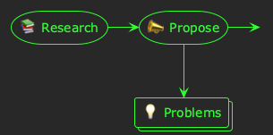
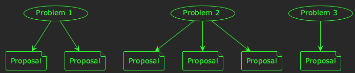
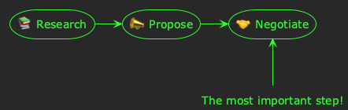
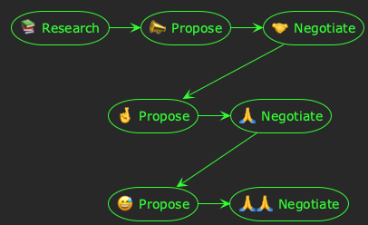

# Three stages of technical leadership

Technical leadership as an individual contributor is a bizarre mix of deep technical research, project management, and *diplomacy*. In order for a software project to be successful, it has to *actually work* and be delivered *on time*. The intersection between these success criteria is all about *shared understanding*, which is where the diplomacy comes in.

> 💡 When I'm referring to *technical leadership* as an *individual contributor*, I'm talking about roles like staff/principal engineer, technical architect, lead engineer, etc.

Over the last few years I've observed that the initial stages of technical leadership fall into three distinct steps. They're not necessarily linear, and there's a lot of feedback cycles and iteration between them. Nonetheless, I think each phase can be characterised by some key activities.

These stages are:

1.  Research
2.  Propose
3.  Negotiate

In this post, I'm going to explain what I think is involved in each step along with some practical tips for being successful at it.

## Stage 1: Research

In order for any technical project to be successful, it has to be researched up-front. As a technical leader, before you can propose a design or articulate a strategy, you have to *know what you're talking about* in sufficient detail to avoid any obvious traps or blind alleys later on.

You might be planning a greenfield project; what technologies or architectures should you use? You might be extending a legacy system; how does it work and what are its limitations?

Whatever the context, deep research at the outset of technical leadership is *essential*. However, it's also *time-consuming*. As a technical leader you're probably also busy, so it's important to conduct research that is *sufficiently deep* in *as little time as possible*.

In my experience there's a real art to this. If your research is too shallow, you risk a torrent of negative feedback at the *proposal* stage; and potentially serious mistakes later in the project. If your research is too thorough, you risk overloading people with details; and using up all your valuable time!

> *Cover as much as possible, with just enough depth to uncover problems*

I think the key to good research at this stage is to cover as much breadth as possible, with *just enough* depth to uncover problems and complexity.

This will give you a good understanding of the overall landscape and alternatives, whilst also uncovering insight into some of the technical challenges you will need to tackle later.

## Stage 2: Proposal

Once you've thoroughly researched your domain, you will have a good understanding of the *problems you need to solve*. At this stage, I always think it's good practice to *write the problems down*. You may still have no idea *how* you might solve these problems; or even *if* you will. But, before writing any proposal for the future of your technical project it's important to understand the *problem* you're trying to solve.

Given your set of problems, and the research you've conducted in the background, you probably now have a pretty good idea about how you'd like to approach the solution. You've already got an idea of which database you're going to use, or which architectural pattern. You can almost see a sequence diagram floating in your mind 💭

The *proposal* stage is where you summarise your research, state your problem, and propose the path you think should be followed. Writing good technical proposals is a [challenge in itself](https://akuszyk.com/2025-04-11-how-i-write-technical-documents.html), but take care not to get too attached to your proposal when it's finished.

The most important thing to remember about the first proposal you write for this project is that it's the *first*. It probably won't be the last! 😅

Ultimately, you may end up with a set of proposals for each of your problem statements&#x2013;each covering an alternative approach:

## Stage 3: Negotiate

So far, so good! Technical leadership as an IC is a breeze! You do loads of research (*fun* 🤓); you write it all down (*fun* 😁). Now you just need to convince everyone you're right!

(*Hard!* 😰)

The reality is that&#x2013;as a technical leader&#x2013;you are a well-informed and experienced *opinion of one*.

The real opportunity in technical leadership is to take your opinion, and *enhance it* with the opinions of others.

When you share your proposal with others (product managers, software engineers, other leaders, etc.), you will&#x2013;of course&#x2013;request feedback. The important thing about the *negotiation* stage is to *accept and assimilate* this feedback.

Coming from a technical background, I find *research* and *proposals* come naturally to me. I don't mean to say that they're *easy*, but it doesn't feel like work. However, *accepting feedback* and *negotiating a path forward* with people is difficult. It involves being objective enough to recognise when your opinion isn't the best in the room, and also requires empathy to understand where other people are coming from.

Sometimes, people might not like what you propose because they would *prefer* an alternative. And that's OK! Technical systems are built by people, and what people think of them matters.

It's during the negotiation stage that your value as a technical leader really comes to the fore. You need to be considerate, empathetic, and strategic; all whilst keeping your deep technical understanding in the background of your mind.

This is where you forge a path ahead that *brings people together*, and rallies teams around a *common vision* for your project. It might not be straightforward, and it might require some diplomacy (and concession on your part) to achieve consensus. You might end up writing more proposals:

Hopefully, however, this will lead to consensus. Stakeholders will support the vision, teams will agree to the plan, then the real work can begin: making it happen!

## Closing thoughts

These stages are the *genesis* of a technical project. Before work can begin in earnest spanning teams, months, and launches, I think it's essential to *research*, *propose*, and *negotiate*.

Effective research and proposals are vital, but by far the most important&#x2013;and most challenging&#x2013;stage is *negotiation*. In order for any technical plan to be successful, it's the negotiation stage which will *bring people together*, *build consensus*, and create a *common senses of purpose*.
