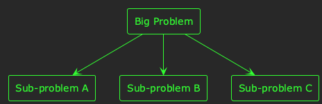
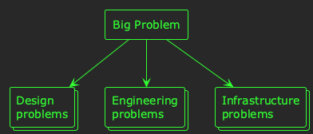
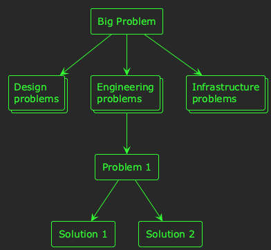

:PROPERTIES:
:UNNUMBERED: t
:END:
#+options: toc:nil stat:nil todo:nil
* Plantuml theme                                                   :noexport:
#+name: theme
#+begin_src plantuml :file theme.png
!theme crt-green
#+end_src
* Structuring technical ideation: problems, proposals, and delivery
I've [[https://akuszyk.com/2025-11-06-three-stages-of-technical-leadership.html][previously written]] about some of the challenges of technical leadership, in particular the need to conduct deep research, explore your problem space, and negotiate consensus with stakeholders.

I find the /exploration of problems/ phase can be particularly daunting--especially when the problem space is large or complex.

At Typeform, it's a common experience for a Product Manager to introduce an incredible new idea, with lots of avenues for investigation, and a tremendous amount of excitement surrounding its delivery. Oh, and did I mention that we're planning an alpha release in four weeks?! 😅

In these situations, it's easy to feel overwhelmed by the scale of the research you need to conduct--and the prospect of crystallising all the options into a cohesive technical plan can seem impossible.

Despite this challenge in the /technical ideation/ phase, a little bit of structure to the way you tackle it can help scaffold your ideas, and allow you to collaborate with a wider group of people.
** Problems
When you're faced with an overwhelming product objective, it can seem like you have /one gigantic problem/ to solve:

#+begin_quote
😰 How are we going to build the enormous thing?
#+end_quote

The first thing to do when faced with this challenge is to try to write down a problem statement for your project. You could structure your problem statement however you prefer, but I favour a simple and concise format like this:

#+begin_src markdown
## Context
What is the background to this problem?

## Problem
What is the problem? Try to stick to a couple of paragraphs, or a few bullet points.

## Success criteria
What are the criteria for a successful solution to this problem? E.g. a design document, a proof-of-concept, a working system, etc.
#+end_src

You probably won't get that far writing this problem statement before realising that solving your /big problem/ actually means solving many smaller problems.

For me, this is the essential first step in breaking down the enormity of a new project, and making it a more manageable topic to deal with.

#+begin_src plantuml :file 2026-02-06-structuring-technical-ideation.org-big-problem.png :noweb yes
<<theme>>
rectangle "Big Problem" as big
rectangle "Sub-problem A" as a
rectangle "Sub-problem B" as b
rectangle "Sub-problem C" as c

big --> a
big --> b
big --> c
#+end_src

#+RESULTS:

I recommend documenting these problems in a shared place where you can collaborate with colleagues. You might write them as Jira or GitHub issues, pages in a Notion database, or cards on a Trello board. The important thing is that you can make them /visible/, invite people to /collaborate/ on them, and track their /progress/.

Once you've started writing down problem statements, the next step is to /share/ them. Send them to your colleagues, invite them to write problem statements of their own, and pretty soon you'll have a new problem: too many problem statements!

#+begin_src plantuml :file 2026-02-06-structuring-technical-ideation.org-too-many-problems.png :noweb yes
<<theme>>
rectangle "Big Problem" as big
collections "Design\nproblems" as des
collections "Engineering\nproblems" as eng
collections "Infrastructure\nproblems" as infr

big --> des
big --> eng
big --> infr
#+end_src

#+RESULTS:

Now, you can start /categorising/ your problems. Some will be higher priority than others. Some will have security implications. Some will require further research. Start dividing up your problems, assign owners, and get to work on them.

At this stage, I breathe a sigh of relief! 😎

What started as an overwhelmingly large problem space has now been divided and conquered. You know what /all/ your problems are. You know that just /some/ of them are high priority. And, you've got colleagues helping you work on them 🤝
** Proposals
Depending on the size and complexity of your project, it might take days, weeks, or even months to enumerate all your problem statements. But, sooner or later you'll need to start working on /solutions/. In my [[https://akuszyk.com/2025-11-06-three-stages-of-technical-leadership.html][previous post]], I referred to this as the /proposal/ and /negotiation/ phase.

You can distribute the problems amongst your team--multiple people can even work on competing solutions to the same problem--and you can propose, discuss, and negotiate your way towards consensus.

Again, how much time this takes--and how much detail you want to go into--is up to you and your project. Typically, I favour writing a /technical design document/ or a /request for comments/ to summarise a problem and outline a solution.

You might end up with a set of problems, each with one or more solution proposals:

#+begin_src plantuml :file 2026-02-06-structuring-technical-ideation.org-proposals.png :noweb yes
<<theme>>
rectangle "Big Problem" as big
collections "Design\nproblems" as des
collections "Engineering\nproblems" as eng
collections "Infrastructure\nproblems" as infr

rectangle "Problem 1" as prob
rectangle "Solution 1" as sol1
rectangle "Solution 2" as sol2

big --> des
big --> eng
big --> infr
eng --> prob
prob --> sol1
prob --> sol2
#+end_src

#+RESULTS:

Competing solution proposals is a good thing; it means you're thoroughly exploring the solution space 👍
** Delivery
Alright! So the Product Manager gave you a brief for a wildly innovative idea, you had no idea how to solve it, but you broke it down and now you have a load of technical designs! 🥳

Whether this process took you days, weeks, or longer, now you're ready for a team of people to tackle the delivery. As a technical leader, the work doesn't stop here. The preparation you've undertaken up until now enabled you to /start/ the delivery, but it didn't uncover all the problems. Some things will take longer than expected; some things will be more complicated.

But /now/ you have a solid plan, a strong understanding of the problem space, and firm foundation from which a team can work together to deliver the solution.
