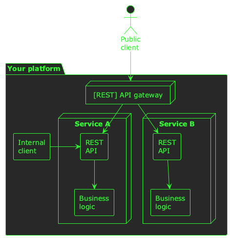
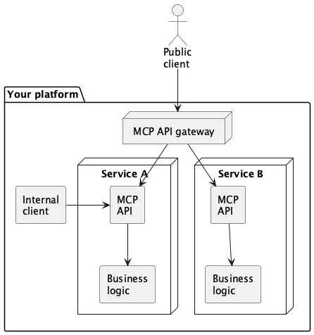
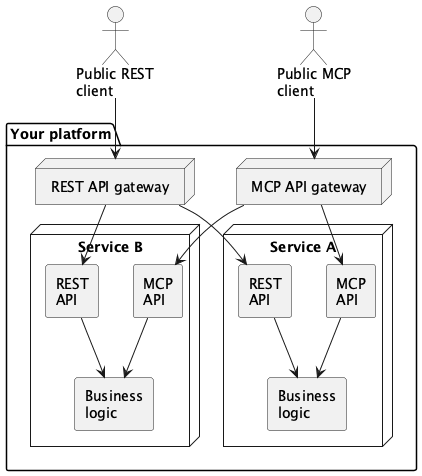

:PROPERTIES:
:UNNUMBERED: t
:END:
#+options: toc:nil stat:nil todo:nil
* Linkedin post                                                    :noexport:
Over the last 12 months, using an LLM to interact with a system or product has gone from being a novelty to being a table-stakes feature that many users are starting to expect.

Behind the scenes, this has led to engineering teams working to introduce LLM-friendly interfaces in their backend systems. Many of these systems may have originally been designed to work well with JavaScript clients, which probably means that they followed a traditional paradigm of exposing business objects over HTTP--likely using the REST pattern.

Unfortunately, LLMs struggle with REST for a number of reasons. In order for an LLM to interact well with a backend system, it has to do so on its own terms--using natural language. The Model Context Protocol has become an industry standard for how to expose external systems to an LLM in such a way that it can interact with those systems fluidly and naturally, but with the structure necessary for machine-to-machine communication.

In my latest blog post I cover the problem with REST for LLMs in more detail, and also describe how we've risen to this challenge at @Typeform--making MCP our new REST API.

https://medium.com/typeforms-engineering-blog/mcp-is-the-new-rest-e5461fc017af
* MCP is the new REST
Over the last 12 months, using an LLM to interact with a system or product has gone from being a novelty--a /nice to have/--to being a table-stakes feature that many users are starting to expect.

Behind the scenes, this has led to a +mad scramble+ co-ordinated effort by engineering teams to introduce LLM-friendly interfaces in their backend systems. Many of these systems may have originally been designed to work well with JavaScript clients, which probably means that they followed a traditional paradigm of exposing business objects over HTTP--likely using the REST pattern.

Unfortunately, LLMs struggle with REST for a number of reasons. In order for an LLM to interact well with a backend system, it has to do so on its own terms--using /natural language/. The Model Context Protocol has become an industry standard for how to expose external systems to an LLM in such a way that it can interact with those systems fluidly and naturally, but with the structure necessary for machine-to-machine communication.

In this post I'm going to cover the problem with REST for LLMs in more detail, and also describe how we've risen to this challenge at Typeform--making MCP our new REST API.

#+begin_quote
💡If you're new to MCP, you might want to read [[https://modelcontextprotocol.io/docs/getting-started/intro][this guide]] before diving into the "rest" of this post (no pun intended! 😂)
#+end_quote
** The problem with REST
REST is a great paradigm for sharing structured resource data between clients and servers transcending network, language, and tooling boundaries. It's also an intuitive way to model domains, and expose granular primitives for creating, reading, updating, and deleting data in those domains.

However, whilst it's great for JavaScript clients, it causes a great deal of confusion for LLMs! Nested data structures, trailing commas, closing braces/brackets/quotes--I mean, it's a JSON jungle out there! 😅

It's definitely possible to get your LLM to speak REST. You can load it with your OpenAPI specs, craft your system prompts with instructions about how to patch resources, and explain the difference between POST and PUT requests. But, at the end of the day, LLMs will always struggle to access resources this way because they're designed to work with /natural language/--not JSON.

MCP comes to the rescue with a structured way for LLMs to access external systems that still has the flexibility of natural language. In some cases, it's even possible to wrap existing REST endpoints with equivalent MCP tools; effectively exposing their JSON structure as a tool's output schema.

However, what LLMs /really/ need are tools to access external systems the way a /user/ would access them. This doesn't mean a CRUD endpoint for a business object; it means a list of operations that a user would perform on a regular basis as part of their interaction with your product.

Let's look at an [arbitrarily simple] example. Imagine you have a REST API that exposes a person resource:

#+begin_src json
{
  "first_name": "james",
  "last_name": "kirk",
  "job_title": "starship captain",
  "favourite_hobby": "boldy going where no-one has gone before"
}
#+end_src

In your product, you might collect information about a person one step at a time. /"What's your name?"/ followed by, /"what's your job title?"/. When your product has finished collecting all the information about a person, it might make a =POST /person= REST request to create the resource.

However, from a /user's/ perspective they're creating individual resources for name, job, hobby, etc.

In order for an LLM to provide the best conversational experience, it needs tools that model this. I.e. it needs tools like:

- =set_person_first_name=
- =set_person_last_name=
- =set_person_job_title=

Rather than a single =create_person= tool. This is obviously a simple example--in reality, a =create_person= tool might be just fine for an LLM. But, if your business objects have tens or hundreds of fields, nested data structures, and complex relationships, then the full structure of your data will be too much for an LLM to handle; it needs smaller, functional tools so that it can think like--well, a human.
** A Taxonomy of Tools
When you start to think about the need to re-model the interface to your platform in terms of an LLM's MCP needs, rather than in a set of REST resources, it's a daunting challenge! You might need hundreds--or thousands!--of individual tools. These tools need many of the same primitives as your REST endpoints--like authentication, rate limiting, access controls, observability, etc.--but they require a completely new approach to your existing HTTP API.

Overcoming this challenge requires the problem space to be divided up and made easier to manage. Of the many tools you need to build some will be easy, some will require a little effort, and some will be major undertakings. If you can categorise the work ahead of you, you can start to plan for MCP tools to emerge organically from the work your teams are already doing.

At Typeform, we did this by establishing a simple /taxonomy of tools/. This allowed us to categorise tools in to low, medium, and high effort--and prepare tooling and strategies for each category. This taxonomy consists of:

- *CRUD tools* which are simple wrappers of existing REST endpoints
- *Domain-specific tools* which are bespoke tools crafted for a particular domain that expose functionality designed for LLMs
- *Agentic tools* which are LLM-enhanced tools that introduce an additional layer of reasoning or inference between the LLM client and the upstream business services.
** Every team is an MCP team
With this framing in place, you can start to build a picture of where you need to build tools, and how you need to build them. However, if your REST API has existed for any length of time then its implementation is probably /decentralised/--its upstream implementation is federated amongst many different services, each owned by a different team.

Now that you have a strategy for building an MCP API to complement your REST one, you need a way to make every /API/ team an /MCP/ team.

At Typeform, we've achieved this with:

- A common architectural vision
- Shared tooling
- An MCP gateway
*** A common architectural vision
We've laid out a paved road for MCP server delivery that enables every team to easily contribute to a shared architectural vision. This architectural vision isn't groundbreaking--in fact it's simple, and very familiar.

Let's consider the implicit common vision in the REST world:
#+begin_src plantuml :file 2026-02-13-mcp-is-the-new-rest.org-rest-vision.png
!theme crt-green
skinparam backgroundColor transparent
actor "Public\nclient" as client

package "Your platform" as plat {
  node "[REST] API gateway" as restgw

  node "Service A" as a {
    rectangle "REST\nAPI" as a_rest
    rectangle "Business\nlogic" as a_biz
    a_rest --> a_biz
  }

  node "Service B" as b {
    rectangle "REST\nAPI" as b_rest
    rectangle "Business\nlogic" as b_biz
    b_rest --> b_biz
  }

  rectangle "Internal\nclient" as int
}

client --> restgw
restgw --> a_rest
restgw --> b_rest
int -> a_rest
#+end_src

#+RESULTS:

In this world, the shared architectural vision is:

- Build your business services in separate programs by domain
- For each domain, expose a REST API for clients to access your services
- Expose the REST API to internal clients directly
- Expose the REST API to public clients via a gateway

A shared vision for teams building MCP servers can look much the same:
#+begin_src plantuml :file 2026-02-13-mcp-is-the-new-rest.org-mcp-vision.png
!theme crt-green
skinparam backgroundColor transparent
actor "Public\nclient" as client

package "Your platform" as plat {
  node "MCP API gateway" as restgw

  node "Service A" as a {
    rectangle "MCP\nAPI" as a_rest
    rectangle "Business\nlogic" as a_biz
    a_rest --> a_biz
  }

  node "Service B" as b {
    rectangle "MCP\nAPI" as b_rest
    rectangle "Business\nlogic" as b_biz
    b_rest --> b_biz
  }

  rectangle "Internal\nclient" as int
}

client --> restgw
restgw --> a_rest
restgw --> b_rest
int -> a_rest

#+end_src

#+RESULTS:

This approach follows all the same paradigms for security, rate-limiting, and observability as the REST API; it just substitutes the protocol for the API. Ultimately, this common vision leads to a hybrid approach where your REST and MCP APIs live alongside one another:
#+begin_src plantuml :file 2026-02-13-mcp-is-the-new-rest.org-mcp-and-rest.png
!theme crt-green
skinparam backgroundColor transparent
actor "Public REST\nclient" as rest_client
actor "Public MCP\nclient" as mcp_client

package "Your platform" as plat {
  node "REST API gateway" as restgw
  node "MCP API gateway" as mcpgw

  node "Service A" as a {
    rectangle "REST\nAPI" as a_rest
    rectangle "MCP\nAPI" as a_mcp
    rectangle "Business\nlogic" as a_biz
    a_rest --> a_biz
    a_mcp --> a_biz
  }

  node "Service B" as b {
    rectangle "REST\nAPI" as b_rest
    rectangle "MCP\nAPI" as b_mcp
    rectangle "Business\nlogic" as b_biz
    b_rest -[hidden]> b_mcp
    b_rest --> b_biz
    b_mcp --> b_biz
  }
}

rest_client --> restgw
mcp_client --> mcpgw
restgw --> a_rest
mcpgw --> b_mcp
restgw --> b_rest
mcpgw --> a_mcp

#+end_src

#+RESULTS:

*** Shared tooling
For your well-established REST API, you probably have shared libraries that handle things like authentication, tracing, and logging. There's middleware, HTTP servers, HTTP clients, testing utilities, and more. In short, you probably have mature shared tooling for building REST APIs.

In order for every team to be able to contribute to this shared architectural vision for MCP, they're going to need similar--if less mature--tooling. At the very least, you'll probably want a paved road for bootstrapping an MCP server, adding tools to it, and integrating it with your existing HTTP servers.

This tooling, combined with a little documentation, and a shared understanding of the architecture, should hopefully lay the foundations for every team to contribute to the future of your new MCP API.
*** An MCP gateway
You might be wondering what an /MCP gateway/ looks like in practice, in the context of this new architecture. In principle, it exists to perform many of the same functions as an API gateway:

- Providing a single endpoint for clients to connect to
- Handling edge concerns like rate-limiting, security, and observability
- Routing traffic to a variety of upstream endpoints (i.e. to many different MCP servers)
- Denying requests to internal-only endpoints--or, in this case, tools

There are many technologies to fulfil this need for REST APIs--some open-source projects, some paid solutions, and some managed services from cloud providers.

I've seen a similar landscape emerging for MCP gateways, but--for now--our needs at Typeform are relatively simple, and we have opted to write our own. We'll continue to re-evaluate this decision as the marketplace matures.
** The future of MCP and REST
So, although MCP is the /new/ REST, I don't mean MCP is /replacing/ REST. I think REST as a paradigm is here to stay--at least as long as we have JavaScript clients!--and MCP is emerging as a complementary API surface that needs to live alongside REST.

For me, the challenge is to navigate the journey of integrating MCP into your platform and business services in a way that is seamless and low-effort. Adding MCP to your product should be an evolution--not a revolution. In a future where products are increasingly LLM-centric, this evolution is an essential one, and I hope the ideas in this post give you food for thought as you embark on your own MCP journey.
