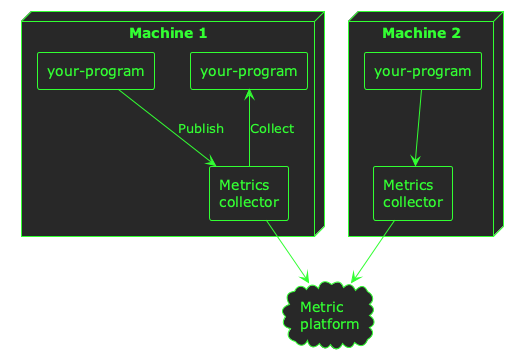
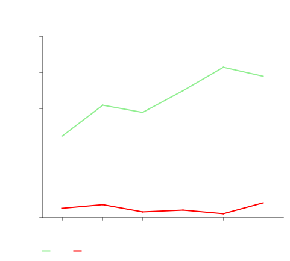

# Getting observability right when bootstrapping an engineering organisation

When you start building a product, its easy to get carried away with the experience your end users will see. You want the product to solve their problems, be easy to use, and out-class your competitors&#x2013;all at the same time!

However, whilst building a *product* it's important to consider that you're also building a *platform*. If you don't build your platform in lock-step with your product, sooner or later you'll start to have problems.

There are many aspects to good platform-building (e.g. testing, secrets management, monitoring & alerting, etc.), but in this blog post I'm going to cover *observability*&#x2013;the *monitoring* in monitoring & alerting.

> ℹ️ This blog post is part 9 of a [series](bootstrapping-an-engineering-organisation.md) about bootstrapping engineering organisations.


## The three pillars of observability

There are three main ways of gaining insight into the way your product is behaving. All three involve *instrumenting* your applications so that you can extract *telemetry* from them.

1.  **Logs:** simple lines of text printed by your programs when they run
2.  **Metrics:** aggregate summaries of events in your programs that can be analysed over time
3.  **Traces:** detailed telemetry about your program's inner workings

I'll cover each of these pillars below, with examples of when&#x2013;and when not&#x2013;to use them.


### Logs

Logs are probably the simplest of all telemetry sources. They are lines of text printed by your programs. Normally these logs are sent to the `stdout` and `stderr` file descriptors for your process, which might result in terminal output or a file depending on where you run your program.

Logs are great for a simple, low-volume way of understanding what your program is doing. Log messages for notable events in your program's lifecycle are useful, but high-volume events&#x2013;or events you want to analyse over time&#x2013;are best suited to a different type of instrumentation.

> 💡 Examples of good uses-cases for logs might include program start/stop messages, information about notable business transactions *(provided they are low-volume)*, and unexpected errors.

If your program is running in a container scheduler like Kubernetes, its logs are probably being sent to a file:

 Now, when you start building a platform, it can be easy enough to view the logs from a single program&#x2013;you just open the file. But as soon as you start running multiple replicas of your program across multiple machines, things begin to get a little complicated:

 When you start running your platform at any scale greater than *one of anything*, you need a way to *aggregate* your logs&#x2013;you need all of them in one place so you can search, filter, and analyse them across machine and container boundaries.

When you're bootstrapping an engineering organisation, I think it's important to solve this problem of *log aggregation* early, because it will serve as the foundation for your team's observability and will pay back its investment quickly in time savings when your team are debugging problems.

There are many platforms that will help you aggregate logs such as Loki/Grafana, Kibana/Elasticsearch, Datadog, New Relic, and more. Utimately, you want a central place where all your logs are aggregated so that an engineer can easily find logs from across your platform:


Once your logs are being aggregated in a single place, there are a couple of other things you might want to consider to really make logs the foundations of your observability stack.

The first is to format your logs in a structured way, so that you can include custom fields in a way that you can search and filter. For example, a basic log line from your program might look like this:

```
2026-03-12 10:44:00    INFO    returned an http response with a status code of 500
```

If you want to search all the logs that show a 500 status code, you need to do a plain-text search across all your log data. This can be expensive and slow, especially if the format of these logs varies. Instead, a common practice is to format these log messages as JSON:

```json
{
  "timestamp": "2026-03-12 10:44:00",
  "level": "INFO",
  "message": "returned an http response",
  "status_code": "500"
}
```

Your program can still output its log messages on individual lines *(I've formatted this JSON for readability)*, but now your log aggregator can index explicit fields in your log data to make searching for `status_code: 500` easy.

The other thing that will help make your logs particular useful is a *correlation ID*. If you get this right from the beginning when building your platform, it really pays dividends as your product grows. A correlation ID is an extra field in your log messages that correlates it with upstream and downstream processing&#x2013;whether that processing happened within a particular program, or in different programs. For example, when a user does something in your product service A might write these log lines:

```json
{
  "timestamp": "2026-03-12 10:44:00",
  "service": "service-a",
  "level": "INFO",
  "message": "processing user event",
  "correlation_id": "4b2ed335-6d16-fc34-8e73-285375ccc734"
}
{
  "timestamp": "2026-03-12 10:44:01",
  "service": "service-a",
  "level": "INFO",
  "message": "sending user event to service b",
  "correlation_id": "4b2ed335-6d16-fc34-8e73-285375ccc734"
}
```

And service B might write this log line:

```json
{
  "timestamp": "2026-03-12 10:44:02",
  "service": "service-b",
  "level": "INFO",
  "message": "user event received",
  "correlation_id": "4b2ed335-6d16-fc34-8e73-285375ccc734"
}
```

By using the same ID across all three log messages, you can *correlate* multiple log messages over time. When your logs are aggregated in a central place, this can be really powerful for filtering your log data for specific user flows or operations.


### Metrics

Once you have an effective way of aggregating and using your log data, the next pillar to consider is metrics. Logs are good for low-volume, textual data. But for high-frequency events they can be expensive, and for numerical data you want to aggregate, query, and chart over time they are simply not a good fit.

For these high-frequency, numerical, time-series use-cases, metrics allow you to aggregate and monitor the performance of your programs over time.

> 💡 Good examples of metrics might be HTTP response times, database query latency, and counters for particular events in your system.

Unlike logs, metrics are normally collected or published via a network protocol like HTTP. This means you will need to set-up some infrastructure to process the metrics telemetry from your programs, and store it in some kind of metrics back-end.

As well as good commercial offerings like Datadog and New Relic, there is strong support for metrics in the open source community with the likes of Prometheus, Cortex, Grafana, and many others.

Similar to logs, a common pattern is to collect metrics from your programs and publish the to a *metrics aggregator* or analysis platform:



Collecting metrics from your applications will enable you to query and analyse trends at a higher level than logs, and understand how your system is performing over time:




### Traces

Logs give you a simple, textual view into the way your programs are running. Metrics give you a good high-level understanding of performance, which is especially useful for numerical data.

However, neither type of instrumentation is particularly good for gain a *detailed* understanding of what your programs are doing. As your platform grows, you might want to understand the flows through your system at the level of *individual function calls* across service and machine boundaries.

Whilst it is possible to gain this insight with logs, it can be very expensive to ingest, index, and store it in log aggregators. Metrics can give you some of this insight as well, but only at the aggregate level of the number or duration of function calls.

If you really want to understand the granular flow of user actions throughout your platform, you need *traces*. Traces are like logs; they're mainly textual, but they're collected at a more granular level (e.g. for each function call). They can be correlated throughout a program&#x2013;and even across a network&#x2013;using a similar approach as logs, but they are detailed and high-volume. That means they are normally *sampled*, and don't really show *macro-trends*.

To understand simple, raw events in your programs; use logs.

To understand how you system is performing en-masse; use metrics.

To get an insight into the inner workings of your entire system; use traces.

Similar to metrics, traces require a bit of infrastructure setup to be useful&#x2013;you will need to collect the trace data, and ingest it into some kind of analysis platforn so that it can be queried and inspected.

When you're bootstrapping a new engineering organisation, it's my opinion that traces are the *least important*. Whilst they are tremendously valuable when done right, they can be harder to build across an entire platform than logs and metrics, and&#x2013;in my opinion&#x2013;offer less value.

If you establish your platform with logs and metrics built-in, then you will have a firm foundation of observability&#x2013;and traces can follow-on later as your platform matures.


## Conclusion

Observability is an essential ingredient to get right when bootstrapping an engineering organisation. If you lay down solid foundations, the investment will pay you back in saved time and increased transparency as your platform grows.

-   **Logs** are great for simple, low-volume insight into the behaviour of your platform
-   **Metrics** will give you a high-level summary of performance over time
-   **Traces** require a little more investment, but give you the highest-fidelity view into what's happening within each of your applications

I hope you've found this post useful to inspire your own approach to establishing good observability practices within your own organisation.
