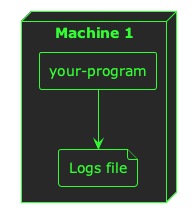
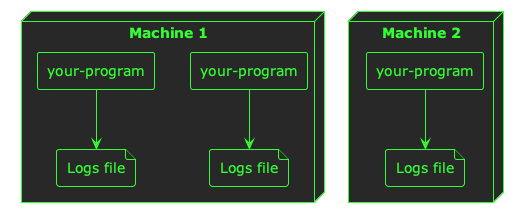
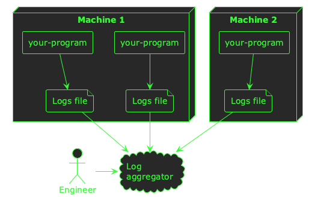

:PROPERTIES:
:UNNUMBERED: t
:END:
#+options: toc:nil stat:nil todo:nil
* Plantuml theme                                                   :noexport:
#+name: plantuml-theme
#+begin_src plantuml :file template.org-plantuml-theme.png :exports none
!theme crt-green
skinparam backgroundColor transparent
#+end_src
* Getting observability right when bootstrapping an engineering organisation
When you start building a product, its easy to get carried away with the experience your end users will see. You want the product to solve their problems, be easy to use, and out-class your competitors--all at the same time!

However, whilst building a /product/ it's important to consider that you're also building a /platform/. If you don't build your platform in lock-step with your product, sooner or later you'll start to have problems.

There are many aspects to good platform-building (e.g. testing, secrets management, monitoring & alerting, etc.), but in this blog post I'm going to cover /observability/--the /monitoring/ in monitoring & alerting.

#+begin_quote
ℹ️ This blog post is part 9 of a [[file:bootstrapping-an-engineering-organisation.md][series]] about bootstrapping engineering organisations.
#+end_quote
** The three pillars of observability
There are three main ways of gaining insight into the way your product is behaving. All three involve /instrumenting/ your applications so that you can extract /telemetry/ from them.

1. *Logs:* simple lines of text printed by your programs when they run
2. *Metrics:* aggregate summaries of events in your programs that can be analysed over time
3. *Traces:* detailed telemetry about your program's inner workings

I'll cover each of these pillars below, with examples of when--and when not--to use them.
*** DONE Logs
CLOSED: [2026-03-12 Thu 10:41]
Logs are probably the simplest of all telemetry sources. They are lines of text printed by your programs. Normally these logs are sent to the =stdout= and =stderr= file descriptors for your process, which might result in terminal output or a file depending on where you run your program.

Logs are great for a simple, low-volume way of understanding what your program is doing. Log messages for notable events in your program's lifecycle are useful, but high-volume events--or events you want to analyse over time--are best suited to a different type of instrumentation.

#+begin_quote
💡 Examples of good uses-cases for logs might include program start/stop messages, information about notable business transactions /(provided they are low-volume)/, and unexpected errors.
#+end_quote

If your program is running in a container scheduler like Kubernetes, its logs are probably being sent to a file:

#+begin_src plantuml :file 2026-03-12-getting-observability-right.org-single-container-logs.png :noweb yes
<<plantuml-theme>>
node "Machine 1" as m1 {
  rectangle "your-program" as p1
  file "Logs file" as l1
  p1 --> l1
}
#+end_src

#+RESULTS:

Now, when you start building a platform, it can be easy enough to view the logs from a single program--you just open the file. But as soon as you start running multiple replicas of your program across multiple machines, things begin to get a little complicated:
#+begin_src plantuml :file 2026-03-12-getting-observability-right.org-logs-multiple-machines.png :noweb yes
<<plantuml-theme>>
node "Machine 1" as m1 {
  rectangle "your-program" as p1
  file "Logs file" as l1
  p1 --> l1

  rectangle "your-program" as p2
  file "Logs file" as l2
  p2 --> l2
}

node "Machine 2" as m2 {
  rectangle "your-program" as p3
  file "Logs file" as l3
  p3 --> l3
}

#+end_src

#+RESULTS:

When you start running your platform at any scale greater than /one of anything/, you need a way to /aggregate/ your logs--you need all of them in one place so you can search, filter, and analyse them across machine and container boundaries.

When you're bootstrapping an engineering organisation, I think it's important to solve this problem of /log aggregation/ early, because it will serve as the foundation for your team's observability and will pay back its investment quickly in time savings when your team are debugging problems.

There are many platforms that will help you aggregate logs such as Loki/Grafana, Kibana/Elasticsearch, Datadog, New Relic, and more. Utimately, you want a central place where all your logs are aggregated so that an engineer can easily find logs from across your platform:

#+begin_src plantuml :file 2026-03-12-getting-observability-right.org-log-aggregator.png :noweb yes

<<plantuml-theme>>

node "Machine 1" as m1 {
  rectangle "your-program" as p1
  file "Logs file" as l1
  p1 --> l1

  rectangle "your-program" as p2
  file "Logs file" as l2
  p2 --> l2
}

node "Machine 2" as m2 {
  rectangle "your-program" as p3
  file "Logs file" as l3
  p3 --> l3
}

cloud "Log\naggregator" as agg
l1 --> agg
l2 --> agg
l3 --> agg

actor "Engineer" as eng
eng -> agg
#+end_src

#+RESULTS:

Once your logs are being aggregated in a single place, there are a couple of other things you might want to consider to really make logs the foundations of your observability stack.

The first is to format your logs in a structured way, so that you can include custom fields in a way that you can search and filter. For example, a basic log line from your program might look like this:

#+begin_src
2026-03-12 10:44:00    INFO    returned an http response with a status code of 500
#+end_src

If you want to search all the logs that show a 500 status code, you need to do a plain-text search across all your log data. This can be expensive and slow, especially if the format of these logs varies. Instead, a common practice is to format these log messages as JSON:

#+begin_src json
{
  "timestamp": "2026-03-12 10:44:00",
  "level": "INFO",
  "message": "returned an http response",
  "status_code": "500"
}
#+end_src

Your program can still output its log messages on individual lines /(I've formatted this JSON for readability)/, but now your log aggregator can index explicit fields in your log data to make searching for =status_code: 500= easy.

The other thing that will help make your logs particular useful is a /correlation ID/. If you get this right from the beginning when building your platform, it really pays dividends as your product grows. A correlation ID is an extra field in your log messages that correlates it with upstream and downstream processing--whether that processing happened within a particular program, or in different programs. For example, when a user does something in your product service A might write these log lines:

#+begin_src json
{
  "timestamp": "2026-03-12 10:44:00",
  "service": "service-a",
  "level": "INFO",
  "message": "processing user event",
  "correlation_id": "4b2ed335-6d16-fc34-8e73-285375ccc734"
}
{
  "timestamp": "2026-03-12 10:44:01",
  "service": "service-a",
  "level": "INFO",
  "message": "sending user event to service b",
  "correlation_id": "4b2ed335-6d16-fc34-8e73-285375ccc734"
}
#+end_src

And service B might write this log line:

#+begin_src json
{
  "timestamp": "2026-03-12 10:44:02",
  "service": "service-b",
  "level": "INFO",
  "message": "user event received",
  "correlation_id": "4b2ed335-6d16-fc34-8e73-285375ccc734"
}
#+end_src

By using the same ID across all three log messages, you can /correlate/ multiple log messages over time. When your logs are aggregated in a central place, this can be really powerful and filtering your log data for specific user flows or operations.
*** PROG Metrics
Once you have an effective way 
*** TODO Traces
** PROG Summary
| Pillar  | Level of detail | Good for time series | Sampled |
|---------+-----------------+----------------------+---------|
| Logs    |                 |                      |         |
| Metrics |                 |                      |         |
| Traces  |                 |                      |         |
** TODO Conclusion
