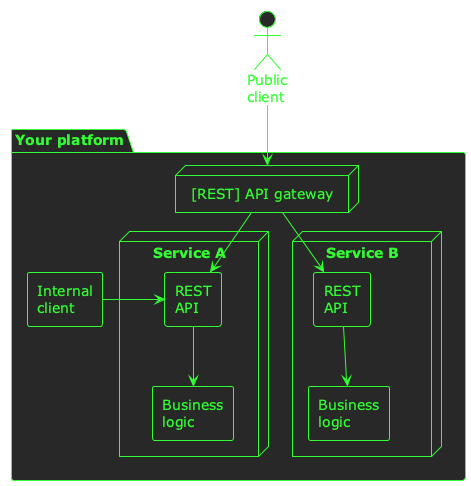
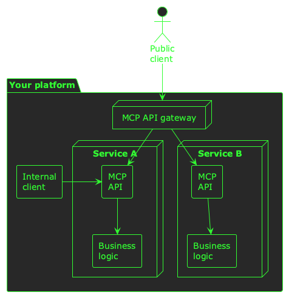
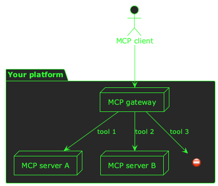

:PROPERTIES:
:UNNUMBERED: t
:END:
#+options: toc:nil stat:nil todo:nil
* Plantuml theme                                                   :noexport:
#+name: plantuml-theme
#+begin_src plantuml :file template.org-plantuml-theme.png :exports none
!theme crt-green
skinparam backgroundColor transparent
#+end_src
* Building a public MCP server
It's 2026, and MCP servers are in the spotlight. /"It's like USB-C, but for LLMs!"/ they say, and across the industry MCP servers are popping into existence like stars in the proto-universe ✨

In principle, an MCP server is easy to build. The protocol has a spec, there are official SDKs for most languages, and the overall idea is simple: you build tools /(just functions)/, you add schema /(just types)/, and you put them on the internet /(just HTTP servers)/.

But, in reality, there are some hidden challenges behind the scenes. Your customers just need /one/ server to connect to, but you don't just have /one/ team building your product. You just need to offer /one/ endpoint for clients to connect to, but you don't just have /one/ backend server.

These challenges aren't new problems, they're just emerging for MCP. If you have a mature product, and a team too big to share a pizza, you need to:

- Enable multiple teams to independently build MCP servers for their domains
- Combine these MCP servers into a single, unified endpoint that your customers can use

We've solved both of these challenges recently at Typeform, and in this post I'm going to describe how we've done it.
** A common architectural vision
If you've got dozens of teams building hundreds of services across your platform, it's not practical to build just /one/ MCP server. You need to build MCP servers in each of your domains, just as you might build REST APIs in many different services. A good place to start is by /extending/ your existing APIs with MCP capabilities. This means your domain logic can remain centralised in specific services, and you can just add MCP as an additional transport option for clients.

In order for this approach to be successful, it's important to establish a /common architectural vision/ across your team so that everyone understands the big picture. You probably already have a shared vision for REST, for example, and it might look something like this:

#+begin_src plantuml :file 2026-03-20-building-a-public-mcp-server.org-rest-vision.png :noweb yes
<<plantuml-theme>>
actor "Public\nclient" as client

package "Your platform" as plat {
  node "[REST] API gateway" as restgw

  node "Service A" as a {
    rectangle "REST\nAPI" as a_rest
    rectangle "Business\nlogic" as a_biz
    a_rest --> a_biz
  }

  node "Service B" as b {
    rectangle "REST\nAPI" as b_rest
    rectangle "Business\nlogic" as b_biz
    b_rest --> b_biz
  }

  rectangle "Internal\nclient" as int
}

client --> restgw
restgw --> a_rest
restgw --> b_rest
int -> a_rest

#+end_src

#+RESULTS:

In this vision:

- Teams build business services that are specific to your domains
- Each service exposes a REST API for its clients
- Internal clients can connect to this API directly
- External clients connect via an API gateway

The API gateway controls which API routes are accessible externally, and also handles cross-cutting concerns like security, rate-limiting, and observability.

A shared vision for teams building MCP servers can look much the same:

#+begin_src plantuml :file 2026-03-20-building-a-public-mcp-server.org-mcp-vision.png :noweb yes
<<plantuml-theme>>
actor "Public\nclient" as client

package "Your platform" as plat {
  node "MCP API gateway" as restgw

  node "Service A" as a {
    rectangle "MCP\nAPI" as a_rest
    rectangle "Business\nlogic" as a_biz
    a_rest --> a_biz
  }

  node "Service B" as b {
    rectangle "MCP\nAPI" as b_rest
    rectangle "Business\nlogic" as b_biz
    b_rest --> b_biz
  }

  rectangle "Internal\nclient" as int
}

client --> restgw
restgw --> a_rest
restgw --> b_rest
int -> a_rest

#+end_src

#+RESULTS:

This illustration is just an example of how you can start building MCP servers throughout your platform, and enable individual teams to develop, deploy, and maintain their own MCP servers. These MCP servers can be consumed internally (e.g. by AI agents), or externally (e.g. by ChatGPT via your MCP gateway).

The important thing about this vision is that it's /shared/ by everyone, and /understood/ across your engineering organisation. This empowers everyone to contribute to the same pattern.
** A foundation of shared tooling
When your team builds REST APIs, there's probably a paved road for them to follow: shared libraries for starting HTTP servers, registering route handlers, authentication, observability, middleware, etc. Your teams don't need to worry about /how/ to build REST APIs--they just focus on /what/ the APIs need to do.

Building platform-wide MCP capabilities throughout your team is going to require the same foundation of shared tooling. At Typeform, we've built a small shared library which:

- Builds an MCP server
- Exposes it as an HTTP handler
- Allows REST endpoints to be wrapped as MCP tools
- Allows arbitrary functions to be exposed as MCP tools
- Handles security and observability

You can do most of these things using the official SDKs of course, but our library does these things the /Typeform/ way--it integrates tightly with the rest of our toolchain, and allows teams to integrate MCP servers closely with their existing services.

If every team understands the /vision/ they're contributing to, and has the /paved road/ to build on, they have everything they need to help build your product's MCP server.
** An MCP gateway
So far, we've talked about the mechanics of many teams in your organisation building MCP servers for their own domains. This works well for internal use cases--AI agents for example--but if you want to combine all of these MCP servers into a /public/ MCP server that your users can connect to there's still one missing piece: an MCP gateway.

In many ways, an MCP gateway is very similar to a [REST] API gateway: it handles routing to upstreams, permitting or denying public usage, and cross-cutting concerns like rate-limiting, security, and observability.

One key difference though, is that generally an API gateway can route to an upstream based on a combination of the relative URL and the HTTP method. With MCP, this combination doesn't identify the operation being performed--for that, a gateway needs to look at the MCP messages themselves. It will need to route, permit, and deny traffic to upstreams based on the MCP /tool names/:

#+begin_src plantuml :file 2026-03-20-building-a-public-mcp-server.org-mcp-gateway-routing.png :noweb yes
<<plantuml-theme>>
actor "MCP client" as client
package "Your platform" {
  node "MCP gateway" as gw
  node "MCP server A" as a
  node "MCP server B" as b
  label "⛔" as denied
}

client --> gw
gw --> a : tool 1
gw --> b : tool 2
gw --> denied : tool 3
#+end_src

#+RESULTS:

The main purpose of this MCP gateway is to:

- Introspect the protocol itself, and identify the tools being called
- Map the tool name to an upstream server, and forward the traffic if it is permitted
- Deny public usage of internal-only tools

This gateway is the endpoint that your public clients will connect to, and is what people will use when they think of your one /logical/ MCP server.

At Typeform, we've written our own, small MCP proxy for this purpose. We might upgrade this to an open source or managed offering in the future, or we might open-source what we've built for others to use. Let's see! 📈
** One MCP server to rule them all
When it comes to opening up MCP access to your platform, I don't think it's a case of just building a single MCP server that exposes access to your entire suite of functionality.

Instead, I think it's important to enable /all/ your teams to start building MCP-native APIs. A common vision and shared tooling can pave the way for this, and an MCP gateway will allow you to present a single endpoint to the world, whilst federating the architecture behind the scenes.
