:PROPERTIES:
:UNNUMBERED: t
:END:
#+options: toc:nil stat:nil todo:nil
* Plantuml theme                                                   :noexport:
#+name: plantuml-theme
#+begin_src plantuml :file template.org-plantuml-theme.png :exports none
!theme crt-green
skinparam backgroundColor transparent
#+end_src
* The brains behind Typeform AI [7/8]
:PROPERTIES:
:ID:       9FFE0E40-EEB4-4E90-B7AF-20B05FCFDE03
:END:
** DONE From point-and-click to AI-native
CLOSED: [2026-07-14 Tue 16:16]
Typeform has always had great user experience at the heart of its product. Whether it's the experience of a creator /(a user who creates a form)/, or a respondent /(a user who completes a form)/. Historically the calibre of the user experience was grounded in what you can see and do on-screen. Elegant interfaces, thoughtful design, and well-researched products.

However, the age of AI is beginning to transform what user experience means. Where before it meant a button in just the right place, increasingly it means this:

#+DOWNLOADED: screenshot @ 2026-07-14 16:07:46
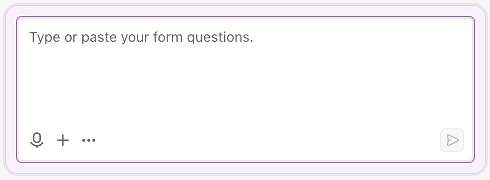

That's right! A text box! AI-native user experiences start here. They might augment themselves with other visual cues, or lead to more traditional interfaces, but their fundamental medium is text. A user types what they want. The AI does it.

At the start of 2025, we found ourselves daunted by the challenge of transforming our user experience into an AI-native one. We knew the shift was happening in the industry, and we wanted to be ahead of the curve.

Well, fast-forward a few months and we launched something amazing:

#+DOWNLOADED: screenshot @ 2026-07-14 16:11:20
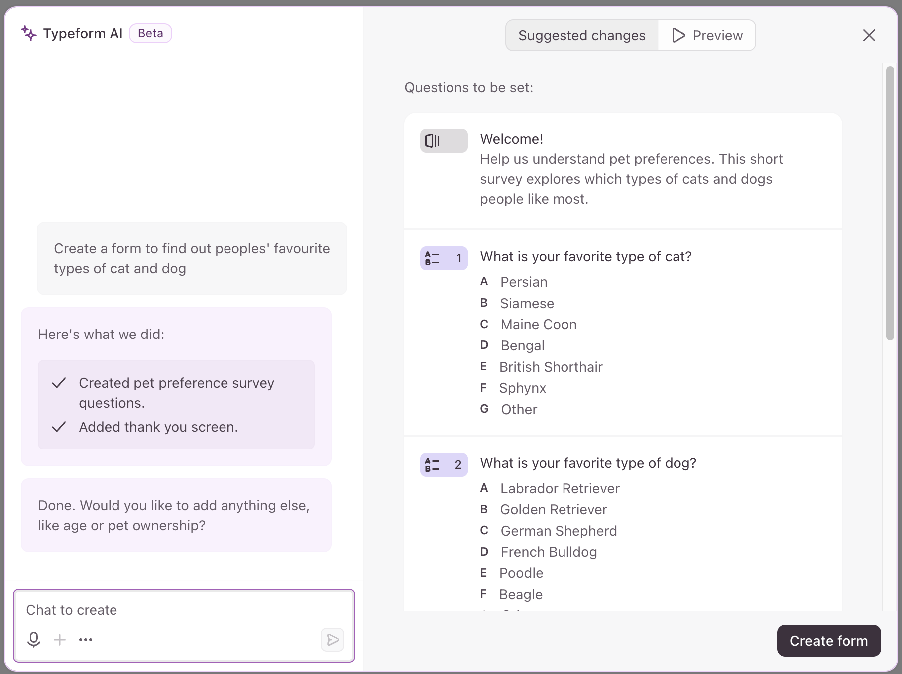

Typeform AI transformed our traditional point-and-click form creation experience into an AI-first alternative. With Typeform AI, our users could create forms /"at the drop of a prompt"/, and achieve in minutes what might have taken them hours before.

Typeform AI /[for forms]/ was a huge success. Our users loved it, adoption skyrocketed, and more people were accepting AI suggestions than ever. At the end of 2025 we realised that we had proven the value of AI-native user experiences. We knew we had to /deepen/ and /broaden/ this experience to make our /entire/ UX AI-native.

This blog post is about how we did that, the principles that guided our choices, and the practical steps we took.
** DONE From AI-native /here/ to AI-native /everywhere/
CLOSED: [2026-07-14 Tue 16:39]
In 2025 we built a rich AI-native experience for /building forms/. Forms are a core part of our product, so this was a natural place to start. However, we have a number of other product domains that are becoming increasingly important to our users. Notably, these include:

- *Contacts* which allows form responses to be aggregated, de-duplicated, and enriched as a central list of respondents /(think a simple-yet-mighty CRM!)/
- *Automations* which allow follow-up actions like sending emails, triggering third-party integrations, and communicating via SMS to be taken when forms or contacts are updated /(think Zapier, but for forms!)/

After our initial success with the /forms/ domain, we wanted to scale Typeform AI across our /contacts/ and /automations/ product areas as well. Not only that, but we wanted to establish the foundations for a future pattern of scalability. When we launch new product areas, we want /them/ to be AI-native too without us having to re-build the infrastructure from scratch.

Essentially, this meant that we wanted to build Typeform AI to be scalable along two different dimensions:

1. *Products:* when we build new products, we want them to be a part of Typeform AI
2. *Teams:* when teams ship new features, we want them to be native in Typeform AI

This sounds like a /technical/ challenge--and, in part, it is. However, it's also an /organisational/ challenge:

#+begin_quote
How do we design our architecture /and/ team to scale AI throughout our product?
#+end_quote
** DONE Conway's law and AI architecture
CLOSED: [2026-07-17 Fri 13:28]
Encountering a technical challenge that's masquerading as an organisational one always makes me think of [[https://en.wikipedia.org/wiki/Conway%27s_law][Conway's Law]]. If you haven't come across it before, Conway's Law can be summarised as:

#+begin_quote
/Organizations which design systems...are constrained to produce designs which are copies of the communication structures of these organizations./
#+end_quote

My take on this is that software systems--or AI systems in our case--are generally a reflection of the structure of the teams that build them. Got one big team all working on the same thing? They'll probably build a /monolith/. Got lots of teams independently working alongside each other? They'll probably build /microservices/.

For me, Conway's Law is most interesting when reflecting on the relationship you want to exist between your /architecture/ and the /teams/ that build it. In our case, we knew we wanted multiple independent product teams to be able to build, own, and operate their part of Typeform AI. Conway's Law tells us that any system these teams build needs to be a /reflection/ of their structure--in other words, it needs to be composed of multiple independent components.

The ambition to scale Typeform AI across domains and teams meant that we needed a unit of architecture that we could scale too. This unit of architecture is a program--or, in our case, an AI agent:

#+begin_src plantuml :noweb yes :file 2026-07-13-building-a-multi-agent-architecture.org-agent-per-domain.png
<<plantuml-theme>>
package "Forms domain" as forms {
  node "🧠 Forms\n     Agent" as fagent
}
package "Contacts domain" as contacts {
  node "🧠 Contacts\n     Agent" as cagent
}
package "Automations domain" as automations {
  node "🧠 Automations\n     Agent" as aagent
}

forms -[hidden]>contacts
contacts -[hidden]>automations

#+end_src

#+RESULTS:
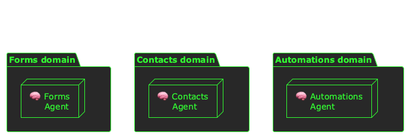

In order for a multi-team, multi-agent architecture to scale we knew teams needed to be able to operate autonomously. They needed to be able to build, ship, and maintain their part of the AI stack. This meant MCP tools, and not just agents:

#+begin_src plantuml :noweb yes :file 2026-07-13-building-a-multi-agent-architecture.org-agent-per-team.png
<<plantuml-theme>>

package "Forms domain" as forms {
  rectangle "Forms team" as fteam #line.dashed {
    node "🧠 Forms\n     Agent" as fagent
    node "⛭ Forms\n   MCP" as fapi
    fagent --> fapi
  }
}
package "Contacts domain" as contacts {
  rectangle "Contacts team" as cteam #line.dashed {
    node "🧠 Contacts\n     Agent" as cagent
    node "⛭ Contacts\n   MCP" as capi
    cagent --> capi
  }
}
package "Automations domain" as automations {
  rectangle "Automations team" as ateam #line.dashed {
    node "🧠 Automations\n     Agent" as aagent
    node "⛭ Automations\n   MCP" as aapi
    aagent --> aapi
    }
}

forms -[hidden]>contacts
contacts -[hidden]>automations

#+end_src

#+RESULTS:
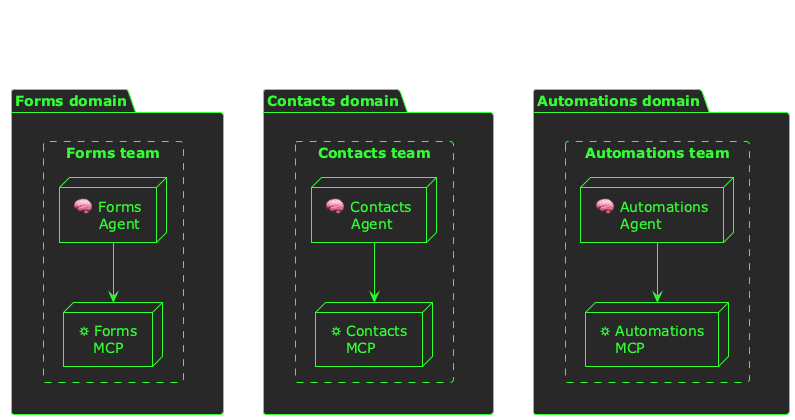

When we framed these domains and components in terms of their teams, we soon settled on a high-level architecture:

#+begin_src plantuml :noweb yes :file 2026-07-13-building-a-multi-agent-architecture.org-agents-arch.png
<<plantuml-theme>>
rectangle "AI Eng. team" as aieng #line.dashed {
  node "🧠 Supervisor\n     Agent" as supervisor
}

rectangle "Forms team" as fteam #line.dashed {
  node "🧠 Forms\n     Agent" as fagent
  node "⛭ Forms\n   MCP" as fapi
  fagent --> fapi
}

rectangle "Contacts team" as cteam #line.dashed {
  node "🧠 Contacts\n     Agent" as cagent
  node "⛭ Contacts\n   MCP" as capi
  cagent --> capi
}

rectangle "Automations team" as ateam #line.dashed {
  node "🧠 Automations\n     Agent" as aagent
  node "⛭ Automations\n   MCP" as aapi
  aagent --> aapi
}

fteam -[hidden]> cteam
cteam -[hidden]> ateam

supervisor --> fagent
supervisor --> cagent : A2A
supervisor --> aagent

#+end_src

#+RESULTS:
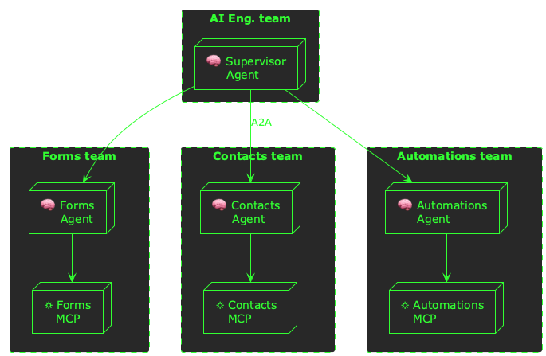

In this architecture, we have:

- Independent product teams building their parts of the AI stack /(specialised agents and MCP servers)/
- A single AI engineering team building the brain of the system /(a supervisor agent)/
- A relationship of co-dependency and delegation between the supervisor and specialised agents /(via the A2A protocol)/
  
And, interestingly, when you compare this architecture back to our organisational structure you find that it matches:

#+begin_src plantuml :noweb yes :file 2026-07-13-building-a-multi-agent-architecture.org-org-arch.png
<<plantuml-theme>>
package "AI Platform" as plat #line.dashed {
  rectangle "AI Eng.\nteam" as aieng
}
package "AI Product" as prod #line.dashed {
  rectangle "Forms\nteam" as forms
  rectangle "Contacts\nteam" as contacts
  rectangle "Automations\nteam" as automations
  collections "Other\nteams" as other
}

aieng --> forms
aieng --> contacts
aieng --> automations
aieng --> other

#+end_src

#+RESULTS:
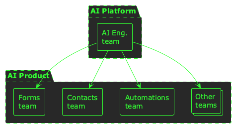

In our organisation, we have:

- Independent product teams owning their own domains
- A central AI engineering team advising and supporting product teams
- A symbiotic and collaborative relationship between product and AI teams
** DONE The problem of durable execution
CLOSED: [2026-07-17 Fri 13:52]
Once we'd decided on a distributed architecture that matched our organisational structure, we immediately knew that we would need to solve a certain category of problems. Distributed systems have to contend with network failure, latency, concurrency, and a whole host /(excuse the pun!)/ of other issues.

However, specifically for this distributed /AI/ architecture, we would have to tackle the problem of /durable execution/.

For short-lived units of work (e.g. HTTP requests), durable execution isn't normally a problem. Let's consider the case of an HTTP server running as a group of replicas behind a load balancer:

#+begin_src plantuml :noweb yes :file 2026-07-13-building-a-multi-agent-architecture.org-de1.png
<<plantuml-theme>>
actor " " as user
node "Load Balancer" as lb

node "Process 1" as p1
node "Process 2" as p2
node "Process 3" as p3 #line.dashed

user --> lb
lb --> p1
lb --> p2
lb --> p3 #line.dashed

#+end_src

#+RESULTS:
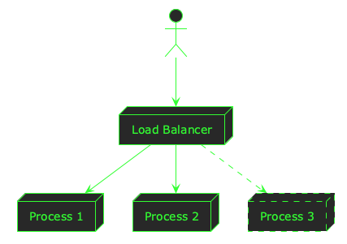

If a unit of work /(request)/ comes into the system and is routed to /Process 3/ just before it is going to terminate, the problem is:

#+begin_quote
/How is the unit of work durably executed in the event of failure/termination?/
#+end_quote

In the case of short-lived work, this problem solves itself. The container scheduler probably gives /Process 3/ thirty seconds to terminate, and an HTTP request might only take a few hundred milliseconds to be processed. When the process receives a termination signal, it can stop accepting new units of work, complete everything in progress, and shut down gracefully.

Durable execution starts to be a problem when the units of work are /long-lived/. If it takes tens of seconds--or longer--for a unit to be executed, a system can't reliably execute the work in the event of a termination or failure event. Now the problem becomes:

#+begin_quote
/How can the execution of a unit of work be made durable across termination/failure boundaries?/
#+end_quote

There are many patterns for dealing with this problem, but one example is:

1. When work is received, don't process it; just persist it
2. Process units asynchronously, and persist their processing state
3. If a unit of work fails, retry it from the work-store
4. Mark units of work as complete when they have been processed

In practice, this might be achieved by using a message bus like SQS, or a streaming platform like Kafka:

#+begin_src plantuml :noweb yes :file 2026-07-13-building-a-multi-agent-architecture.org-de-message-bus.png
<<plantuml-theme>>

node "Load Balancer" as lb

node "Process 1" as p1
node "Process 2" as p2
node "Process 3" as p3 #line.dashed
collections "Workers" as work
p1 -[hidden]> p2
lb --> p1
lb --> p2
lb --> p3 #line.dashed

queue "Message\nbus" as queue

p3 --> queue
queue -> work

#+end_src

#+RESULTS:
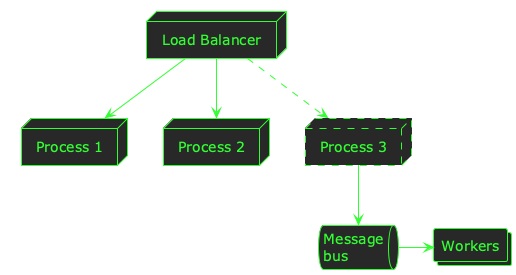

This way, /Process 3/ can quickly persist the unit of work before it might terminate. If a worker terminates mid-way through executing a unit of work, the unit can just be retried later by another worker.

This works just fine under certain conditions:

- *Real-time isn't a requirement;* units of work might be processed several times before they are successful, and message buses introduce latency
- *Idempotency can be guaranteed;* every time there is a failure, units of work will be retried--it must be safe to replay them without side-effects.

Depending on the complexity and duration of the units of work, this pattern can be extended to include multiple asynchronous steps that are orchestrated across failure boundaries. Tools like [[https://docs.aws.amazon.com/step-functions/latest/dg/welcome.html][AWS Step Functions]] and [[https://temporal.io/][Temporal]] make this easier.
** DONE Durable execution: why us?
CLOSED: [2026-07-17 Fri 13:57]
Returning to our problem of durably executing a /distributed AI system/, we knew we would need to solve this problem; but why?

In itself, each agent is a complex web of network I/O, LLM calls, and reasoning loops. A single call to a single agent could easily take tens of seconds, and the entire filigree of agent interactions amplifies this problem. A single user message might require several rounds of agent reasoning and delegation:

#+begin_src plantuml :noweb yes :file 2026-07-13-building-a-multi-agent-architecture.org-agent-reasoning.png
<<plantuml-theme>>

'node "Load Balancer" as u1
'actor " " as u2

package "🧠 Supervisor Agent" as supervisor {
  rectangle "Reasoning" as reas1
  rectangle "Tools" as tool1
  rectangle "Delegation" as dele1
  reas1 -> tool1
  tool1 -> dele1
}

package "🧠 Specialised Agent" as specialised {
  rectangle "Reasoning" as reas2
  rectangle "Tools" as tool2
  rectangle "Respond" as res1
  tool2 <- reas2
  res1 <- tool2
}

dele1 --> reas2

'supervisor -[hidden]-> specialised
'supervisor <- u1
'res1 --> u2

#+end_src

#+RESULTS:
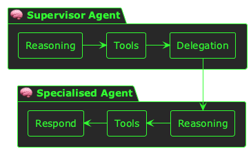

With this in mind, we needed to decide: /how would we solve the problem of durable execution?/
** DONE Solving durable execution
CLOSED: [2026-07-17 Fri 14:08]
Our baseline option was to deploy our agents to Kubernetes, and build the infrastructure to reliably orchestrate agent executions around the agents themselves. This is how we normally build the rest of our backend services, although the duration of the units of work was a novel problem for us.

However, we also started researching alternative platforms. We actually use Temporal and AWS Step Functions elsewhere in our platform, so they were a consideration. However, neither of these options would remove much of the burden of implementation from us. We wanted to move quickly, ship fast, and bring a step-change improvement in Typeform AI to market as soon as we could. This meant that we needed to focus on building for /customer value/, rather than /platform infrastructure/. The value of the experience comes from the agents themselves--their rich array of tools, and their detailed system prompts. The underlying platform powers this experience, but it isn't the difference between a great experience and a mediocre one.

We challenged ourselves:

#+begin_quote
/How can we optimise our efforts for customer value, whilst still building on a reliable platform foundation?/
#+end_quote

It was around this time that we came across [[https://docs.aws.amazon.com/bedrock-agentcore/latest/devguide/agentcore-get-started-cli.html][AWS Bedrock AgentCore]]. AgentCore seemed to solve all of our needs in a single managed service, and all but eradicated the problem of durable execution from our system.

We could have built a complex, durable, and asynchronous orchestration system for our agents in Kubernetes:

#+begin_src plantuml :noweb yes :file 2026-07-13-building-a-multi-agent-architecture.org-k8s.png
<<plantuml-theme>>

queue "Message\nbus" as bus
node "🧠 Agent" as agent
database "💿 Memory" as memory
node "Orchestrator" as orch

bus --> orch
orch -> agent
agent --> memory

#+end_src

#+RESULTS:
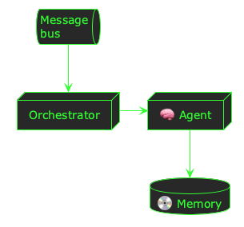

However, [[https://docs.aws.amazon.com/bedrock-agentcore/latest/devguide/agents-tools-runtime.html][AgentCore Runtime]] provides a serverless compute environment in which agents can execute for up to 8 hours. This meant that we didn't need to worry about inadvertent termination mid-way through processing a user message; agents can safely take their time to reason, process, and respond to a user's request.

#+begin_src plantuml :noweb yes :file 2026-07-13-building-a-multi-agent-architecture.org-runtime.png
<<plantuml-theme>>

node "MicroVM" as vm {
  rectangle "🧠 Agent" as agent
}

#+end_src

#+RESULTS:
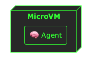

Deploying agents in AgentCore is /much/ simpler than on Kubernetes, and--even without all the supporting machinery--still offers great durable execution guarantees.
** DONE Typeform AI: from forms to flows in 4 months
CLOSED: [2026-07-17 Fri 14:12]
This decision-making process, and the selection of AgentCore as our foundational platform, underpinned the engineering work we undertook in the first few months of 2026. We re-built our entire Typeform AI architecture to follow this new pattern, and scaled its product coverage from just forms to include contacts, automations, and more--a powerful suite of tools for executing customer workflows.

Conway's Law, as the backdrop to our choice of architecture, has helped us build a system that harmonises with our engineering organisation, and allows teams to extend their domains into our AI-native future whenever they are ready.

This has just been the beginning for us; we're now reaping the benefits of this approach, and continuing to scale its implementation across our product and throughout our teams 🚀
